# AGAPP — Citizen Mobile App Flowcharts

> **Status:** Draft for review · **Created:** 2026-07-18 · **Revised:** 2026-07-18
> **Source:** Derived by reading the actual screen code in `agapp-system/apps/mobile/src/`,
> not from design intent. Quirks and gaps are called out in the **Notes** under each
> chart rather than silently corrected.
> **Format:** Charts are kept deliberately small so each one fits a single page or
> half-page in the manuscript.

---

## How to read these charts

Every chart is small and self-contained. Charts connect through **off-page
connectors** — the yellow circles containing an ID. When you reach one, continue on
the chart with that ID.

| Symbol | Meaning | draw.io shape |
|---|---|---|
| Rounded rectangle | Start / End terminator | Terminator |
| Rectangle | Process / action / screen | Process |
| Diamond | Decision | Decision |
| Yellow circle with an ID | **Off-page connector** | Off-Page Reference |
| Dashed red rectangle | Error / rejection / blocked outcome | Process, dashed border |

**Numbering:** a letter identifies the feature, a digit identifies the part —
so `K1`, `K2`, `K3` are all parts of identity verification. Letters **I** and **O**
are skipped so they are never confused with 1 and 0.

### Chart index

| Group | Charts | Covers |
|---|---|---|
| **A** | A1 · A2 | Guest journey overview |
| **B** | B1 · B2 · B3 | Unverified account journey |
| **C** | C1 · C2 · C3 | Verified account journey |
| **D** | D1 · D2 | App boot and routing |
| **E** | E1 · E2 · E3 | Onboarding and town discovery |
| **F** | F1 · F2 · F3 · F4 · F5 | Sign in, sign up, OTP, password reset |
| **G** | G1 | Municipality selection |
| **H** | H1 · H2 · H3 · H4 · H5 | Home dashboard |
| **J** | J1 · J2 · J3 | Global search |
| **K** | K1 · K2 · K3 · K4 · K5 · K6 | Identity verification |
| **L** | L1 · L2 | Guided camera capture |
| **M** | M1 · M2 · M3 · M4 | E-Services |
| **N** | N1 · N2 · N3 · N4 · N5 | Report an incident |
| **P** | P1 · P2 · P3 | Tracking detail |
| **Q** | Q1 · Q2 · Q3 · Q4 | Community forum |
| **R** | R1 · R2 | Chatbot assistant |
| **S** | S1 · S2 | News and announcements |
| **T** | T1 | Citizen guide directory |
| **U** | U1 · U2 | Map explorer |
| **V** | V1 | Emergency hotlines |
| **W** | W1 · W2 · W3 · W4 | Profile and settings |
| **X** | X1 · X2 | Notifications |
| **Y** | Y1 · Y2 · Y3 | Connectivity, session and errors |

### The three access levels

| Level | Meaning | Blocked actions lead to |
|---|---|---|
| **Guest** | No account, browsing only | **F1** — sign in |
| **Unverified** | Signed in, ID not yet approved | **K1** — verify identity |
| **Verified** | ID approved by the LGU | Nothing blocked |

### Access matrix

| Feature | Guest | Unverified | Verified |
|---|---|---|---|
| Home dashboard | ✅ | ✅ + own data | ✅ + barangay |
| Global search | ⚠️ No personal results | ✅ | ✅ |
| Notifications | ❌ | ✅ | ✅ |
| News · Guide · Emergency | ✅ | ✅ | ✅ |
| Forum — read | ⚠️ 3 replies max | ✅ | ✅ |
| Forum — like, bookmark | ❌ | ✅ | ✅ |
| Forum — post, reply | ❌ | ❌ | ✅ |
| E-Services — browse | ✅ | ✅ | ✅ |
| E-Services — submit | ❌ | ❌ | ✅ |
| Reports — browse | ✅ | ✅ | ✅ |
| Reports — submit | ❌ | ❌ | ✅ |
| My reports / requests | ❌ | ✅ | ✅ |
| Tracking detail | ❌ | ✅ | ✅ |
| Chatbot | ❌ | ✅ | ✅ |
| Map explorer | ❌ | ✅ | ✅ |
| Profile | ❌ | ✅ | ✅ |

---

# A — Guest journey

## A1 — What a guest can do

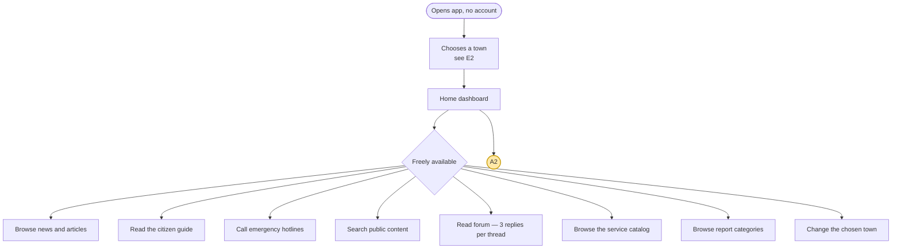
```mermaid
flowchart TD
    START(["Opens app, no account"]) --> DISC["Chooses a town<br/>see E2"]
    DISC --> HOME["Home dashboard"]
    HOME --> FREE{"Freely available"}
    FREE --> F1["Browse news and articles"]
    FREE --> F2["Read the citizen guide"]
    FREE --> F3["Call emergency hotlines"]
    FREE --> F4["Search public content"]
    FREE --> F5["Read forum — 3 replies per thread"]
    FREE --> F6["Browse the service catalog"]
    FREE --> F7["Browse report categories"]
    FREE --> F8["Change the chosen town"]
    HOME --> BLOCKED(("A2"))

    classDef connector fill:#FFE9A8,stroke:#C79A00,stroke-width:2px
    class BLOCKED connector
```

## A2 — What a guest is blocked from

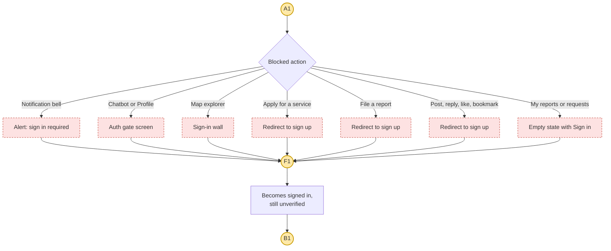
```mermaid
flowchart TD
    IN(("A1")) --> BLOCKED{"Blocked action"}
    BLOCKED -->|"Notification bell"| B1["Alert: sign in required"]
    BLOCKED -->|"Chatbot or Profile"| B2["Auth gate screen"]
    BLOCKED -->|"Map explorer"| B3["Sign-in wall"]
    BLOCKED -->|"Apply for a service"| B4["Redirect to sign up"]
    BLOCKED -->|"File a report"| B5["Redirect to sign up"]
    BLOCKED -->|"Post, reply, like, bookmark"| B6["Redirect to sign up"]
    BLOCKED -->|"My reports or requests"| B7["Empty state with Sign in"]

    B1 --> AUTH
    B2 --> AUTH
    B3 --> AUTH
    B4 --> AUTH
    B5 --> AUTH
    B6 --> AUTH
    B7 --> AUTH
    AUTH(("F1"))
    AUTH --> BECOME["Becomes signed in,<br/>still unverified"]
    BECOME --> NEXT(("B1"))

    classDef connector fill:#FFE9A8,stroke:#C79A00,stroke-width:2px
    classDef errorNode fill:#FDE2E2,stroke:#C0392B,stroke-dasharray:4 3
    class IN,AUTH,NEXT connector
    class B1,B2,B3,B4,B5,B6,B7 errorNode
```

**The guest ceiling:** consume everything the LGU publishes; contribute nothing.

---

# B — Unverified account journey

## B1 — What being signed in unlocks

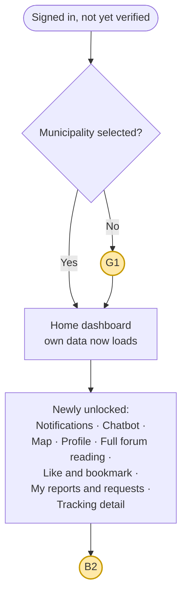
```mermaid
flowchart TD
    START(["Signed in, not yet verified"]) --> LGUCHK{"Municipality selected?"}
    LGUCHK -->|"No"| PICKLGU(("G1"))
    LGUCHK -->|"Yes"| HOME["Home dashboard<br/>own data now loads"]
    PICKLGU --> HOME

    HOME --> GAINED["Newly unlocked:<br/>Notifications · Chatbot ·<br/>Map · Profile · Full forum reading ·<br/>Like and bookmark ·<br/>My reports and requests ·<br/>Tracking detail"]
    GAINED --> TRY(("B2"))

    classDef connector fill:#FFE9A8,stroke:#C79A00,stroke-width:2px
    class PICKLGU,TRY connector
```

## B2 — Where the verification wall appears

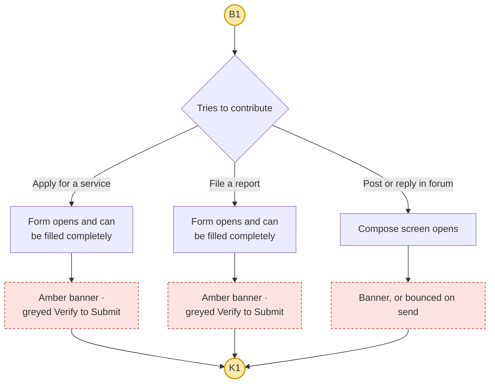
```mermaid
flowchart TD
    IN(("B1")) --> TRY{"Tries to contribute"}
    TRY -->|"Apply for a service"| F1["Form opens and can<br/>be filled completely"]
    TRY -->|"File a report"| F2["Form opens and can<br/>be filled completely"]
    TRY -->|"Post or reply in forum"| F3["Compose screen opens"]

    F1 --> W1["Amber banner ·<br/>greyed Verify to Submit"]
    F2 --> W2["Amber banner ·<br/>greyed Verify to Submit"]
    F3 --> W3["Banner, or bounced on send"]

    W1 --> VERIFY
    W2 --> VERIFY
    W3 --> VERIFY
    VERIFY(("K1"))

    classDef connector fill:#FFE9A8,stroke:#C79A00,stroke-width:2px
    classDef errorNode fill:#FDE2E2,stroke:#C0392B,stroke-dasharray:4 3
    class IN,VERIFY connector
    class W1,W2,W3 errorNode
```

**Design issue:** all three walls appear *after* the form is filled, not before.

## B3 — Waiting for the decision

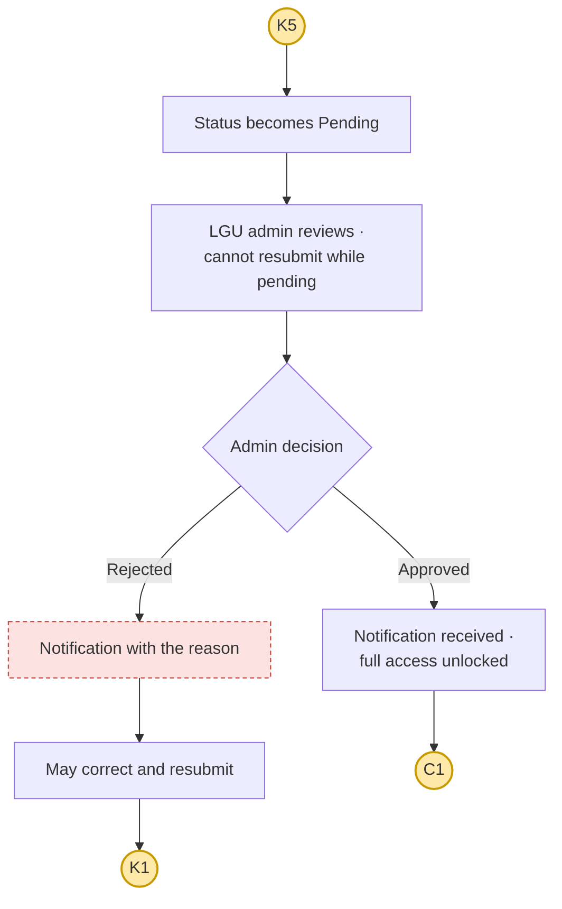
```mermaid
flowchart TD
    IN(("K5")) --> SUBMITTED["Status becomes Pending"]
    SUBMITTED --> WAIT["LGU admin reviews ·<br/>cannot resubmit while pending"]
    WAIT --> OUTCOME{"Admin decision"}
    OUTCOME -->|"Approved"| APPROVED["Notification received ·<br/>full access unlocked"]
    OUTCOME -->|"Rejected"| REJECTED["Notification with the reason"]
    REJECTED --> RESUBMIT["May correct and resubmit"]
    RESUBMIT --> BACK(("K1"))
    APPROVED --> NEXT(("C1"))

    classDef connector fill:#FFE9A8,stroke:#C79A00,stroke-width:2px
    classDef errorNode fill:#FDE2E2,stroke:#C0392B,stroke-dasharray:4 3
    class IN,BACK,NEXT connector
    class REJECTED errorNode
```

---

# C — Verified account journey

## C1 — Full access

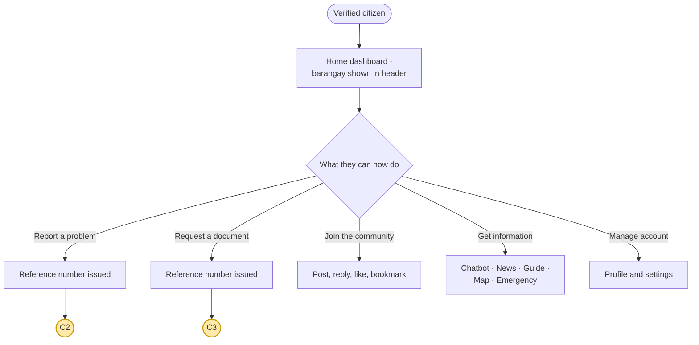
```mermaid
flowchart TD
    START(["Verified citizen"]) --> HOME["Home dashboard ·<br/>barangay shown in header"]
    HOME --> ALL{"What they can now do"}
    ALL -->|"Report a problem"| RPT["Reference number issued"]
    ALL -->|"Request a document"| SVC["Reference number issued"]
    ALL -->|"Join the community"| FRM["Post, reply, like, bookmark"]
    ALL -->|"Get information"| INFO["Chatbot · News · Guide ·<br/>Map · Emergency"]
    ALL -->|"Manage account"| ACC["Profile and settings"]

    RPT --> L1(("C2"))
    SVC --> L2(("C3"))

    classDef connector fill:#FFE9A8,stroke:#C79A00,stroke-width:2px
    class L1,L2 connector
```

## C2 — Report lifecycle from the citizen's side

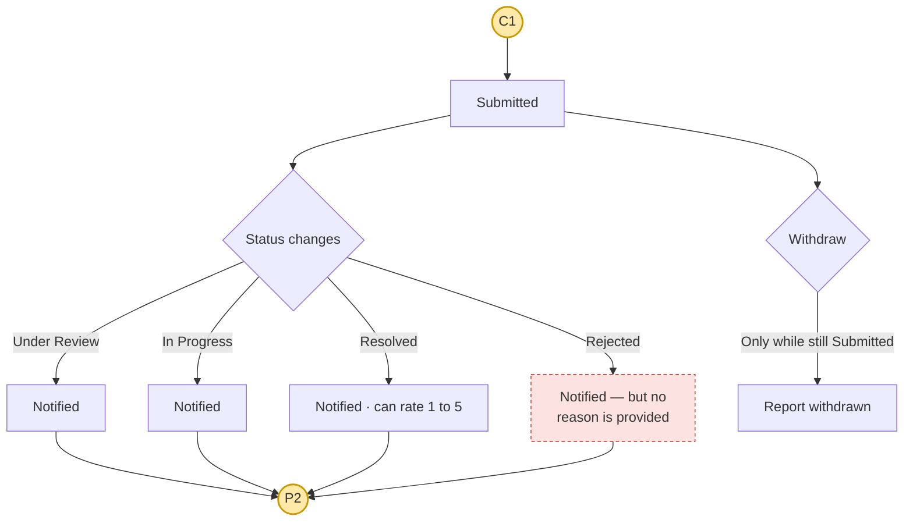
```mermaid
flowchart TD
    IN(("C1")) --> SUB["Submitted"]
    SUB --> LIFE{"Status changes"}
    LIFE -->|"Under Review"| N1["Notified"]
    LIFE -->|"In Progress"| N2["Notified"]
    LIFE -->|"Resolved"| N3["Notified · can rate 1 to 5"]
    LIFE -->|"Rejected"| N4["Notified — but no<br/>reason is provided"]
    SUB --> WD{"Withdraw"}
    WD -->|"Only while still Submitted"| N5["Report withdrawn"]

    N1 --> DETAIL(("P2"))
    N2 --> DETAIL
    N3 --> DETAIL
    N4 --> DETAIL

    classDef connector fill:#FFE9A8,stroke:#C79A00,stroke-width:2px
    classDef errorNode fill:#FDE2E2,stroke:#C0392B,stroke-dasharray:4 3
    class IN,DETAIL connector
    class N4 errorNode
```

## C3 — Service request lifecycle from the citizen's side

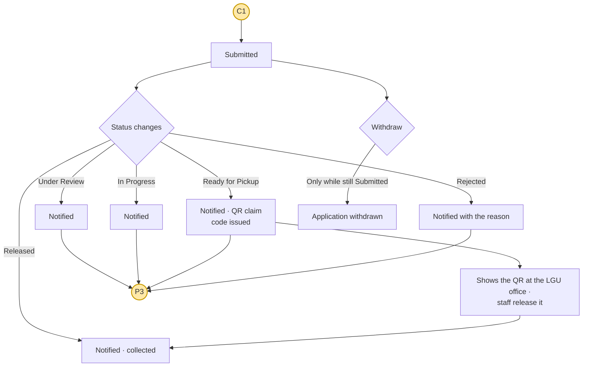
```mermaid
flowchart TD
    IN(("C1")) --> SUB["Submitted"]
    SUB --> LIFE{"Status changes"}
    LIFE -->|"Under Review"| M1["Notified"]
    LIFE -->|"In Progress"| M2["Notified"]
    LIFE -->|"Ready for Pickup"| M3["Notified · QR claim<br/>code issued"]
    LIFE -->|"Released"| M4["Notified · collected"]
    LIFE -->|"Rejected"| M5["Notified with the reason"]
    SUB --> WD{"Withdraw"}
    WD -->|"Only while still Submitted"| M6["Application withdrawn"]

    M3 --> COUNTER["Shows the QR at the LGU office ·<br/>staff release it"]
    COUNTER --> M4

    M1 --> DETAIL(("P3"))
    M2 --> DETAIL
    M3 --> DETAIL
    M5 --> DETAIL

    classDef connector fill:#FFE9A8,stroke:#C79A00,stroke-width:2px
    class IN,DETAIL connector
```

---

# D — App boot & routing

## D1 — Startup sequence

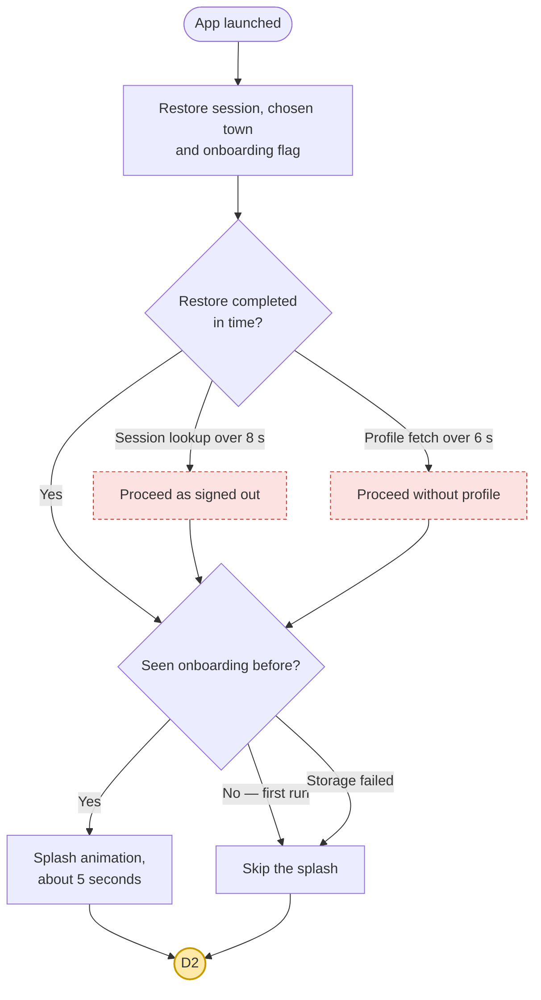
```mermaid
flowchart TD
    START(["App launched"]) --> LOAD["Restore session, chosen town<br/>and onboarding flag"]
    LOAD --> TIMEOUT{"Restore completed<br/>in time?"}
    TIMEOUT -->|"Session lookup over 8 s"| T1["Proceed as signed out"]
    TIMEOUT -->|"Profile fetch over 6 s"| T2["Proceed without profile"]
    TIMEOUT -->|"Yes"| SEEN
    T1 --> SEEN
    T2 --> SEEN

    SEEN{"Seen onboarding before?"}
    SEEN -->|"No — first run"| SKIP["Skip the splash"]
    SEEN -->|"Yes"| SPLASH["Splash animation,<br/>about 5 seconds"]
    SEEN -->|"Storage failed"| SKIP
    SPLASH --> NEXT
    SKIP --> NEXT
    NEXT(("D2"))

    classDef connector fill:#FFE9A8,stroke:#C79A00,stroke-width:2px
    classDef errorNode fill:#FDE2E2,stroke:#C0392B,stroke-dasharray:4 3
    class NEXT connector
    class T1,T2 errorNode
```

**Note:** both timeouts fail **open** — a slow network degrades to a signed-out
session rather than a frozen splash screen.

## D2 — Where the app sends you

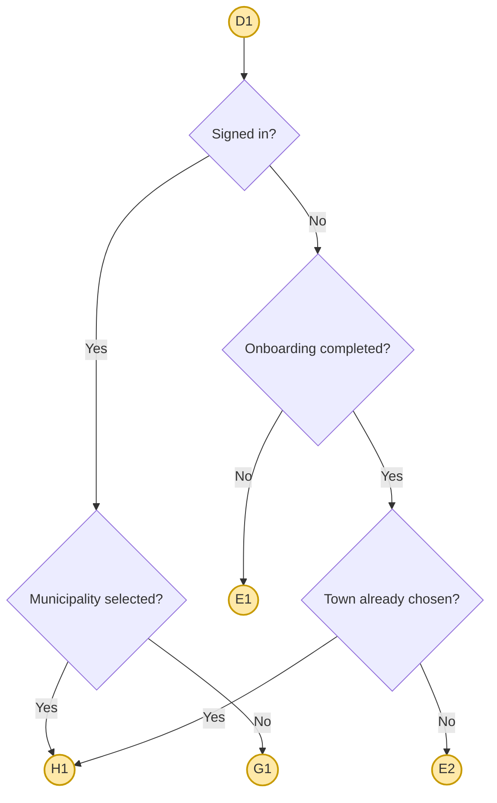
```mermaid
flowchart TD
    IN(("D1")) --> AUTH{"Signed in?"}
    AUTH -->|"Yes"| LGUCHK{"Municipality selected?"}
    AUTH -->|"No"| ONBCHK{"Onboarding completed?"}

    LGUCHK -->|"Yes"| GOH(("H1"))
    LGUCHK -->|"No"| GOG(("G1"))

    ONBCHK -->|"No"| GOE1(("E1"))
    ONBCHK -->|"Yes"| GUESTCHK{"Town already chosen?"}
    GUESTCHK -->|"No"| GOE2(("E2"))
    GUESTCHK -->|"Yes"| GOH

    classDef connector fill:#FFE9A8,stroke:#C79A00,stroke-width:2px
    class IN,GOH,GOG,GOE1,GOE2 connector
```

**Note:** screens are added to and removed from the navigation stack based on state,
so these redirects happen automatically rather than by an explicit navigation call.

---

# E — Onboarding & town discovery

## E1 — Onboarding carousel

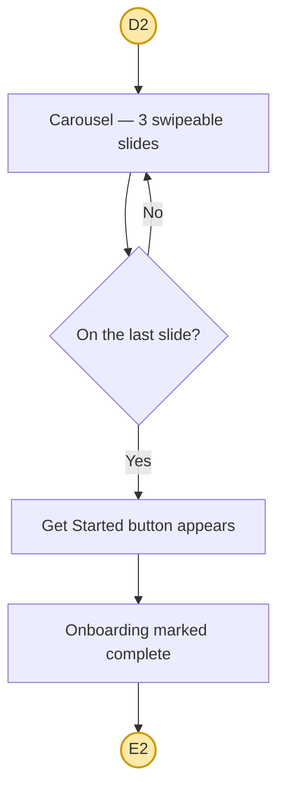
```mermaid
flowchart TD
    IN(("D2")) --> ONB["Carousel — 3 swipeable slides"]
    ONB --> SLIDE{"On the last slide?"}
    SLIDE -->|"No"| ONB
    SLIDE -->|"Yes"| BTN["Get Started button appears"]
    BTN --> SAVE["Onboarding marked complete"]
    SAVE --> OUT(("E2"))

    classDef connector fill:#FFE9A8,stroke:#C79A00,stroke-width:2px
    class IN,OUT connector
```

## E2 — Finding your town

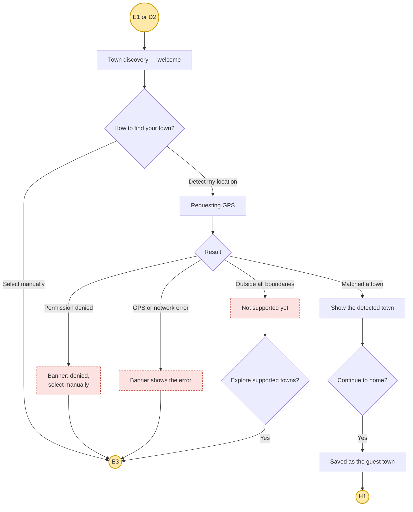
```mermaid
flowchart TD
    IN(("E1 or D2")) --> WELCOME["Town discovery — welcome"]
    WELCOME --> CHOICE{"How to find your town?"}
    CHOICE -->|"Detect my location"| DETECT["Requesting GPS"]
    CHOICE -->|"Select manually"| GOMAN(("E3"))

    DETECT --> RESULT{"Result"}
    RESULT -->|"Matched a town"| FOUND["Show the detected town"]
    RESULT -->|"Permission denied"| ERR1["Banner: denied,<br/>select manually"]
    RESULT -->|"Outside all boundaries"| NOTSUP["Not supported yet"]
    RESULT -->|"GPS or network error"| ERR2["Banner shows the error"]

    ERR1 --> GOMAN
    ERR2 --> GOMAN
    NOTSUP --> EXPLORE{"Explore supported towns?"}
    EXPLORE -->|"Yes"| GOMAN

    FOUND --> CONFIRM{"Continue to home?"}
    CONFIRM -->|"Yes"| SAVE["Saved as the guest town"]
    SAVE --> OUT(("H1"))

    classDef connector fill:#FFE9A8,stroke:#C79A00,stroke-width:2px
    classDef errorNode fill:#FDE2E2,stroke:#C0392B,stroke-dasharray:4 3
    class IN,GOMAN,OUT connector
    class ERR1,ERR2,NOTSUP errorNode
```

## E3 — Choosing a town manually

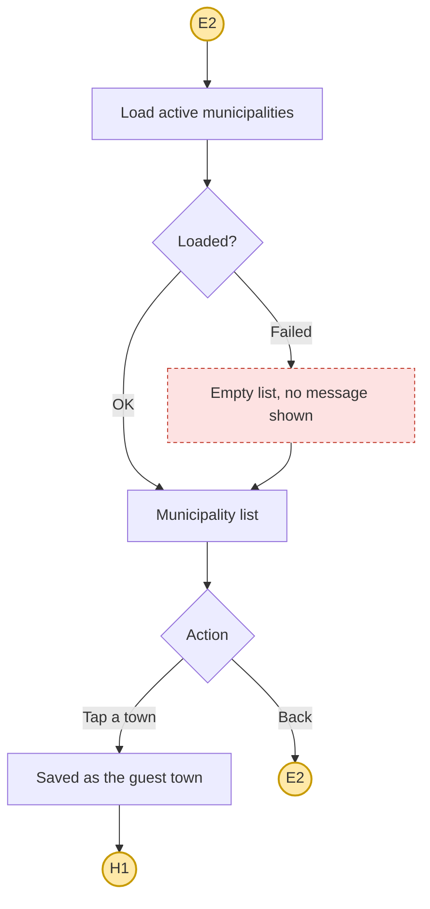
```mermaid
flowchart TD
    IN(("E2")) --> FETCH["Load active municipalities"]
    FETCH --> RES{"Loaded?"}
    RES -->|"Failed"| ERR["Empty list, no message shown"]
    RES -->|"OK"| LIST["Municipality list"]
    ERR --> LIST
    LIST --> ACT{"Action"}
    ACT -->|"Tap a town"| SAVE["Saved as the guest town"]
    ACT -->|"Back"| BACK(("E2"))
    SAVE --> OUT(("H1"))

    classDef connector fill:#FFE9A8,stroke:#C79A00,stroke-width:2px
    classDef errorNode fill:#FDE2E2,stroke:#C0392B,stroke-dasharray:4 3
    class IN,BACK,OUT connector
    class ERR errorNode
```

**Note:** a failed load shows an **empty list with no error message**. Worth fixing.

---

# F — Sign in, sign up, OTP

## F1 — Sign in

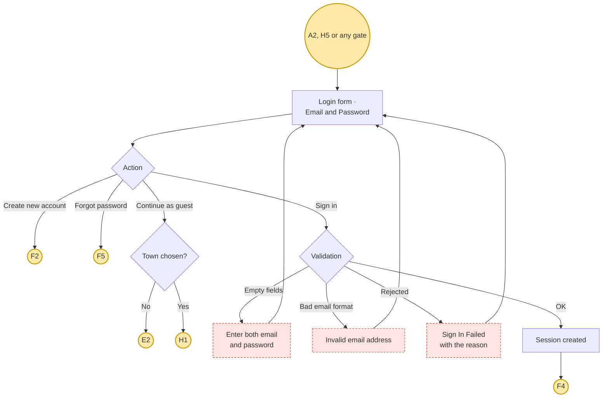
```mermaid
flowchart TD
    IN(("A2, H5 or any gate")) --> LOGIN["Login form ·<br/>Email and Password"]
    LOGIN --> ACT{"Action"}
    ACT -->|"Create new account"| GOF2(("F2"))
    ACT -->|"Forgot password"| GOF5(("F5"))
    ACT -->|"Continue as guest"| GUEST{"Town chosen?"}
    ACT -->|"Sign in"| VAL{"Validation"}

    GUEST -->|"No"| GOE(("E2"))
    GUEST -->|"Yes"| GOH(("H1"))

    VAL -->|"Empty fields"| E1["Enter both email<br/>and password"]
    VAL -->|"Bad email format"| E2["Invalid email address"]
    VAL -->|"Rejected"| E3["Sign In Failed<br/>with the reason"]
    VAL -->|"OK"| SESSION["Session created"]
    E1 --> LOGIN
    E2 --> LOGIN
    E3 --> LOGIN

    SESSION --> OUT(("F4"))

    classDef connector fill:#FFE9A8,stroke:#C79A00,stroke-width:2px
    classDef errorNode fill:#FDE2E2,stroke:#C0392B,stroke-dasharray:4 3
    class IN,GOF2,GOF5,GOE,GOH,OUT connector
    class E1,E2,E3 errorNode
```

## F2 — Sign up, step 1: personal details

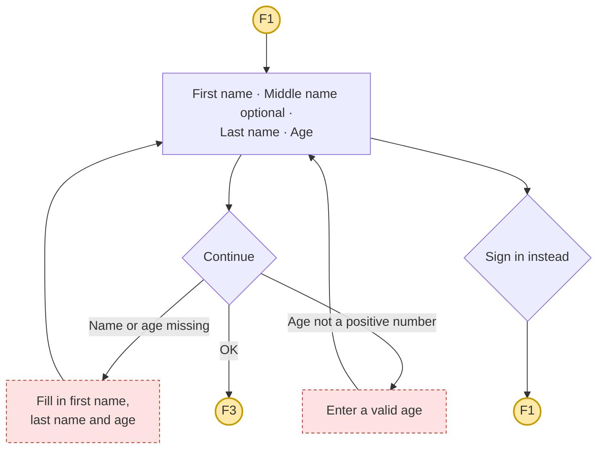
```mermaid
flowchart TD
    IN(("F1")) --> FORM["First name · Middle name optional ·<br/>Last name · Age"]
    FORM --> VAL{"Continue"}
    VAL -->|"Name or age missing"| E1["Fill in first name,<br/>last name and age"]
    VAL -->|"Age not a positive number"| E2["Enter a valid age"]
    VAL -->|"OK"| OUT(("F3"))
    E1 --> FORM
    E2 --> FORM
    FORM --> BACK{"Sign in instead"}
    BACK --> GOF1(("F1"))

    classDef connector fill:#FFE9A8,stroke:#C79A00,stroke-width:2px
    classDef errorNode fill:#FDE2E2,stroke:#C0392B,stroke-dasharray:4 3
    class IN,OUT,GOF1 connector
    class E1,E2 errorNode
```

## F3 — Sign up, step 2: credentials

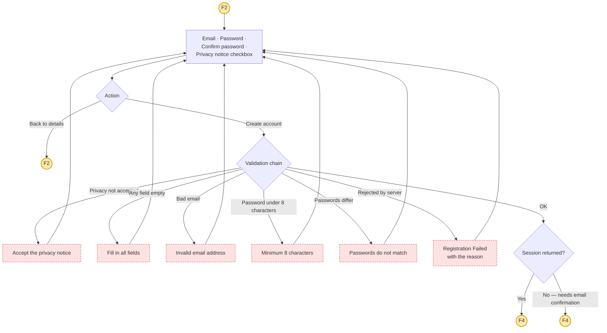
```mermaid
flowchart TD
    IN(("F2")) --> FORM["Email · Password ·<br/>Confirm password ·<br/>Privacy notice checkbox"]
    FORM --> ACT{"Action"}
    ACT -->|"Back to details"| GOF2(("F2"))
    ACT -->|"Create account"| VAL{"Validation chain"}

    VAL -->|"Privacy not accepted"| E1["Accept the privacy notice"]
    VAL -->|"Any field empty"| E2["Fill in all fields"]
    VAL -->|"Bad email"| E3["Invalid email address"]
    VAL -->|"Password under 8 characters"| E4["Minimum 8 characters"]
    VAL -->|"Passwords differ"| E5["Passwords do not match"]
    VAL -->|"Rejected by server"| E6["Registration Failed<br/>with the reason"]
    VAL -->|"OK"| RESULT{"Session returned?"}

    E1 --> FORM
    E2 --> FORM
    E3 --> FORM
    E4 --> FORM
    E5 --> FORM
    E6 --> FORM

    RESULT -->|"Yes"| GOF4(("F4"))
    RESULT -->|"No — needs email confirmation"| GOOTP(("F4"))

    classDef connector fill:#FFE9A8,stroke:#C79A00,stroke-width:2px
    classDef errorNode fill:#FDE2E2,stroke:#C0392B,stroke-dasharray:4 3
    class IN,GOF2,GOF4,GOOTP connector
    class E1,E2,E3,E4,E5,E6 errorNode
```

**Note:** the privacy checkbox **defaults to accepted**, which weakens it as consent.

## F4 — Email confirmation code

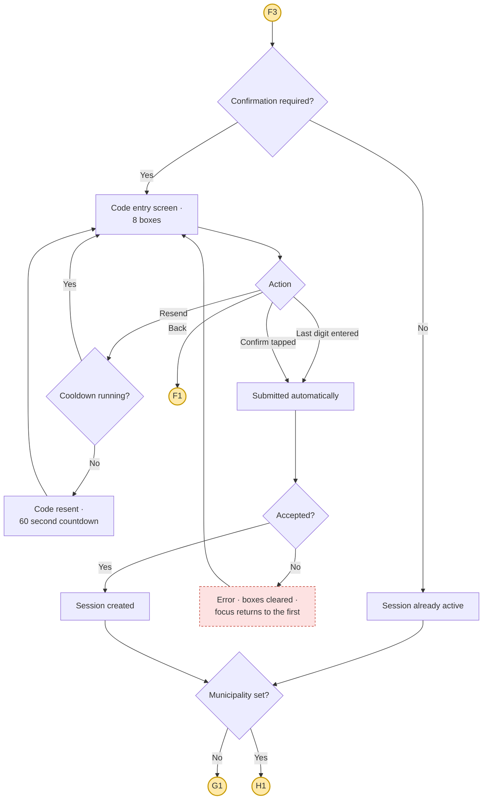
```mermaid
flowchart TD
    IN(("F3")) --> NEEDED{"Confirmation required?"}
    NEEDED -->|"No"| SKIP["Session already active"]
    NEEDED -->|"Yes"| OTP["Code entry screen ·<br/>8 boxes"]

    OTP --> ACT{"Action"}
    ACT -->|"Last digit entered"| VERIFY["Submitted automatically"]
    ACT -->|"Confirm tapped"| VERIFY
    ACT -->|"Resend"| COOL{"Cooldown running?"}
    ACT -->|"Back"| GOF1(("F1"))

    COOL -->|"Yes"| OTP
    COOL -->|"No"| SENT["Code resent ·<br/>60 second countdown"]
    SENT --> OTP

    VERIFY --> RES{"Accepted?"}
    RES -->|"No"| E["Error · boxes cleared ·<br/>focus returns to the first"]
    RES -->|"Yes"| SESSION["Session created"]
    E --> OTP

    SKIP --> LGUQ
    SESSION --> LGUQ{"Municipality set?"}
    LGUQ -->|"No"| GOG(("G1"))
    LGUQ -->|"Yes"| GOH(("H1"))

    classDef connector fill:#FFE9A8,stroke:#C79A00,stroke-width:2px
    classDef errorNode fill:#FDE2E2,stroke:#C0392B,stroke-dasharray:4 3
    class IN,GOF1,GOG,GOH connector
    class E errorNode
```

**Note:** the screen renders **8 boxes** but its error message says "enter all 6
digits" — one of them is wrong.

## F5 — Password reset

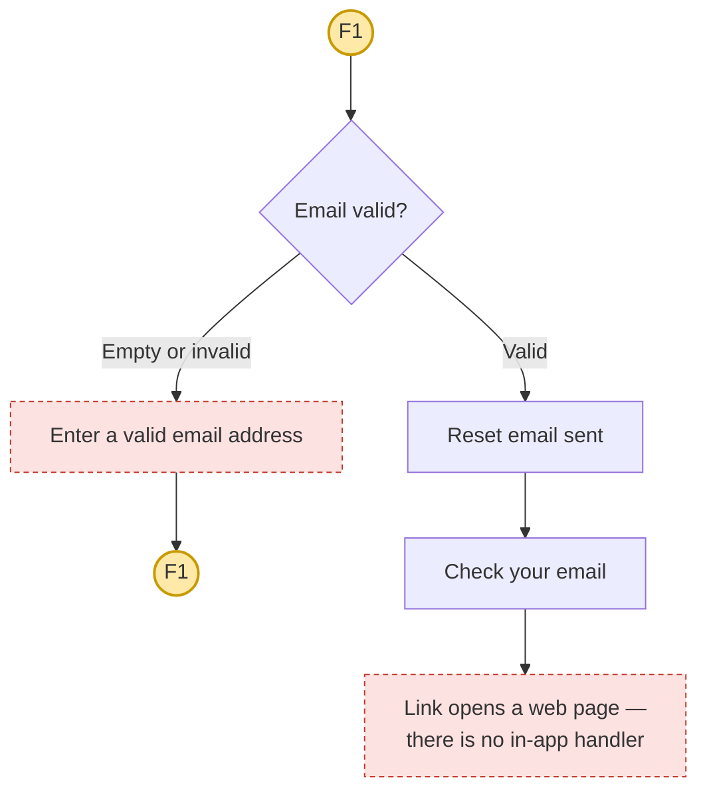
```mermaid
flowchart TD
    IN(("F1")) --> VAL{"Email valid?"}
    VAL -->|"Empty or invalid"| E["Enter a valid email address"]
    VAL -->|"Valid"| SEND["Reset email sent"]
    E --> BACK(("F1"))
    SEND --> TOAST["Check your email"]
    TOAST --> DEAD["Link opens a web page —<br/>there is no in-app handler"]

    classDef connector fill:#FFE9A8,stroke:#C79A00,stroke-width:2px
    classDef errorNode fill:#FDE2E2,stroke:#C0392B,stroke-dasharray:4 3
    class IN,BACK connector
    class E,DEAD errorNode
```

**Note:** the reset link opens a **web page**, not the app — the deep link handler
was never built. Drawn as a dead end because that is what it is.

---

# G — Municipality selection

## G1 — Choosing your municipality

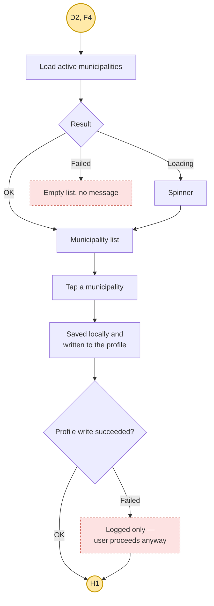
```mermaid
flowchart TD
    IN(("D2, F4")) --> LOAD["Load active municipalities"]
    LOAD --> STATE{"Result"}
    STATE -->|"Loading"| SPIN["Spinner"]
    STATE -->|"Failed"| EMPTY["Empty list, no message"]
    STATE -->|"OK"| LIST["Municipality list"]
    SPIN --> LIST

    LIST --> TAP["Tap a municipality"]
    TAP --> SAVE["Saved locally and<br/>written to the profile"]
    SAVE --> WQ{"Profile write succeeded?"}
    WQ -->|"Failed"| SILENT["Logged only —<br/>user proceeds anyway"]
    WQ -->|"OK"| OUT(("H1"))
    SILENT --> OUT

    classDef connector fill:#FFE9A8,stroke:#C79A00,stroke-width:2px
    classDef errorNode fill:#FDE2E2,stroke:#C0392B,stroke-dasharray:4 3
    class IN,OUT connector
    class EMPTY,SILENT errorNode
```

**Note:** when signed in without a municipality this is the **only** screen in the
stack — there is no back button until a choice is made.

---

# H — Home dashboard

## H1 — Home by access level

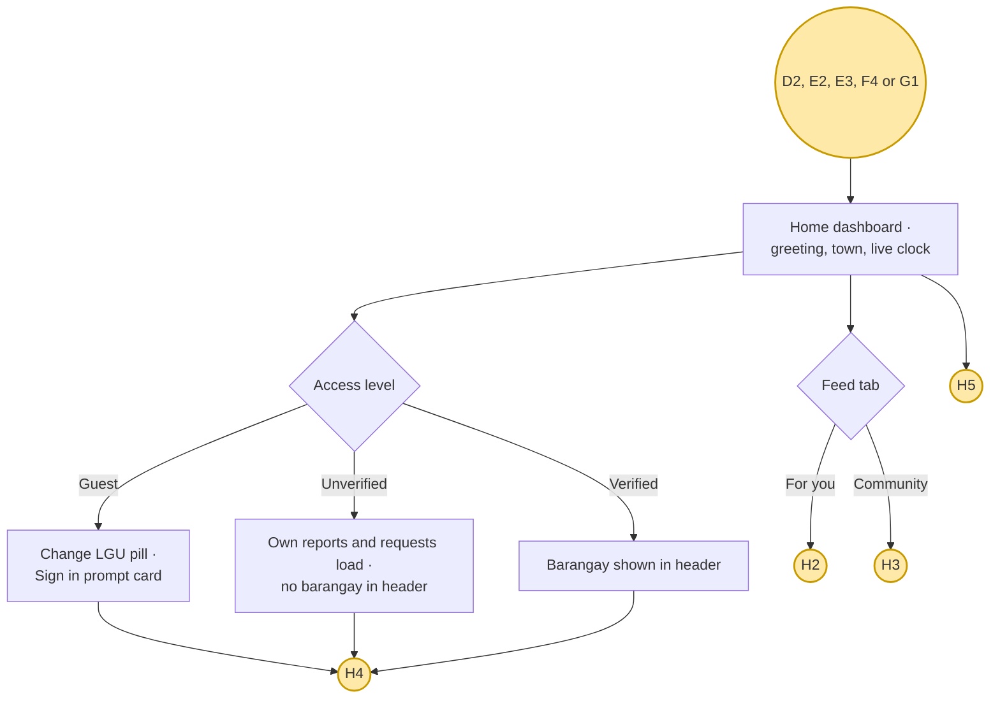
```mermaid
flowchart TD
    IN(("D2, E2, E3, F4 or G1")) --> HOME["Home dashboard ·<br/>greeting, town, live clock"]
    HOME --> WHO{"Access level"}
    WHO -->|"Guest"| GUEST["Change LGU pill ·<br/>Sign in prompt card"]
    WHO -->|"Unverified"| UNV["Own reports and requests load ·<br/>no barangay in header"]
    WHO -->|"Verified"| VER["Barangay shown in header"]

    GUEST --> NAV
    UNV --> NAV
    VER --> NAV
    NAV(("H4"))

    HOME --> TABS{"Feed tab"}
    TABS -->|"For you"| GOH2(("H2"))
    TABS -->|"Community"| GOH3(("H3"))
    HOME --> BELL(("H5"))

    classDef connector fill:#FFE9A8,stroke:#C79A00,stroke-width:2px
    class IN,NAV,GOH2,GOH3,BELL connector
```

## H2 — For-you feed

```mermaid
flowchart TD
    IN(("H1")) --> FEED["For-you feed"]
    FEED --> PARTS["Advisory strip if any exist ·<br/>Featured news carousel ·<br/>Quick action grid"]
    PARTS --> ACT{"Action"}
    ACT -->|"Advisory strip"| GOH3(("H3"))
    ACT -->|"Carousel arrows"| FEED
    ACT -->|"Carousel View button"| GOS(("S1"))
    ACT -->|"No news published"| EMPTY["No featured updates<br/>at this time"]
    ACT -->|"Quick action tile"| GOH4(("H4"))

    classDef connector fill:#FFE9A8,stroke:#C79A00,stroke-width:2px
    classDef errorNode fill:#FDE2E2,stroke:#C0392B,stroke-dasharray:4 3
    class IN,GOH3,GOS,GOH4 connector
    class EMPTY errorNode
```

## H3 — Community feed

```mermaid
flowchart TD
    IN(("H1 or H2")) --> FEED["Community feed"]
    FEED --> PARTS["Announcements ·<br/>Trending discussion ·<br/>News feed"]
    PARTS --> ACT{"Action"}
    ACT -->|"Read full article"| GOS(("S2"))
    ACT -->|"Trending discussion"| GOQ(("Q4"))
    ACT -->|"Nothing published"| EMPTY["No feed items yet"]

    classDef connector fill:#FFE9A8,stroke:#C79A00,stroke-width:2px
    classDef errorNode fill:#FDE2E2,stroke:#C0392B,stroke-dasharray:4 3
    class IN,GOS,GOQ connector
    class EMPTY errorNode
```

## H4 — Navigation targets

```mermaid
flowchart TD
    IN(("H1 or H2")) --> SRC{"Where from?"}
    SRC -->|"Quick action tile"| TILES
    SRC -->|"Bottom tab bar"| TABS

    TILES{"Which of the 8 tiles?"}
    TILES -->|"E-Services"| GOM(("M1"))
    TILES -->|"Report"| GON(("N1"))
    TILES -->|"Citizen Guide"| GOT(("T1"))
    TILES -->|"News"| GOS(("S1"))
    TILES -->|"Forum"| GOQ(("Q1"))
    TILES -->|"Chatbot"| GOR(("R1"))
    TILES -->|"Explore map"| GOU(("U1"))
    TILES -->|"Emergency"| GOV(("V1"))

    TABS{"Which tab?"}
    TABS -->|"Home"| HOME(("H1"))
    TABS -->|"Services"| GOM
    TABS -->|"Reports"| GON
    TABS -->|"Forum"| GOQ
    TABS -->|"Profile"| PROFQ{"Signed in?"}
    PROFQ -->|"No"| GATE["Auth gate screen"]
    PROFQ -->|"Yes"| GOW(("W1"))
    GATE --> GOF(("F1"))

    IN --> SEARCH{"Search pill"}
    SEARCH --> GOJ(("J1"))

    classDef connector fill:#FFE9A8,stroke:#C79A00,stroke-width:2px
    classDef errorNode fill:#FDE2E2,stroke:#C0392B,stroke-dasharray:4 3
    class IN,GOM,GON,GOT,GOS,GOQ,GOR,GOU,GOV,HOME,GOW,GOF,GOJ connector
    class GATE errorNode
```

**Note:** every quick-action tile is open to guests. The gate happens *inside* the
destination feature, not here.

## H5 — Notification bell gate

```mermaid
flowchart TD
    IN(("H1")) --> BELL{"Signed in with<br/>a municipality?"}
    BELL -->|"Yes"| GOX(("X1"))
    BELL -->|"No"| ALERT["Alert: sign in required"]
    ALERT --> CHOICE{"Choose"}
    CHOICE -->|"Sign in"| GOF(("F1"))
    CHOICE -->|"Cancel"| HOME(("H1"))

    classDef connector fill:#FFE9A8,stroke:#C79A00,stroke-width:2px
    classDef errorNode fill:#FDE2E2,stroke:#C0392B,stroke-dasharray:4 3
    class IN,GOX,GOF,HOME connector
    class ALERT errorNode
```

**Note:** this is the **only gated control on Home**. The unread badge refreshes only
on pull-to-refresh — there is no live subscription on this screen.

---

# J — Global search

## J1 — Opening search

```mermaid
flowchart TD
    IN(("H4")) --> MODAL["Full-screen search"]
    MODAL --> TYPED{"Query entered?"}
    TYPED -->|"No"| HIST{"Any history?"}
    HIST -->|"Yes"| RECENT["Recent searches ·<br/>up to 15 stored ·<br/>delete one or clear all"]
    HIST -->|"No"| EMPTY["Empty prompt"]
    RECENT --> TYPED
    EMPTY --> TYPED
    TYPED -->|"Yes"| OUT(("J2"))

    classDef connector fill:#FFE9A8,stroke:#C79A00,stroke-width:2px
    class IN,OUT connector
```

## J2 — Running the search

```mermaid
flowchart TD
    IN(("J1")) --> DEBOUNCE["Wait 350 ms"]
    DEBOUNCE --> WHO{"Signed in?"}
    WHO -->|"Guest"| Q1["Search 5 public sources"]
    WHO -->|"Signed in"| Q2["Same 5, plus own reports<br/>and service requests"]
    Q1 --> RES
    Q2 --> RES
    RES{"Any results?"}
    RES -->|"No, or the query failed"| NORES["No Results Found —<br/>same state for both"]
    RES -->|"Yes"| OUT(("J3"))

    classDef connector fill:#FFE9A8,stroke:#C79A00,stroke-width:2px
    classDef errorNode fill:#FDE2E2,stroke:#C0392B,stroke-dasharray:4 3
    class IN,OUT connector
    class NORES errorNode
```

**Note:** a failed query and a genuinely empty result look **identical** to the user.

## J3 — Where results lead

```mermaid
flowchart TD
    IN(("J2")) --> TAP{"Tap a result"}
    TAP -->|"Service"| GOM(("M1"))
    TAP -->|"Report category"| GON(("N1"))
    TAP -->|"Article"| GOS(("S2"))
    TAP -->|"Forum thread"| GOQ(("Q4"))
    TAP -->|"Citizen guide"| GOT(("T1"))
    TAP -->|"Government office"| GOU(("U1"))
    TAP -->|"Own report or request"| GOP(("P1"))
    TAP -->|"Emergency hotline"| DIAL["Phone dialer opens"]
    TAP -->|"Tool shortcut"| GOH(("H4"))

    GOM --> SAVE["Saved to history ·<br/>modal closes"]

    classDef connector fill:#FFE9A8,stroke:#C79A00,stroke-width:2px
    class IN,GOM,GON,GOS,GOQ,GOT,GOU,GOP,GOH connector
```

---

# K — Identity verification

## K1 — Entry and status check

```mermaid
flowchart TD
    IN(("B2, W1 or any gate")) --> STATUS{"Current status"}
    STATUS -->|"Verified"| DONE["Already Verified screen ·<br/>Go back only"]
    STATUS -->|"Pending"| PEND["Pending Review screen ·<br/>Go back only"]
    STATUS -->|"Rejected"| REJ["Wizard opens with the<br/>rejection reason shown"]
    STATUS -->|"Unverified"| START["Wizard opens"]
    REJ --> OUT
    START --> OUT
    OUT(("K2"))

    classDef connector fill:#FFE9A8,stroke:#C79A00,stroke-width:2px
    classDef errorNode fill:#FDE2E2,stroke:#C0392B,stroke-dasharray:4 3
    class IN,OUT connector
    class REJ errorNode
```

## K2 — Step 1: ID photo

```mermaid
flowchart TD
    IN(("K1")) --> TYPE["Choose ID type ·<br/>National ID · Barangay · Voter ·<br/>Driver · Postal · Other"]
    TYPE --> CAM(("L1"))
    CAM --> GOT{"Photo returned?"}
    GOT -->|"Cancelled"| TYPE
    GOT -->|"Yes"| UPLOAD["Upload to private storage"]

    UPLOAD --> RES{"Result"}
    RES -->|"Over 10 MB"| E1["Photo larger than 10 MB"]
    RES -->|"Upload failed"| E2["Could not upload<br/>your ID photo"]
    RES -->|"Success"| OCR(("K3"))
    E1 --> TYPE
    E2 --> TYPE

    classDef connector fill:#FFE9A8,stroke:#C79A00,stroke-width:2px
    classDef errorNode fill:#FDE2E2,stroke:#C0392B,stroke-dasharray:4 3
    class IN,CAM,OCR connector
    class E1,E2 errorNode
```

**Note:** camera only — **no gallery upload**, deliberately. A gallery photo could be
a screenshot or someone else's ID.

## K3 — Step 2: residency address

```mermaid
flowchart TD
    IN(("K2")) --> OCR["Read text from the ID ·<br/>8 second timeout"]
    OCR --> OCRRES{"Text returned?"}
    OCRRES -->|"Yes"| PREFILL["ZIP and street pre-filled ·<br/>scanned-ID note shown"]
    OCRRES -->|"No or unavailable"| MANUAL0["Address typed manually"]
    PREFILL --> MODE
    MANUAL0 --> MODE

    MODE{"Address entry mode"}
    MODE -->|"Automatic"| CASCADE["Region, then Province,<br/>then City, then Barangay —<br/>each unlocks the next"]
    MODE -->|"Manual toggle"| FREE["Four free-text fields"]
    MODE -->|"Region list failed"| AUTOSWITCH["Manual mode switched<br/>on automatically"]
    AUTOSWITCH --> FREE

    CASCADE --> COMMON
    FREE --> COMMON
    COMMON["Street address and ZIP code"]
    COMMON --> VAL{"Street, ZIP, barangay,<br/>city and region all filled?"}
    VAL -->|"No"| DIS["Continue stays disabled"]
    VAL -->|"Yes"| OUT(("K4"))
    DIS --> COMMON

    classDef connector fill:#FFE9A8,stroke:#C79A00,stroke-width:2px
    classDef errorNode fill:#FDE2E2,stroke:#C0392B,stroke-dasharray:4 3
    class IN,OUT connector
    class DIS,AUTOSWITCH errorNode
```

**Note:** reading the ID is **best-effort** — failure never blocks the flow. Province
is not required, because some regions have none.

## K4 — Step 3: selfie

```mermaid
flowchart TD
    IN(("K3")) --> CAM(("L1"))
    CAM --> GOT{"Photo returned?"}
    GOT -->|"Cancelled"| CAM
    GOT -->|"Yes"| UPLOAD["Upload the selfie"]
    UPLOAD --> RES{"Upload OK?"}
    RES -->|"No"| E["Could not upload your selfie"]
    RES -->|"Yes"| OUT(("K5"))
    E --> CAM

    classDef connector fill:#FFE9A8,stroke:#C79A00,stroke-width:2px
    classDef errorNode fill:#FDE2E2,stroke:#C0392B,stroke-dasharray:4 3
    class IN,CAM,OUT connector
    class E errorNode
```

## K5 — Step 4: review and submit

```mermaid
flowchart TD
    IN(("K4")) --> REVIEW["Review · ID type ·<br/>declared address · privacy note"]
    REVIEW --> SUBMIT["Submit for review"]
    SUBMIT --> VAL{"Server validation"}

    VAL -->|"Missing account or municipality"| E1["Re-select your municipality"]
    VAL -->|"Missing photos"| E2["Complete ID and selfie"]
    VAL -->|"Address incomplete"| E3["Jumps back to step 2"]
    VAL -->|"Already pending or verified"| E4["Specific reason shown"]
    VAL -->|"Accepted"| OK["Status becomes Pending ·<br/>success message · returns back"]

    E1 --> REVIEW
    E2 --> REVIEW
    E4 --> REVIEW
    E3 --> BACKSTEP(("K3"))
    OK --> OUT(("B3"))

    classDef connector fill:#FFE9A8,stroke:#C79A00,stroke-width:2px
    classDef errorNode fill:#FDE2E2,stroke:#C0392B,stroke-dasharray:4 3
    class IN,BACKSTEP,OUT connector
    class E1,E2,E3,E4 errorNode
```

## K6 — What happens after the decision

```mermaid
flowchart TD
    IN(("B3")) --> DECISION{"LGU admin decides"}
    DECISION -->|"Approved"| APP["Citizen becomes Verified"]
    DECISION -->|"Rejected"| REJ["Reason recorded"]
    APP --> PURGE
    REJ --> PURGE
    PURGE["ID and selfie photos<br/>deleted from storage"]
    PURGE --> NOTIFY["Citizen notified"]
    APP --> UNLOCK["Can now submit reports,<br/>service requests and forum posts"]
    REJ --> RESUB["May correct and resubmit"]
    RESUB --> BACK(("K1"))

    classDef connector fill:#FFE9A8,stroke:#C79A00,stroke-width:2px
    classDef errorNode fill:#FDE2E2,stroke:#C0392B,stroke-dasharray:4 3
    class IN,BACK connector
    class REJ errorNode
```

**Note:** photos are **deleted once a decision is recorded** — a deliberate data
minimisation choice. The trade-off: a disputed decision cannot be re-examined.

---

# L — Guided camera capture

## L1 — Camera permission

```mermaid
flowchart TD
    IN(("K2 or K4")) --> PERM{"Permission state"}
    PERM -->|"Granted"| OUT(("L2"))
    PERM -->|"Not yet asked"| ASK["Grant camera access screen"]
    PERM -->|"Denied"| DENIED["We need camera access<br/>to capture this photo"]

    ASK --> RES{"User response"}
    RES -->|"Allowed"| OUT
    RES -->|"Refused"| DENIED
    DENIED --> ACT{"Action"}
    ACT -->|"Grant camera access"| ASK
    ACT -->|"Cancel"| BACK(("Back to K2 or K4"))

    classDef connector fill:#FFE9A8,stroke:#C79A00,stroke-width:2px
    classDef errorNode fill:#FDE2E2,stroke:#C0392B,stroke-dasharray:4 3
    class IN,OUT,BACK connector
    class DENIED errorNode
```

## L2 — Capture and review

```mermaid
flowchart TD
    IN(("L1")) --> SHAPE{"Guide shape"}
    SHAPE -->|"ID photo"| CARD["Card outline · rear camera"]
    SHAPE -->|"Selfie"| OVAL["Oval outline · front camera ·<br/>never mirrored"]
    CARD --> READY
    OVAL --> READY

    READY{"Camera reported ready?"}
    READY -->|"Not yet"| DIS["Shutter dimmed and disabled"]
    READY -->|"Yes"| ARMED["Shutter enabled"]
    DIS --> READY

    ARMED --> SHOOT["Tap the shutter"]
    SHOOT --> RES{"Capture and crop OK?"}
    RES -->|"Failed"| E["Could not capture the photo,<br/>please try again"]
    RES -->|"OK"| CROP["Cropped to the guide frame"]
    E --> ARMED

    CROP --> REVIEW["Review the cropped photo"]
    REVIEW --> ACT{"Retake or use?"}
    ACT -->|"Retake"| ARMED
    ACT -->|"Use this photo"| OUT(("Back to K2 or K4"))
    ACT -->|"Close"| CANCEL(("Back to K2 or K4"))

    classDef connector fill:#FFE9A8,stroke:#C79A00,stroke-width:2px
    classDef errorNode fill:#FDE2E2,stroke:#C0392B,stroke-dasharray:4 3
    class IN,OUT,CANCEL connector
    class DIS,E errorNode
```

**Note:** the shutter is **disabled until the camera reports ready**, which prevents
the silent failure where an early tap produced nothing. **This is not the camera used
for incident reports** — those use the phone's own camera app (see N3).

---

# M — E-Services

## M1 — Browsing the catalog

```mermaid
flowchart TD
    IN(("H4 or J3")) --> TABS{"Which tab?"}
    TABS -->|"Services"| CATALOG["Service catalog grid"]
    TABS -->|"My Requests"| GOM4(("M4"))

    CATALOG --> EMPTYQ{"Any services?"}
    EMPTYQ -->|"No"| NONE["No services available yet"]
    EMPTYQ -->|"Yes"| TAP["Tap a service"]
    TAP --> DETAIL["Detail sheet · fee ·<br/>processing time · requirements"]
    DETAIL --> ACT{"Request this document?"}
    ACT -->|"Back"| CATALOG
    ACT -->|"Guest"| GOF(("F1"))
    ACT -->|"Signed in"| GOM2(("M2"))

    classDef connector fill:#FFE9A8,stroke:#C79A00,stroke-width:2px
    classDef errorNode fill:#FDE2E2,stroke:#C0392B,stroke-dasharray:4 3
    class IN,GOM4,GOF,GOM2 connector
    class NONE errorNode
```

## M2 — Filling the application

```mermaid
flowchart TD
    IN(("M1")) --> FORM["Full name · Purpose · Copies"]
    FORM --> PURPOSE{"Purpose entry"}
    PURPOSE -->|"Preset chip"| P1["Filled from a preset"]
    PURPOSE -->|"Typed freely"| P2["Custom text"]
    P1 --> VERQ
    P2 --> VERQ

    VERQ{"Verified?"}
    VERQ -->|"No"| BANNER["Amber banner ·<br/>Verify to Submit greyed out"]
    BANNER --> GOK(("K1"))
    VERQ -->|"Yes"| OUT(("M3"))

    classDef connector fill:#FFE9A8,stroke:#C79A00,stroke-width:2px
    classDef errorNode fill:#FDE2E2,stroke:#C0392B,stroke-dasharray:4 3
    class IN,GOK,OUT connector
    class BANNER errorNode
```

## M3 — Submitting

```mermaid
flowchart TD
    IN(("M2")) --> SUBMIT["Submit application"]
    SUBMIT --> VAL{"Validation"}
    VAL -->|"Name or purpose empty"| E1["Fill in required fields"]
    VAL -->|"Save failed"| E2["Error shown ·<br/>form data preserved"]
    VAL -->|"OK"| OK["Reference number issued ·<br/>switches to My Requests"]
    E1 --> BACK(("M2"))
    E2 --> BACK
    OK --> OUT(("M4"))

    classDef connector fill:#FFE9A8,stroke:#C79A00,stroke-width:2px
    classDef errorNode fill:#FDE2E2,stroke:#C0392B,stroke-dasharray:4 3
    class IN,BACK,OUT connector
    class E1,E2 errorNode
```

## M4 — My requests

```mermaid
flowchart TD
    IN(("M1 or M3")) --> WHO{"Signed in?"}
    WHO -->|"No"| GUEST["Empty state with Sign in"]
    GUEST --> GOF(("F1"))
    WHO -->|"Yes, none yet"| NONE["No applications yet"]
    WHO -->|"Yes"| ROWS["Request rows with status"]

    ROWS --> ACT{"Row action"}
    ACT -->|"Tap the row"| GOP(("P3"))
    ACT -->|"Withdraw — only while Submitted"| CONF{"Confirm?"}
    CONF -->|"Keep"| ROWS
    CONF -->|"Withdraw"| RES{"Result"}
    RES -->|"Failed"| E["Error shown"]
    RES -->|"OK"| WOK["Application withdrawn"]
    E --> ROWS
    WOK --> ROWS

    classDef connector fill:#FFE9A8,stroke:#C79A00,stroke-width:2px
    classDef errorNode fill:#FDE2E2,stroke:#C0392B,stroke-dasharray:4 3
    class IN,GOF,GOP connector
    class GUEST,NONE,E errorNode
```

---

# N — Report an incident

## N1 — Choosing a category

```mermaid
flowchart TD
    IN(("H4 or J3")) --> TABS{"Which tab?"}
    TABS -->|"Report"| CATS["Category grid · Pothole ·<br/>Drainage · Stray animal ·<br/>Damaged pole"]
    TABS -->|"My Reports"| GON5(("N5"))

    CATS --> TAP{"Tap a category"}
    TAP -->|"Guest"| GOF(("F1"))
    TAP -->|"Signed in"| FORM["Report form opens"]
    FORM --> OUT(("N2"))

    classDef connector fill:#FFE9A8,stroke:#C79A00,stroke-width:2px
    class IN,GON5,GOF,OUT connector
```

## N2 — Getting your location

```mermaid
flowchart TD
    IN(("N1")) --> AUTO["GPS fetch starts automatically<br/>every time the screen opens"]
    AUTO --> STATE{"GPS state"}
    STATE -->|"Loading"| LOAD["Getting coordinates"]
    STATE -->|"Denied"| DENY["Red card · GPS disabled ·<br/>Settings button"]
    STATE -->|"Locked"| OK["Coordinates locked ·<br/>mini map preview"]
    LOAD --> STATE
    DENY --> RETRY{"Tap to retry or<br/>open Settings"}
    RETRY --> AUTO
    OK --> OUT(("N3"))

    classDef connector fill:#FFE9A8,stroke:#C79A00,stroke-width:2px
    classDef errorNode fill:#FDE2E2,stroke:#C0392B,stroke-dasharray:4 3
    class IN,OUT connector
    class DENY errorNode
```

## N3 — Photo evidence

```mermaid
flowchart TD
    IN(("N2")) --> TAP["Add photo evidence"]
    TAP --> GPSQ{"GPS ready?"}
    GPSQ -->|"No"| WAIT["Still getting location ·<br/>the camera does not open"]
    GPSQ -->|"Yes"| PERM{"Camera permission"}
    WAIT --> IN

    PERM -->|"Denied"| PE["Camera access needed"]
    PERM -->|"Granted"| SHOOT["Phone camera app opens ·<br/>gallery not offered"]
    PE --> TAP

    SHOOT --> RES{"Photo taken?"}
    RES -->|"Cancelled"| TAP
    RES -->|"Yes"| PREVIEW["Review with stamp overlay ·<br/>address · coordinates · time"]
    PREVIEW --> ACT{"Retake or use?"}
    ACT -->|"Retake"| SHOOT
    ACT -->|"Use photo"| STAMP["Stamp burned into the image"]
    STAMP --> SRES{"Stamping OK?"}
    SRES -->|"Failed"| SF["Stamp failed but the<br/>photo is still attached"]
    SRES -->|"OK"| ATTACHED["Photo attached"]
    SF --> ATTACHED
    ATTACHED --> OUT(("N4"))

    classDef connector fill:#FFE9A8,stroke:#C79A00,stroke-width:2px
    classDef errorNode fill:#FDE2E2,stroke:#C0392B,stroke-dasharray:4 3
    class IN,OUT connector
    class WAIT,PE,SF errorNode
```

**Note:** the camera **will not open until GPS has locked**, so every report photo
carries coordinates.

## N4 — Submitting a report

```mermaid
flowchart TD
    IN(("N3")) --> VERQ{"Verified?"}
    VERQ -->|"No"| BANNER["Amber banner ·<br/>Submit greyed out"]
    BANNER --> GOK(("K1"))
    VERQ -->|"Yes"| SUBMIT["Submit Report"]

    SUBMIT --> CHAIN{"Validation chain, in order"}
    CHAIN -->|"1 · Within cooldown"| E1["Wait N seconds"]
    CHAIN -->|"2 · Description under 15 characters"| E2["Write a fuller description"]
    CHAIN -->|"3 · No photo"| E3["Attach a photo"]
    CHAIN -->|"4 · No GPS and denied"| E4["Open Settings"]
    CHAIN -->|"5 · Over 15 km from town"| E5["Outside municipal boundary,<br/>with the distance"]
    CHAIN -->|"6 · Photo over 5 MB"| E6["Image must be under 5 MB"]
    CHAIN -->|"7 · Upload failed"| E7["Upload failed ·<br/>form preserved"]
    CHAIN -->|"All pass"| ML["AI photo check runs"]

    E1 --> BACK
    E2 --> BACK
    E3 --> BACK
    E4 --> BACK
    E5 --> BACK
    E6 --> BACK
    E7 --> BACK
    BACK(("N3"))

    ML --> NOTE["Result recorded only —<br/>never blocks submission"]
    NOTE --> SAVE{"Save"}
    SAVE -->|"Failed"| E8["Submission error ·<br/>form preserved"]
    SAVE -->|"OK"| OK["Reference number issued"]
    E8 --> BACK
    OK --> OUT(("N5"))

    classDef connector fill:#FFE9A8,stroke:#C79A00,stroke-width:2px
    classDef errorNode fill:#FDE2E2,stroke:#C0392B,stroke-dasharray:4 3
    class IN,GOK,BACK,OUT connector
    class E1,E2,E3,E4,E5,E6,E7,E8,BANNER errorNode
```

**Note:** the app enforces a **120 second** cooldown while the database enforces
**90** — one of them should change.

## N5 — My reports

```mermaid
flowchart TD
    IN(("N1 or N4")) --> WHO{"Signed in?"}
    WHO -->|"No"| GUEST["Empty state with Sign in"]
    GUEST --> GOF(("F1"))
    WHO -->|"Yes, none yet"| NONE["No reports yet"]
    WHO -->|"Yes"| ROWS["Report rows with status"]

    ROWS --> ACT{"Row action"}
    ACT -->|"Tap the row"| GOP(("P2"))
    ACT -->|"Withdraw — only while Submitted"| CONF{"Confirm?"}
    CONF -->|"Keep"| ROWS
    CONF -->|"Withdraw"| WOK["Report withdrawn"]
    WOK --> ROWS

    classDef connector fill:#FFE9A8,stroke:#C79A00,stroke-width:2px
    classDef errorNode fill:#FDE2E2,stroke:#C0392B,stroke-dasharray:4 3
    class IN,GOF,GOP connector
    class GUEST,NONE errorNode
```

---

# P — Tracking detail

## P1 — Opening an item

```mermaid
flowchart TD
    IN(("J3, M4, N5, W3 or X2")) --> LOAD["Load by reference"]
    LOAD --> FOUND{"Found and permitted?"}
    FOUND -->|"No"| NF["Not Found — missing or<br/>belongs to someone else"]
    FOUND -->|"Yes"| TYPE{"Which type?"}
    TYPE -->|"Report"| GOP2(("P2"))
    TYPE -->|"Service request"| GOP3(("P3"))
    LOAD --> LIVE["Live subscription — status changes<br/>appear without refreshing"]

    classDef connector fill:#FFE9A8,stroke:#C79A00,stroke-width:2px
    classDef errorNode fill:#FDE2E2,stroke:#C0392B,stroke-dasharray:4 3
    class IN,GOP2,GOP3 connector
    class NF errorNode
```

## P2 — Report detail

```mermaid
flowchart TD
    IN(("P1")) --> VIEW["Reference · status · category ·<br/>photo proof · description ·<br/>location with map"]
    VIEW --> STATE{"Status"}
    STATE -->|"Resolved, not yet rated"| RATE["Rating card · 1 to 5 stars"]
    STATE -->|"Already rated"| RATED["Shows your rating"]
    STATE -->|"Any other"| PLAIN["Status only"]

    RATE --> SUB{"Submit rating"}
    SUB -->|"Failed"| E["Rating failed"]
    SUB -->|"OK"| RATED
    E --> RATE

    classDef connector fill:#FFE9A8,stroke:#C79A00,stroke-width:2px
    classDef errorNode fill:#FDE2E2,stroke:#C0392B,stroke-dasharray:4 3
    class IN connector
    class E errorNode
```

**Note:** only **reports** can be rated, and only once Resolved. There is **no
withdraw button here** — that lives on the list screens (M4, N5).

## P3 — Service request detail

```mermaid
flowchart TD
    IN(("P1")) --> VIEW["Reference · status ·<br/>progress timeline"]
    VIEW --> TL["Submitted → Under Review →<br/>In Progress → Ready for Pickup →<br/>Released"]
    TL --> STATE{"Current status"}
    STATE -->|"Ready for Pickup"| QR["Pickup card with QR code<br/>and written claim code"]
    STATE -->|"Released"| REL["Released confirmation<br/>with timestamp"]
    STATE -->|"Rejected"| REJ["Reason shown ·<br/>timeline hidden entirely"]
    STATE -->|"Other"| PLAIN["Service type · office · purpose"]

    QR --> COUNTER["Show the QR at the office ·<br/>staff release it"]
    COUNTER --> REL

    classDef connector fill:#FFE9A8,stroke:#C79A00,stroke-width:2px
    classDef errorNode fill:#FDE2E2,stroke:#C0392B,stroke-dasharray:4 3
    class IN connector
    class REJ errorNode
```

---

# Q — Community forum

## Q1 — Browsing threads

```mermaid
flowchart TD
    IN(("H4 or J3")) --> LIST["Thread list · newest 50"]
    LIST --> CTRL{"Browse controls"}
    CTRL -->|"For you or Bookmarks tab"| LIST
    CTRL -->|"Search"| LIST
    CTRL -->|"Tag filter"| LIST
    CTRL -->|"Trending rail — top 3"| GOQ4(("Q4"))
    CTRL -->|"Tap a thread"| GOQ4
    CTRL -->|"New thread button"| GOQ2(("Q2"))
    CTRL -->|"Like or bookmark"| GOQ2

    classDef connector fill:#FFE9A8,stroke:#C79A00,stroke-width:2px
    class IN,GOQ4,GOQ2 connector
```

## Q2 — Forum gates

```mermaid
flowchart TD
    IN(("Q1")) --> ACTION{"Which action?"}
    ACTION -->|"Like or bookmark"| L{"Signed in?"}
    ACTION -->|"New thread"| N{"Access level"}

    L -->|"No"| GOF(("F1"))
    L -->|"Yes"| LIKEOK{"Saved?"}
    LIKEOK -->|"Rejected"| LFAIL["Heart silently reverts ·<br/>no message shown"]
    LIKEOK -->|"OK"| LOK["Recorded · bookmarks<br/>stored on this device only"]

    N -->|"Guest"| GOF
    N -->|"Unverified"| GOK(("K1"))
    N -->|"Verified"| GOQ3(("Q3"))

    classDef connector fill:#FFE9A8,stroke:#C79A00,stroke-width:2px
    classDef errorNode fill:#FDE2E2,stroke:#C0392B,stroke-dasharray:4 3
    class IN,GOF,GOK,GOQ3 connector
    class LFAIL errorNode
```

## Q3 — Creating a thread

```mermaid
flowchart TD
    IN(("Q2")) --> FORM["Title max 100 · Content ·<br/>Tags · Optional preset image"]
    FORM --> VAL{"Can post?"}
    VAL -->|"Title or content empty"| DIS["Button disabled ·<br/>no message shown"]
    VAL -->|"Post"| SCREEN{"Profanity screening"}
    DIS --> FORM

    SCREEN -->|"Clean"| OK["Posted · visible to everyone"]
    SCREEN -->|"Flagged by the app"| HELD["Saved but hidden ·<br/>awaiting moderation"]
    SCREEN -->|"Rejected by the database"| ERR["Raw error text shown ·<br/>form kept"]
    ERR --> FORM
    OK --> BACK(("Q1"))
    HELD --> BACK

    classDef connector fill:#FFE9A8,stroke:#C79A00,stroke-width:2px
    classDef errorNode fill:#FDE2E2,stroke:#C0392B,stroke-dasharray:4 3
    class IN,BACK connector
    class DIS,ERR,HELD errorNode
```

**Note:** when the database rejects a post the **raw error text is shown to the
citizen**. Should be a friendly message.

## Q4 — Reading and replying to a thread

```mermaid
flowchart TD
    IN(("Q1 or H3")) --> WHO{"Access level"}
    WHO -->|"Guest"| TRUNC["Only 3 replies visible ·<br/>sign-in prompt replaces input"]
    WHO -->|"Signed in"| FULL["All replies · input bar active"]
    TRUNC --> GOF(("F1"))

    FULL --> ACT{"Action"}
    ACT -->|"Send a reply"| REPLYQ{"Verified?"}
    ACT -->|"Bookmark"| BM["Saved on this device"]
    ACT -->|"Copy link"| CP["Thread link copied"]
    ACT -->|"Swipe or long-press a reply"| TARGET["Reply-targeting banner"]
    ACT -->|"Close"| BACK(("Q1"))

    REPLYQ -->|"No"| GOK(("K1"))
    REPLYQ -->|"Yes"| SCREEN{"Screening"}
    SCREEN -->|"Clean"| OK["Reply posted"]
    SCREEN -->|"Flagged"| HELD["Awaiting moderation"]
    SCREEN -->|"Database rejection"| ERR["Raw error text shown"]

    classDef connector fill:#FFE9A8,stroke:#C79A00,stroke-width:2px
    classDef errorNode fill:#FDE2E2,stroke:#C0392B,stroke-dasharray:4 3
    class IN,GOF,GOK,BACK connector
    class TRUNC,ERR,HELD errorNode
```

**Note:** an unverified user can type a whole reply and only get bounced on send.

---

# R — Chatbot assistant

## R1 — Access gate

```mermaid
flowchart TD
    IN(("H4")) --> GATE{"Signed in?"}
    GATE -->|"No"| WALL["Auth gate screen —<br/>the chatbot never loads"]
    WALL --> GOF(("F1"))
    GATE -->|"Yes, verified or not"| LGUQ{"Municipality set?"}
    LGUQ -->|"No"| DEAD["Sending does nothing ·<br/>no error shown"]
    LGUQ -->|"Yes"| OUT(("R2"))

    classDef connector fill:#FFE9A8,stroke:#C79A00,stroke-width:2px
    classDef errorNode fill:#FDE2E2,stroke:#C0392B,stroke-dasharray:4 3
    class IN,GOF,OUT connector
    class WALL,DEAD errorNode
```

**Note:** verification is **not** required — only signing in.

## R2 — Asking a question

```mermaid
flowchart TD
    IN(("R1")) --> FIRST{"First message yet?"}
    FIRST -->|"No"| SUGG["5 suggestion cards"]
    FIRST -->|"Yes"| PILLS["Quick-reply pills · Reset"]
    SUGG --> ASK
    PILLS --> ASK
    ASK["Question sent with the last<br/>4 messages as context ·<br/>10 second timeout"]

    ASK --> RES{"Response"}
    RES -->|"Answer returned"| ANSWER["Bot reply"]
    RES -->|"Empty answer"| E1["Having trouble<br/>understanding right now"]
    RES -->|"Timed out"| E2["The server took<br/>too long to respond"]
    RES -->|"Network error"| E3["Could not reach the server"]

    ANSWER --> REDIR{"Suggests a screen?"}
    REDIR -->|"No"| IN
    REDIR -->|"Allowed target"| GO(("M1, N1, Q1 or U1"))
    REDIR -->|"Unlisted target"| DEADBTN["Card renders but<br/>tapping does nothing"]

    classDef connector fill:#FFE9A8,stroke:#C79A00,stroke-width:2px
    classDef errorNode fill:#FDE2E2,stroke:#C0392B,stroke-dasharray:4 3
    class IN,GO connector
    class E1,E2,E3,DEADBTN errorNode
```

**Note:** keyword-matched FAQ with an AI fallback, not document search. The microphone
button has **no handler** and Profile redirect cards do nothing.

---

# S — News & announcements

## S1 — News list

```mermaid
flowchart TD
    IN(("H2 or H4")) --> LGUQ{"Municipality known?"}
    LGUQ -->|"No"| SPIN["Spinner never resolves"]
    LGUQ -->|"Yes"| LOAD["Load published items"]
    LOAD --> EXPIRE["Drop anything past its expiry"]
    EXPIRE --> SORT["Advisories first, then announcements,<br/>then news · newest first"]

    SORT --> TAB{"Which tab?"}
    TAB -->|"Latest"| LATEST["Featured top 3 · hero card · list"]
    TAB -->|"Archives"| ARCH["Archived public items"]

    LATEST --> SEARCH{"Search entered?"}
    ARCH --> SEARCH
    SEARCH -->|"No matches"| NONE["No news items found"]
    SEARCH -->|"Otherwise"| CARDS["Article cards"]
    CARDS --> TAP["Tap an article"]
    TAP --> OUT(("S2"))

    LOAD --> BELL{"Notification bell"}
    BELL -->|"Guest"| GOF(("F1"))
    BELL -->|"Signed in"| GOX(("X1"))

    classDef connector fill:#FFE9A8,stroke:#C79A00,stroke-width:2px
    classDef errorNode fill:#FDE2E2,stroke:#C0392B,stroke-dasharray:4 3
    class IN,OUT,GOF,GOX connector
    class SPIN,NONE errorNode
```

**Note:** there is **no type filter** — advisory/announcement/news only affect sort
order. If no municipality is known the screen **spins forever**.

## S2 — Article detail

```mermaid
flowchart TD
    IN(("S1, H3 or J3")) --> LOAD["Load the article"]
    LOAD --> FOUND{"Loaded?"}
    FOUND -->|"No"| NF["Not Found"]
    FOUND -->|"Yes"| SHOW["Hero image · title ·<br/>published date · body"]
    SHOW --> BACK{"Back"}
    BACK --> OUT(("S1"))

    classDef connector fill:#FFE9A8,stroke:#C79A00,stroke-width:2px
    classDef errorNode fill:#FDE2E2,stroke:#C0392B,stroke-dasharray:4 3
    class IN,OUT connector
    class NF errorNode
```

**Note:** the label always reads "ANNOUNCEMENT" regardless of the item's real type.

---

# T — Citizen guide directory

## T1 — Browsing the directory

```mermaid
flowchart TD
    IN(("H4 or J3")) --> LOAD["Load entries grouped by section"]
    LOAD --> SECT["ID Registration and Licenses ·<br/>Benefits and Contributions ·<br/>Specialized Assistance ·<br/>Other Local Offices"]
    SECT --> SEARCH{"Search entered?"}
    SEARCH -->|"No match"| NONE["No matching guides found"]
    SEARCH -->|"No entries at all"| EMPTY["No directories listed yet"]
    SEARCH -->|"Otherwise"| CARDS["Cards · title · address ·<br/>schedule · website · phone"]

    CARDS --> ACT{"Card action"}
    ACT -->|"Website"| WEB["Opens in the browser"]
    ACT -->|"Phone"| DIAL["Opens the dialer"]
    ACT -->|"Back"| OUT(("H1"))

    classDef connector fill:#FFE9A8,stroke:#C79A00,stroke-width:2px
    classDef errorNode fill:#FDE2E2,stroke:#C0392B,stroke-dasharray:4 3
    class IN,OUT connector
    class NONE,EMPTY errorNode
```

**Note:** read-only directory — no detail page and **no appointment scheduler**.
Open to guests.

---

# U — Map explorer

## U1 — Access gate and map

```mermaid
flowchart TD
    IN(("H4 or J3")) --> GATE{"Signed in?"}
    GATE -->|"No"| WALL["Sign-in wall —<br/>no map shown at all"]
    WALL --> GOF(("F1"))
    GATE -->|"Yes, verified or not"| MAP["Map centred on your town<br/>with the boundary outline"]

    MAP --> PINS["Pins by category · Municipal ·<br/>Police · Fire · Hospital · Other"]
    PINS --> ACT{"Action"}
    ACT -->|"Locate me"| PERM{"Location permission"}
    ACT -->|"Search"| SHEET["Bottom sheet · search<br/>and category pills"]
    ACT -->|"Tap a pin"| GOU2(("U2"))

    PERM -->|"Denied"| E1["Location access required"]
    PERM -->|"Error"| E2["Unable to fetch location"]
    PERM -->|"Granted"| ME["You are here marker"]

    SHEET --> SRES{"Any facilities?"}
    SRES -->|"No"| SNONE["No facilities found"]
    SRES -->|"Yes"| GOU2

    classDef connector fill:#FFE9A8,stroke:#C79A00,stroke-width:2px
    classDef errorNode fill:#FDE2E2,stroke:#C0392B,stroke-dasharray:4 3
    class IN,GOF,GOU2 connector
    class WALL,E1,E2,SNONE errorNode
```

**Note:** the map and the chatbot are the **only two features guests are fully locked
out of**, while every other browse feature stays open.

## U2 — Facility detail

```mermaid
flowchart TD
    IN(("U1")) --> POI["Image · category · name ·<br/>address · description"]
    POI --> ACT{"Action"}
    ACT -->|"Call"| PHONEQ{"Number on file?"}
    ACT -->|"Directions"| NAV["Opens the maps app"]
    ACT -->|"Close"| BACK(("U1"))
    PHONEQ -->|"No"| NOPHONE["Button disabled · No Phone"]
    PHONEQ -->|"Yes"| DIAL["Opens the dialer"]

    classDef connector fill:#FFE9A8,stroke:#C79A00,stroke-width:2px
    classDef errorNode fill:#FDE2E2,stroke:#C0392B,stroke-dasharray:4 3
    class IN,BACK connector
    class NOPHONE errorNode
```

---

# V — Emergency hotlines

## V1 — Calling a hotline

```mermaid
flowchart TD
    IN(("H4 or J3")) --> LIST["911 · 117 Police · 160 Fire ·<br/>143 Red Cross · NDRRMC"]
    LIST --> TAP{"Tap a hotline"}
    TAP --> DIAL["Dialer opens immediately<br/>with the number filled in"]
    DIAL --> OSCONF["Only the phone's own<br/>call confirmation applies"]
    LIST --> BACK{"Back"}
    BACK --> OUT(("H1"))

    classDef connector fill:#FFE9A8,stroke:#C79A00,stroke-width:2px
    class IN,OUT connector
```

**Note:** open to guests, correctly. **No in-app confirmation step.** The numbers are
national hotlines, not per-municipality.

---

# W — Profile & settings

## W1 — Profile overview

```mermaid
flowchart TD
    IN(("H4")) --> WHO{"Signed in?"}
    WHO -->|"No"| GATE["Auth gate screen"]
    GATE --> GOF(("F1"))
    WHO -->|"Yes"| PROF["Avatar · name · email ·<br/>verification badge"]

    PROF --> VSTATE{"Verification status"}
    VSTATE -->|"Unverified"| CTA1["Verify your identity button"]
    VSTATE -->|"Rejected"| CTA2["Reason shown ·<br/>Re-submit verification"]
    VSTATE -->|"Pending or Verified"| NOCTA["No action button"]
    CTA1 --> GOK(("K1"))
    CTA2 --> GOK

    PROF --> GROUPS{"Settings group"}
    GROUPS -->|"Account"| GOW2(("W2"))
    GROUPS -->|"Preferences"| GOW3(("W3"))
    GROUPS -->|"Support and Legal"| LINKS["Social links · About ·<br/>Terms and Privacy Policy"]
    GROUPS -->|"Logout"| GOW4(("W4"))
    PROF --> SEARCH["Settings search filters every row"]

    classDef connector fill:#FFE9A8,stroke:#C79A00,stroke-width:2px
    classDef errorNode fill:#FDE2E2,stroke:#C0392B,stroke-dasharray:4 3
    class IN,GOF,GOK,GOW2,GOW3,GOW4 connector
    class GATE errorNode
```

**Note:** Terms and Privacy Policy open the **same** modal.

## W2 — Account actions

```mermaid
flowchart TD
    IN(("W1")) --> ACT{"Which row?"}
    ACT -->|"Account verification"| GOK(("K1"))
    ACT -->|"Change email"| EMAIL["Email modal"]
    ACT -->|"Change profile picture"| AVATAR["Photo library picker"]
    ACT -->|"History"| GOW3H(("W3"))

    EMAIL --> EVAL{"Valid email?"}
    EVAL -->|"No"| EE["Invalid email address"]
    EVAL -->|"Yes"| ESENT["Confirmation link sent ·<br/>email changes only once confirmed"]
    EE --> EMAIL

    AVATAR --> APERM{"Photo permission"}
    APERM -->|"Denied"| AE1["Photo access needed"]
    APERM -->|"Granted"| APICK{"Image chosen?"}
    APICK -->|"Cancelled"| IN
    APICK -->|"Over 5 MB"| AE2["Must be under 5 MB"]
    APICK -->|"OK"| AOK["Uploaded · profile updated"]

    classDef connector fill:#FFE9A8,stroke:#C79A00,stroke-width:2px
    classDef errorNode fill:#FDE2E2,stroke:#C0392B,stroke-dasharray:4 3
    class IN,GOK,GOW3H connector
    class EE,AE1,AE2 errorNode
```

## W3 — Preferences and history

```mermaid
flowchart TD
    IN(("W1 or W2")) --> WHICH{"Which?"}
    WHICH -->|"Appearance"| DARK["Dark mode toggle"]
    WHICH -->|"GPS access"| GPSQ{"Already granted?"}
    WHICH -->|"Push notifications"| PUSH["Preference saved · in-app<br/>notifications are unaffected"]
    WHICH -->|"History"| HIST

    GPSQ -->|"Yes"| OPENSET["Opens phone settings —<br/>cannot revoke in-app"]
    GPSQ -->|"No"| ASK["Requests permission"]

    HIST["History modal"]
    HIST --> HQ{"Any history?"}
    HQ -->|"None"| HNONE["No reports or requests yet"]
    HQ -->|"Yes"| HROWS["Latest 20 reports and<br/>20 requests, date sorted"]
    HROWS --> HTAP["Tap an entry"]
    HTAP --> GOP(("P1"))

    classDef connector fill:#FFE9A8,stroke:#C79A00,stroke-width:2px
    classDef errorNode fill:#FDE2E2,stroke:#C0392B,stroke-dasharray:4 3
    class IN,GOP connector
    class HNONE,OPENSET errorNode
```

## W4 — Signing out

```mermaid
flowchart TD
    IN(("W1")) --> CONFIRM["Logout confirmation screen"]
    CONFIRM --> Q{"Confirm?"}
    Q -->|"Cancel"| BACK(("W1"))
    Q -->|"Log out"| CLEAR["Clear session, push token<br/>and chosen municipality"]
    CLEAR --> RES{"Succeeded?"}
    RES -->|"Failed"| E["Spinner stops ·<br/>no message shown"]
    RES -->|"OK"| OUT(("D1"))
    E --> CONFIRM

    classDef connector fill:#FFE9A8,stroke:#C79A00,stroke-width:2px
    classDef errorNode fill:#FDE2E2,stroke:#C0392B,stroke-dasharray:4 3
    class IN,BACK,OUT connector
    class E errorNode
```

**Note:** the push token is cleared so the next person on that device does not receive
the previous user's notifications.

---

# X — Notifications

## X1 — Notification list

```mermaid
flowchart TD
    IN(("H5 or S1")) --> LIST["Latest 50 · newest first"]
    LIST --> EMPTY{"Any notifications?"}
    EMPTY -->|"No"| NONE["No notifications yet"]
    EMPTY -->|"Yes"| ROWS["Unread rows highlighted<br/>with a red dot"]

    ROWS --> ACT{"Action"}
    ACT -->|"Mark all read"| ALL["All marked read"]
    ACT -->|"Tap one"| OUT(("X2"))
    ALL --> LIST
    LIST --> LIVE["Live subscription — new ones<br/>appear instantly"]

    classDef connector fill:#FFE9A8,stroke:#C79A00,stroke-width:2px
    classDef errorNode fill:#FDE2E2,stroke:#C0392B,stroke-dasharray:4 3
    class IN,OUT connector
    class NONE errorNode
```

## X2 — Where a notification leads

```mermaid
flowchart TD
    IN(("X1 or a push tap")) --> SRC{"Arrived how?"}
    SRC -->|"Tapped in the app"| ROUTE
    SRC -->|"Tapped a push notification"| COLD{"Was the app closed?"}
    COLD -->|"Yes"| QUEUE["Destination queued until sign-in<br/>and the navigator are ready"]
    COLD -->|"No"| ROUTE
    QUEUE --> ROUTE

    ROUTE{"Notification type"}
    ROUTE -->|"Report status update"| GOP2(("P2"))
    ROUTE -->|"Service status update"| GOP3(("P3"))
    ROUTE -->|"Verification approved"| GOK1(("K1"))
    ROUTE -->|"Verification rejected"| GOK2(("K1"))
    ROUTE -->|"Anything else"| STAY["Marked read ·<br/>stays on the list"]

    classDef connector fill:#FFE9A8,stroke:#C79A00,stroke-width:2px
    class IN,GOP2,GOP3,GOK1,GOK2 connector
```

**Note:** a push tap and an in-app tap route to **exactly the same place**. Push
requires a real installed build — it does not work in Expo Go.

---

# Y — Connectivity, session & errors

## Y1 — When the network fails

```mermaid
flowchart TD
    START(["Action needing the network"]) --> NET{"Connected?"}
    NET -->|"Yes"| GOY2(("Y2"))
    NET -->|"No"| KIND{"What kind of action?"}
    KIND -->|"Loading a list"| E1["Empty list, usually<br/>with no error message"]
    KIND -->|"Submitting a form"| E2["Error shown ·<br/>form contents preserved"]
    KIND -->|"Chatbot"| E3["Could not reach the server"]
    KIND -->|"Uploading a photo"| E4["Upload failed ·<br/>form preserved · can retry"]

    classDef connector fill:#FFE9A8,stroke:#C79A00,stroke-width:2px
    classDef errorNode fill:#FDE2E2,stroke:#C0392B,stroke-dasharray:4 3
    class GOY2 connector
    class E1,E2,E3,E4 errorNode
```

**Note:** there is **no offline mode and no global offline banner**. Several list
screens fail silently — the user cannot tell "no content" from "request failed".

## Y2 — When the session expires

```mermaid
flowchart TD
    IN(("Y1")) --> AUTH{"Session still valid?"}
    AUTH -->|"Valid"| GOY3(("Y3"))
    AUTH -->|"Expired, refresh works"| REFRESH["Silently refreshed ·<br/>action proceeds"]
    AUTH -->|"Expired, refresh fails"| OUT2["Session cleared"]
    REFRESH --> GOY3
    OUT2 --> GUEST["Returns to the guest experience ·<br/>signed-in screens disappear"]
    GUEST --> OUT(("D1"))

    classDef connector fill:#FFE9A8,stroke:#C79A00,stroke-width:2px
    classDef errorNode fill:#FDE2E2,stroke:#C0392B,stroke-dasharray:4 3
    class IN,GOY3,OUT connector
    class OUT2 errorNode
```

**Note:** no "session expired" message is shown — the user is quietly returned to
guest mode.

## Y3 — What the database enforces

```mermaid
flowchart TD
    IN(("Y2")) --> DB{"Database permits the action?"}
    DB -->|"Yes"| OK["Success"]
    DB -->|"No — not verified"| E1["Blocked · see K1"]
    DB -->|"No — not the owner"| E2["Treated as not found"]
    DB -->|"No — cooldown"| E3["Please wait before<br/>submitting again"]
    DB -->|"No — flagged content"| E4["Held for moderation ·<br/>see Q3"]

    classDef connector fill:#FFE9A8,stroke:#C79A00,stroke-width:2px
    classDef errorNode fill:#FDE2E2,stroke:#C0392B,stroke-dasharray:4 3
    class IN connector
    class E1,E2,E3,E4 errorNode
```

**Note — worth stating in the manuscript:** the database is the **final** authority on
every gate. Even if the interface were bypassed, an unverified user still cannot
submit. This is a genuine security property, not a UI convenience.

---

## Open questions before this is final

1. **Guest lockout is inconsistent** — guests browse news, guides, forum, services and
   report categories, but are fully blocked from the **map** (U1) and the **chatbot**
   (R1). Deliberate? If yes, say why; if not, it is a small fix.
2. **Verify-gate placement** (M2, N4, Q4) — an unverified user can fill an entire
   form and only hit the wall on submit. The single most defensible usability
   improvement in this document.
3. **Two different cameras** — verification uses a custom in-app camera with a guide
   frame and auto-crop (L2); incident reports use the phone's camera app (N3).
4. **Report cooldown mismatch** (N4) — the app says 120 seconds, the database says 90.
5. **Silent failures** (Y1) — several screens show an empty list when a request fails.
6. **Raw database errors shown to citizens** in the forum (Q3).
7. **The citizen guide has no scheduler** (T1) — the manuscript should not claim one.
8. **The OTP screen has 8 boxes but says "6 digits"** (F4).
9. **The privacy checkbox defaults to accepted** (F3).

---

## What this document does not cover

- Visual design and layout — behaviour and navigation only.
- The admin side of any citizen flow — see documents 02 and 03.
- Animations, transitions and loading skeletons.
- Exact wording of every message, except where the wording drives a decision.

---

## Related documents

- `02-LGU-Admin-Flowcharts.md` — LGU Admin and Personnel
- `03-Super-Admin-Flowcharts.md` — Super Admin
