# AGAPP — LGU Admin & Personnel Flowcharts

> **Status:** Draft for review · **Created:** 2026-07-18 · **Revised:** 2026-07-18
> **Source:** Derived by reading the actual page code in `agapp-system/apps/admin/src/`,
> not from design intent. Quirks and gaps are called out in the **Notes** under each
> chart rather than silently corrected.
> **Format:** Charts are kept small so each fits a single page or half-page.
> **Companion documents:** `01-Citizen-App-Flowcharts.md` · `03-Super-Admin-Flowcharts.md`

---

## How to read these charts

| Symbol | Meaning | draw.io shape |
|---|---|---|
| Rounded rectangle | Start / End terminator | Terminator |
| Rectangle | Process / action / screen | Process |
| Diamond | Decision | Decision |
| Yellow circle with an ID | **Off-page connector** | Off-Page Reference |
| Dashed red rectangle | Error / rejection / blocked outcome | Process, dashed border |

**Numbering:** a letter group identifies the feature, a digit identifies the part.
`EN*` = shared entry · `L*` = LGU Admin · `P*` = Personnel · `S*` = Super Admin
(document 03). Letters **I** and **O** are skipped.

### Chart index

| Group | Charts | Covers |
|---|---|---|
| **EN** | EN1 · EN2 · EN3 | Login, role routing, password reset |
| **LA** | LA1 · LA2 · LA3 | Admin shell, nav badges, notification bell |
| **LB** | LB1 · LB2 · LB3 | Dashboard |
| **LC** | LC1 · LC2 · LC3 · LC4 | Issue reports queue |
| **LD** | LD1 · LD2 · LD3 · LD4 · LD5 | Service requests queue |
| **LE** | LE1 · LE2 · LE3 | Citizen verifications |
| **LF** | LF1 · LF2 · LF3 · LF4 | News and announcements |
| **LG** | LG1 · LG2 · LG3 | Forum moderation |
| **LH** | LH1 · LH2 | E-services catalog |
| **LJ** | LJ1 · LJ2 | Facilities map |
| **LK** | LK1 · LK2 | Citizen guide directory |
| **LL** | LL1 · LL2 · LL3 · LL4 | Settings and staff management |
| **PA** | PA1 · PA2 | Personnel — service queue |
| **PB** | PB1 | Personnel — issue reports |
| **PC** | PC1 | Personnel — settings |
| **LY** | LY1 · LY2 | Admin errors and edge cases |

### Who can reach what

| Area | LGU Admin | LGU Personnel | Super Admin |
|---|---|---|---|
| `/lgu/*` | ✅ Own LGU only | ❌ Redirected | ❌ Redirected |
| `/personnel/*` | ❌ Redirected | ✅ Own LGU only | ❌ Redirected |
| `/super/*` | ❌ Redirected | ❌ Redirected | ✅ All LGUs |

Enforced by **server-side middleware** on every request, backed by database row-level
security. A citizen account cannot log in here at all.

---

# EN — Login & role routing (shared)

These three charts also appear in document 03, so each document stands alone.

## EN1 — Reaching the login page

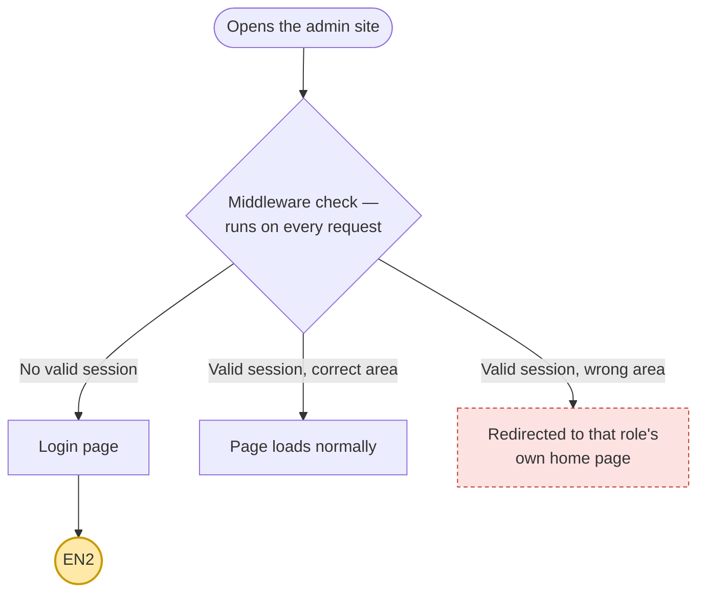
```mermaid
flowchart TD
    START(["Opens the admin site"]) --> MW{"Middleware check —<br/>runs on every request"}
    MW -->|"No valid session"| LOGIN["Login page"]
    MW -->|"Valid session, correct area"| PASS["Page loads normally"]
    MW -->|"Valid session, wrong area"| REDIR["Redirected to that role's<br/>own home page"]
    LOGIN --> OUT(("EN2"))

    classDef connector fill:#FFE9A8,stroke:#C79A00,stroke-width:2px
    classDef errorNode fill:#FDE2E2,stroke:#C0392B,stroke-dasharray:4 3
    class OUT connector
    class REDIR errorNode
```

**Note:** route protection is **real and server-side** — it verifies the session and
the role on every request, not a client-side redirect that could be bypassed.

## EN2 — Signing in

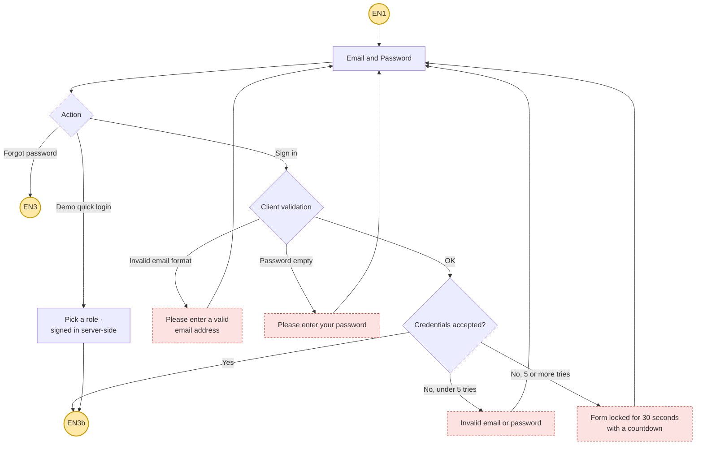
```mermaid
flowchart TD
    IN(("EN1")) --> FORM["Email and Password"]
    FORM --> ACT{"Action"}
    ACT -->|"Forgot password"| GOEN3(("EN3"))
    ACT -->|"Demo quick login"| DEMO["Pick a role ·<br/>signed in server-side"]
    ACT -->|"Sign in"| VAL{"Client validation"}

    VAL -->|"Invalid email format"| E1["Please enter a valid<br/>email address"]
    VAL -->|"Password empty"| E2["Please enter your password"]
    VAL -->|"OK"| AUTH{"Credentials accepted?"}
    E1 --> FORM
    E2 --> FORM

    AUTH -->|"No, under 5 tries"| E3["Invalid email or password"]
    AUTH -->|"No, 5 or more tries"| LOCK["Form locked for 30 seconds<br/>with a countdown"]
    AUTH -->|"Yes"| OUT(("EN3b"))
    E3 --> FORM
    LOCK --> FORM
    DEMO --> OUT

    classDef connector fill:#FFE9A8,stroke:#C79A00,stroke-width:2px
    classDef errorNode fill:#FDE2E2,stroke:#C0392B,stroke-dasharray:4 3
    class IN,GOEN3,OUT connector
    class E1,E2,E3,LOCK errorNode
```

**Note:** the 5-attempt lockout is **client-side friction only** — real rate limiting
happens on the server. Do not describe it as a security control.

## EN3 — Role routing and password reset

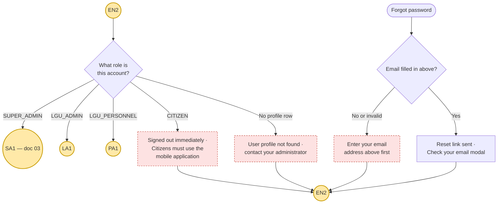
```mermaid
flowchart TD
    IN(("EN2")) --> ROLE{"What role is<br/>this account?"}
    ROLE -->|"SUPER_ADMIN"| GOSA(("SA1 — doc 03"))
    ROLE -->|"LGU_ADMIN"| GOLA(("LA1"))
    ROLE -->|"LGU_PERSONNEL"| GOPA(("PA1"))
    ROLE -->|"CITIZEN"| KICK["Signed out immediately ·<br/>Citizens must use the<br/>mobile application"]
    ROLE -->|"No profile row"| NOPROF["User profile not found ·<br/>contact your administrator"]
    KICK --> BACK(("EN2"))
    NOPROF --> BACK

    RESET(["Forgot password"]) --> RVAL{"Email filled in above?"}
    RVAL -->|"No or invalid"| RE["Enter your email<br/>address above first"]
    RVAL -->|"Yes"| RSENT["Reset link sent ·<br/>Check your email modal"]
    RE --> BACK
    RSENT --> BACK

    classDef connector fill:#FFE9A8,stroke:#C79A00,stroke-width:2px
    classDef errorNode fill:#FDE2E2,stroke:#C0392B,stroke-dasharray:4 3
    class IN,GOSA,GOLA,GOPA,BACK connector
    class KICK,NOPROF,RE errorNode
```

**Note:** a citizen account is **actively rejected**, not merely redirected — the
session is signed out.

---

# LA — Admin shell

## LA1 — Sidebar navigation

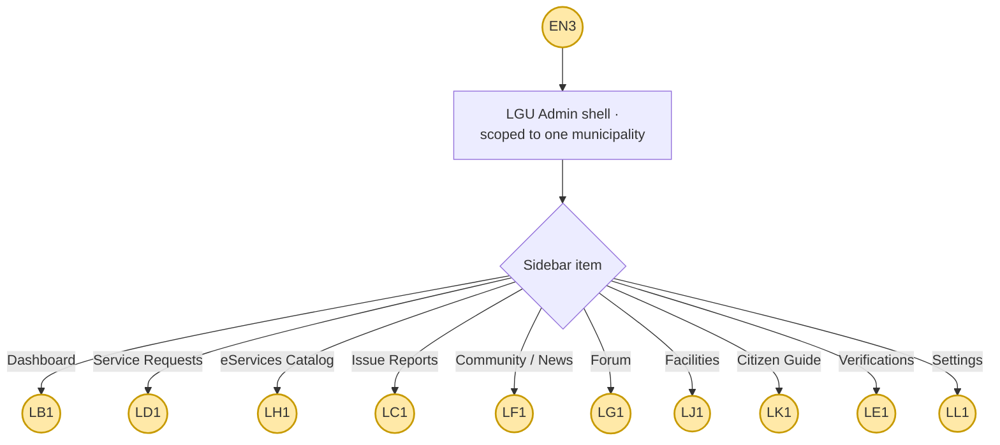
```mermaid
flowchart TD
    IN(("EN3")) --> SHELL["LGU Admin shell ·<br/>scoped to one municipality"]
    SHELL --> NAV{"Sidebar item"}
    NAV -->|"Dashboard"| GOB(("LB1"))
    NAV -->|"Service Requests"| GOD(("LD1"))
    NAV -->|"eServices Catalog"| GOH(("LH1"))
    NAV -->|"Issue Reports"| GOC(("LC1"))
    NAV -->|"Community / News"| GOF(("LF1"))
    NAV -->|"Forum"| GOG(("LG1"))
    NAV -->|"Facilities"| GOJ(("LJ1"))
    NAV -->|"Citizen Guide"| GOK(("LK1"))
    NAV -->|"Verifications"| GOE(("LE1"))
    NAV -->|"Settings"| GOL(("LL1"))

    classDef connector fill:#FFE9A8,stroke:#C79A00,stroke-width:2px
    class IN,GOB,GOC,GOD,GOE,GOF,GOG,GOH,GOJ,GOK,GOL connector
```

**Note:** every page is **scoped to the admin's own municipality**, enforced by
database rules rather than by the interface.

## LA2 — Navigation badges

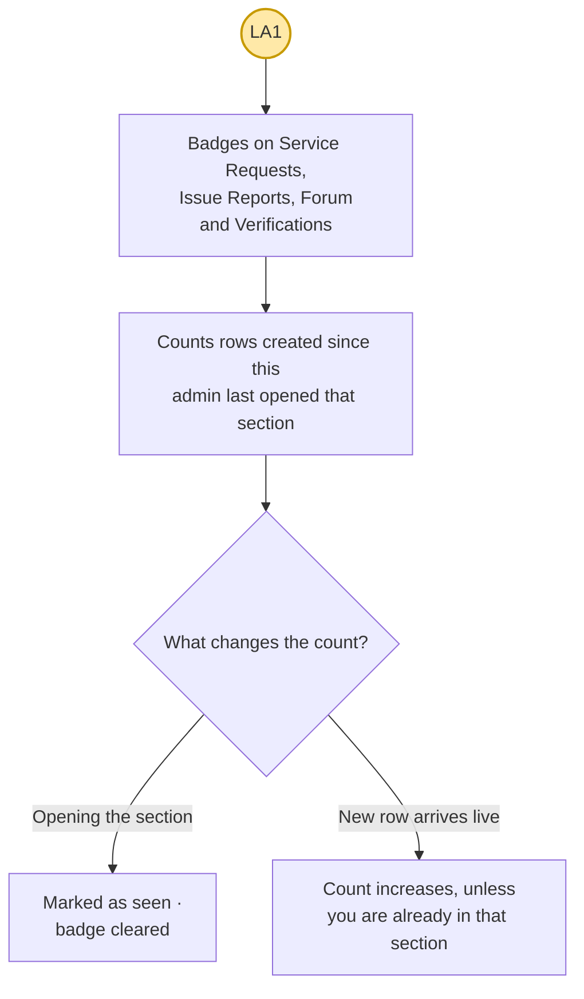
```mermaid
flowchart TD
    IN(("LA1")) --> BADGE["Badges on Service Requests,<br/>Issue Reports, Forum<br/>and Verifications"]
    BADGE --> COUNT["Counts rows created since this<br/>admin last opened that section"]
    COUNT --> EVENTS{"What changes the count?"}
    EVENTS -->|"Opening the section"| CLEAR["Marked as seen ·<br/>badge cleared"]
    EVENTS -->|"New row arrives live"| BUMP["Count increases, unless<br/>you are already in that section"]

    classDef connector fill:#FFE9A8,stroke:#C79A00,stroke-width:2px
    class IN connector
```

## LA3 — Notification bell

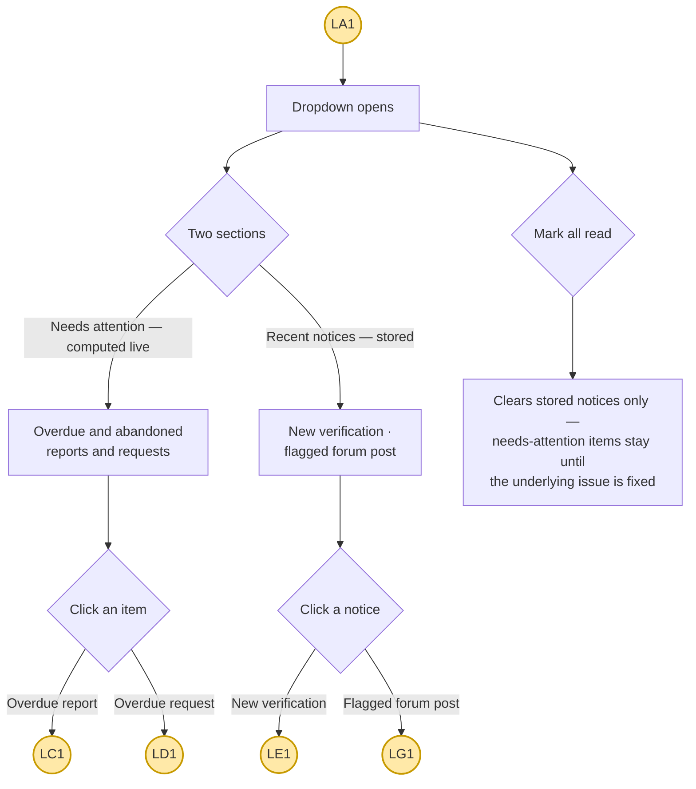
```mermaid
flowchart TD
    IN(("LA1")) --> OPEN["Dropdown opens"]
    OPEN --> SECT{"Two sections"}
    SECT -->|"Needs attention — computed live"| S1["Overdue and abandoned<br/>reports and requests"]
    SECT -->|"Recent notices — stored"| S2["New verification ·<br/>flagged forum post"]

    S1 --> C1{"Click an item"}
    C1 -->|"Overdue report"| GOC(("LC1"))
    C1 -->|"Overdue request"| GOD(("LD1"))

    S2 --> C2{"Click a notice"}
    C2 -->|"New verification"| GOE(("LE1"))
    C2 -->|"Flagged forum post"| GOG(("LG1"))

    OPEN --> MARK{"Mark all read"}
    MARK --> CLEARED["Clears stored notices only —<br/>needs-attention items stay until<br/>the underlying issue is fixed"]

    classDef connector fill:#FFE9A8,stroke:#C79A00,stroke-width:2px
    class IN,GOC,GOD,GOE,GOG connector
```

**Note:** good behaviour — "mark all read" **cannot hide a genuinely overdue item**.

---

# LB — Dashboard

## LB1 — Loading and stat cards

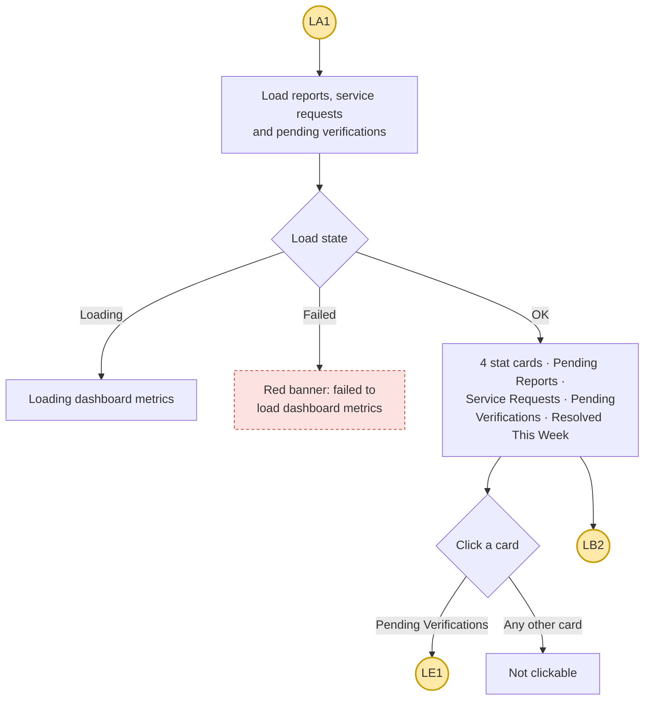
```mermaid
flowchart TD
    IN(("LA1")) --> LOAD["Load reports, service requests<br/>and pending verifications"]
    LOAD --> STATE{"Load state"}
    STATE -->|"Loading"| SPIN["Loading dashboard metrics"]
    STATE -->|"Failed"| ERR["Red banner: failed to<br/>load dashboard metrics"]
    STATE -->|"OK"| CARDS["4 stat cards · Pending Reports ·<br/>Service Requests · Pending<br/>Verifications · Resolved This Week"]

    CARDS --> CLICK{"Click a card"}
    CLICK -->|"Pending Verifications"| GOE(("LE1"))
    CLICK -->|"Any other card"| NOOP["Not clickable"]
    CARDS --> MORE(("LB2"))

    classDef connector fill:#FFE9A8,stroke:#C79A00,stroke-width:2px
    classDef errorNode fill:#FDE2E2,stroke:#C0392B,stroke-dasharray:4 3
    class IN,GOE,MORE connector
    class ERR errorNode
```

## LB2 — Map and category distribution

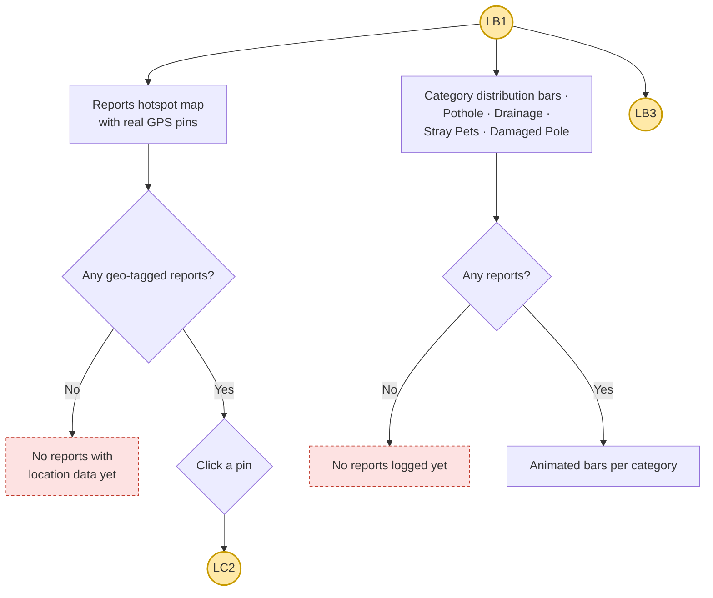
```mermaid
flowchart TD
    IN(("LB1")) --> MAP["Reports hotspot map<br/>with real GPS pins"]
    MAP --> MQ{"Any geo-tagged reports?"}
    MQ -->|"No"| MEMPTY["No reports with<br/>location data yet"]
    MQ -->|"Yes"| PIN{"Click a pin"}
    PIN --> GOC(("LC2"))

    IN --> DIST["Category distribution bars ·<br/>Pothole · Drainage ·<br/>Stray Pets · Damaged Pole"]
    DIST --> DQ{"Any reports?"}
    DQ -->|"No"| DEMPTY["No reports logged yet"]
    DQ -->|"Yes"| BARS["Animated bars per category"]
    IN --> NEXT(("LB3"))

    classDef connector fill:#FFE9A8,stroke:#C79A00,stroke-width:2px
    classDef errorNode fill:#FDE2E2,stroke:#C0392B,stroke-dasharray:4 3
    class IN,GOC,NEXT connector
    class MEMPTY,DEMPTY errorNode
```

## LB3 — Recent submissions

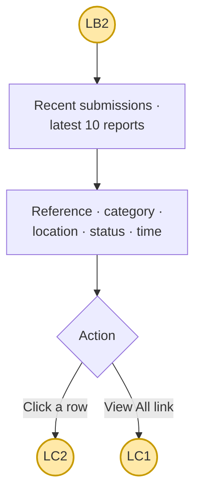
```mermaid
flowchart TD
    IN(("LB2")) --> TABLE["Recent submissions ·<br/>latest 10 reports"]
    TABLE --> COLS["Reference · category ·<br/>location · status · time"]
    COLS --> ACT{"Action"}
    ACT -->|"Click a row"| GOC(("LC2"))
    ACT -->|"View All link"| GOCL(("LC1"))

    classDef connector fill:#FFE9A8,stroke:#C79A00,stroke-width:2px
    class IN,GOC,GOCL connector
```

**Note:** the dashboard is **read-only** — every action is a link into a queue.

---

# LC — Issue reports queue

## LC1 — List and filters

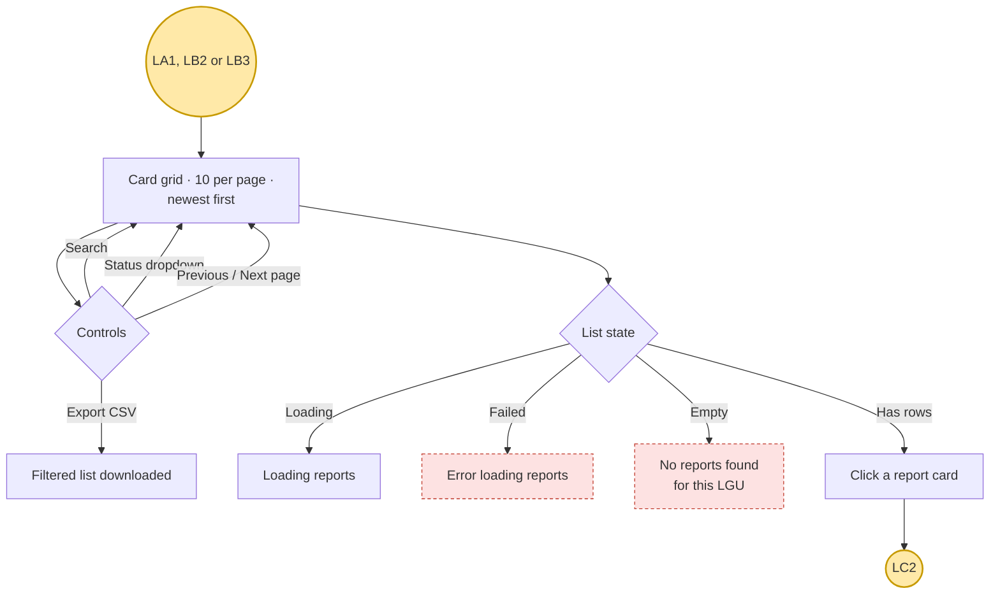
```mermaid
flowchart TD
    IN(("LA1, LB2 or LB3")) --> LIST["Card grid · 10 per page ·<br/>newest first"]
    LIST --> FILT{"Controls"}
    FILT -->|"Search"| LIST
    FILT -->|"Status dropdown"| LIST
    FILT -->|"Previous / Next page"| LIST
    FILT -->|"Export CSV"| CSV["Filtered list downloaded"]

    LIST --> STATE{"List state"}
    STATE -->|"Loading"| LOADING["Loading reports"]
    STATE -->|"Failed"| ERR["Error loading reports"]
    STATE -->|"Empty"| EMPTY["No reports found<br/>for this LGU"]
    STATE -->|"Has rows"| SELECT["Click a report card"]
    SELECT --> OUT(("LC2"))

    classDef connector fill:#FFE9A8,stroke:#C79A00,stroke-width:2px
    classDef errorNode fill:#FDE2E2,stroke:#C0392B,stroke-dasharray:4 3
    class IN,OUT connector
    class ERR,EMPTY errorNode
```

**Note:** the status filter offers no "Rejected" option even though rejected is a
real status.

## LC2 — Report detail and AI badge

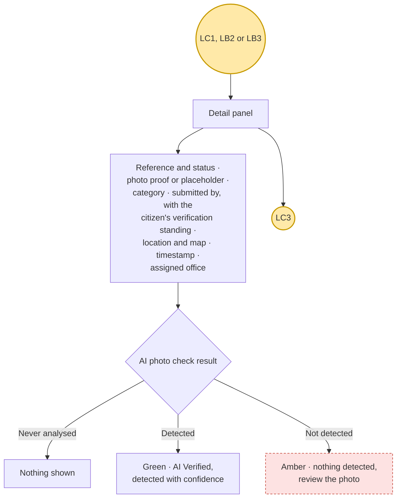
```mermaid
flowchart TD
    IN(("LC1, LB2 or LB3")) --> DETAIL["Detail panel"]
    DETAIL --> PARTS["Reference and status ·<br/>photo proof or placeholder ·<br/>category · submitted by, with the<br/>citizen's verification standing ·<br/>location and map · timestamp ·<br/>assigned office"]

    PARTS --> ML{"AI photo check result"}
    ML -->|"Never analysed"| MLNONE["Nothing shown"]
    ML -->|"Detected"| MLYES["Green · AI Verified,<br/>detected with confidence"]
    ML -->|"Not detected"| MLNO["Amber · nothing detected,<br/>review the photo"]

    DETAIL --> OUT(("LC3"))

    classDef connector fill:#FFE9A8,stroke:#C79A00,stroke-width:2px
    classDef errorNode fill:#FDE2E2,stroke:#C0392B,stroke-dasharray:4 3
    class IN,OUT connector
    class MLNO errorNode
```

**Note:** the tri-state AI badge is **correctly implemented** — "not detected" looks
different from "never analysed", which matters because they mean very different things.

## LC3 — Status actions

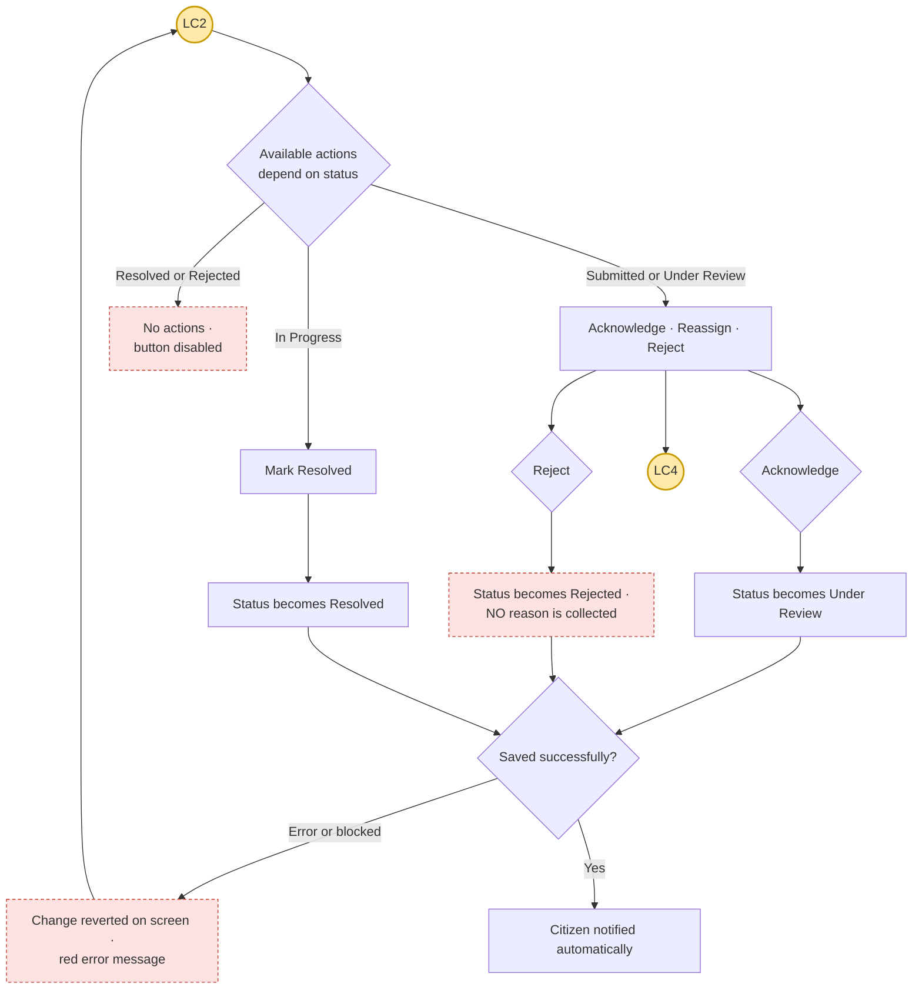
```mermaid
flowchart TD
    IN(("LC2")) --> ACT{"Available actions<br/>depend on status"}
    ACT -->|"Submitted or Under Review"| A1["Acknowledge · Reassign · Reject"]
    ACT -->|"In Progress"| A2["Mark Resolved"]
    ACT -->|"Resolved or Rejected"| A3["No actions ·<br/>button disabled"]

    A1 --> ACK{"Acknowledge"}
    ACK --> T1["Status becomes Under Review"]
    A1 --> REJ{"Reject"}
    REJ --> T2["Status becomes Rejected ·<br/>NO reason is collected"]
    A1 --> REASSIGN(("LC4"))
    A2 --> T3["Status becomes Resolved"]

    T1 --> SAVE
    T2 --> SAVE
    T3 --> SAVE
    SAVE{"Saved successfully?"}
    SAVE -->|"Error or blocked"| ROLL["Change reverted on screen ·<br/>red error message"]
    SAVE -->|"Yes"| OK["Citizen notified automatically"]
    ROLL --> IN

    classDef connector fill:#FFE9A8,stroke:#C79A00,stroke-width:2px
    classDef errorNode fill:#FDE2E2,stroke:#C0392B,stroke-dasharray:4 3
    class IN,REASSIGN connector
    class T2,ROLL,A3 errorNode
```

**Notes — two real gaps**
1. **Rejecting collects no reason.** Services and verifications both require one; the
   citizen is told "rejected" with **no explanation**.
2. **Nothing here moves a report to In Progress**, yet Mark Resolved only appears
   *for* In Progress — so a report can get stuck at Under Review. The personnel screen
   (**PB1**) has the missing button.

## LC4 — Reassigning to an office

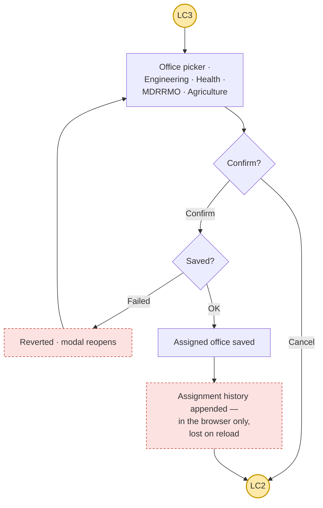
```mermaid
flowchart TD
    IN(("LC3")) --> MODAL["Office picker ·<br/>Engineering · Health ·<br/>MDRRMO · Agriculture"]
    MODAL --> Q{"Confirm?"}
    Q -->|"Cancel"| BACK(("LC2"))
    Q -->|"Confirm"| SAVE{"Saved?"}
    SAVE -->|"Failed"| ERR["Reverted · modal reopens"]
    SAVE -->|"OK"| OK["Assigned office saved"]
    ERR --> MODAL
    OK --> HIST["Assignment history appended —<br/>in the browser only,<br/>lost on reload"]
    HIST --> BACK

    classDef connector fill:#FFE9A8,stroke:#C79A00,stroke-width:2px
    classDef errorNode fill:#FDE2E2,stroke:#C0392B,stroke-dasharray:4 3
    class IN,BACK connector
    class ERR,HIST errorNode
```

**Note:** **assignment history is not saved** — it disappears on reload. Either
persist it or remove it.

---

# LD — Service requests queue

## LD1 — List and filters

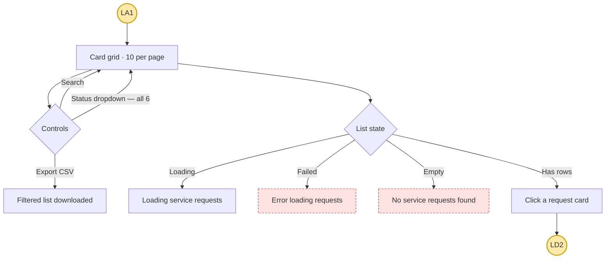
```mermaid
flowchart TD
    IN(("LA1")) --> LIST["Card grid · 10 per page"]
    LIST --> FILT{"Controls"}
    FILT -->|"Search"| LIST
    FILT -->|"Status dropdown — all 6"| LIST
    FILT -->|"Export CSV"| CSV["Filtered list downloaded"]

    LIST --> STATE{"List state"}
    STATE -->|"Loading"| LOADING["Loading service requests"]
    STATE -->|"Failed"| ERR["Error loading requests"]
    STATE -->|"Empty"| EMPTY["No service requests found"]
    STATE -->|"Has rows"| SELECT["Click a request card"]
    SELECT --> OUT(("LD2"))

    classDef connector fill:#FFE9A8,stroke:#C79A00,stroke-width:2px
    classDef errorNode fill:#FDE2E2,stroke:#C0392B,stroke-dasharray:4 3
    class IN,OUT connector
    class ERR,EMPTY errorNode
```

**Note:** this CSV export **lacks the spreadsheet-formula protection** that the
reports export has — a malicious value could execute when opened in Excel.

## LD2 — Request detail

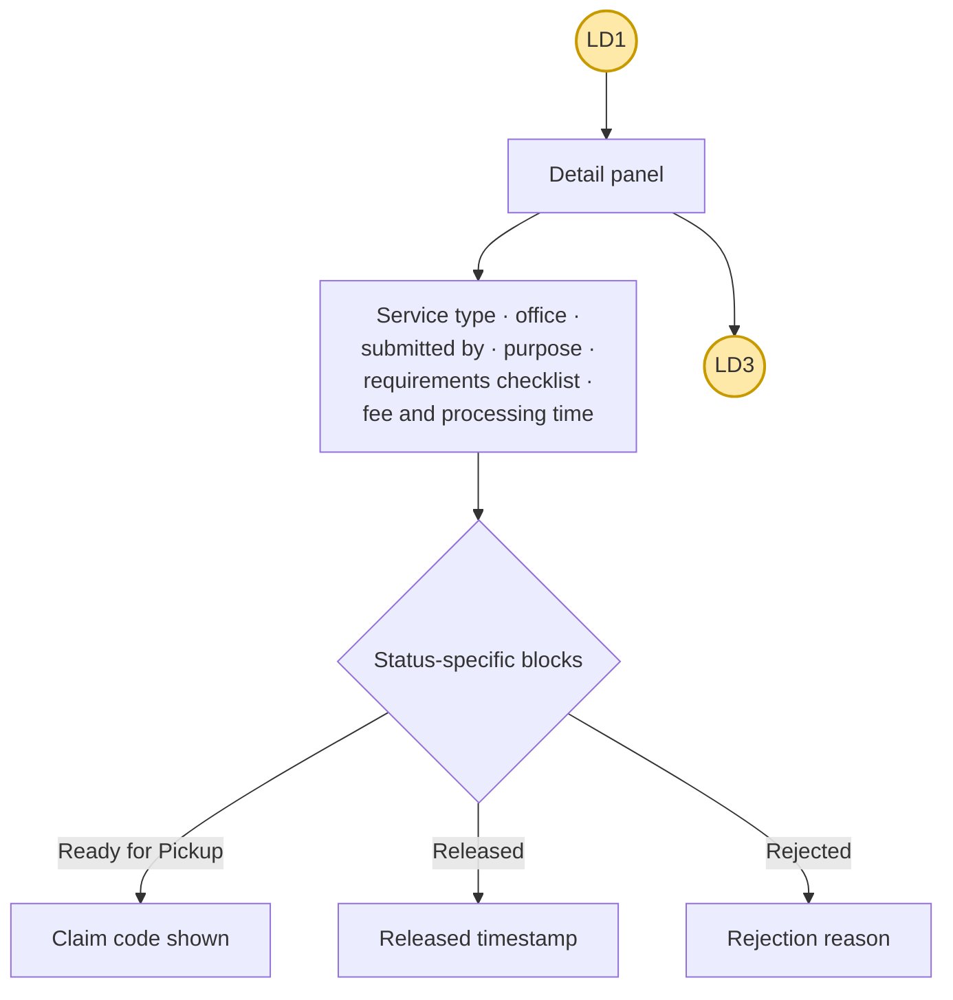
```mermaid
flowchart TD
    IN(("LD1")) --> DETAIL["Detail panel"]
    DETAIL --> PARTS["Service type · office ·<br/>submitted by · purpose ·<br/>requirements checklist ·<br/>fee and processing time"]
    PARTS --> COND{"Status-specific blocks"}
    COND -->|"Ready for Pickup"| C1["Claim code shown"]
    COND -->|"Released"| C2["Released timestamp"]
    COND -->|"Rejected"| C3["Rejection reason"]
    DETAIL --> OUT(("LD3"))

    classDef connector fill:#FFE9A8,stroke:#C79A00,stroke-width:2px
    class IN,OUT connector
```

**Note:** the assigned-personnel field is **displayed but never editable** — there is
no way to assign a request to a specific staff member.

## LD3 — Status progression

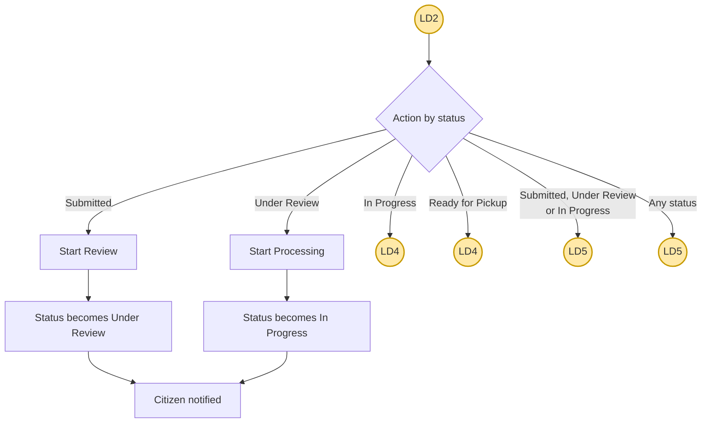
```mermaid
flowchart TD
    IN(("LD2")) --> ACT{"Action by status"}
    ACT -->|"Submitted"| S1["Start Review"]
    ACT -->|"Under Review"| S2["Start Processing"]
    ACT -->|"In Progress"| S3(("LD4"))
    ACT -->|"Ready for Pickup"| S4(("LD4"))
    ACT -->|"Submitted, Under Review<br/>or In Progress"| S5(("LD5"))
    ACT -->|"Any status"| S6(("LD5"))

    S1 --> T1["Status becomes Under Review"]
    S2 --> T2["Status becomes In Progress"]
    T1 --> NOTIFY["Citizen notified"]
    T2 --> NOTIFY

    classDef connector fill:#FFE9A8,stroke:#C79A00,stroke-width:2px
    class IN,S3,S4,S5,S6 connector
```

**Note:** unlike reports (**LC3**), this queue has a **complete lifecycle** — every
transition has a button. Use it as the model when fixing reports.

## LD4 — Claim code and release

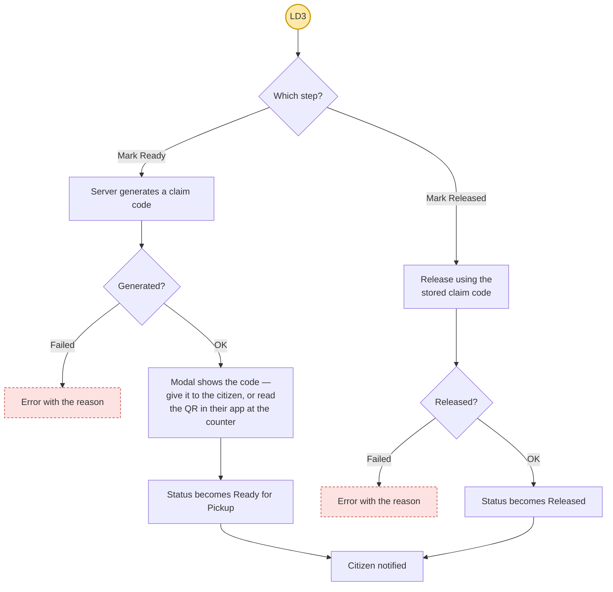
```mermaid
flowchart TD
    IN(("LD3")) --> WHICH{"Which step?"}
    WHICH -->|"Mark Ready"| GEN["Server generates a claim code"]
    WHICH -->|"Mark Released"| REL["Release using the<br/>stored claim code"]

    GEN --> GQ{"Generated?"}
    GQ -->|"Failed"| GE["Error with the reason"]
    GQ -->|"OK"| MODAL["Modal shows the code —<br/>give it to the citizen, or read<br/>the QR in their app at the counter"]
    MODAL --> T1["Status becomes Ready for Pickup"]

    REL --> RQ{"Released?"}
    RQ -->|"Failed"| RE["Error with the reason"]
    RQ -->|"OK"| T2["Status becomes Released"]

    T1 --> NOTIFY["Citizen notified"]
    T2 --> NOTIFY

    classDef connector fill:#FFE9A8,stroke:#C79A00,stroke-width:2px
    classDef errorNode fill:#FDE2E2,stroke:#C0392B,stroke-dasharray:4 3
    class IN connector
    class GE,RE errorNode
```

**Notes**
- The claim code is generated **server-side**, so it cannot be forged by an admin.
- **There is no QR scanner in the admin interface.** Release happens by pressing a
  button on an already-open request; the citizen's QR is read visually. If you intend
  a real scan-to-release workflow, it does not exist yet.

## LD5 — Reject and print

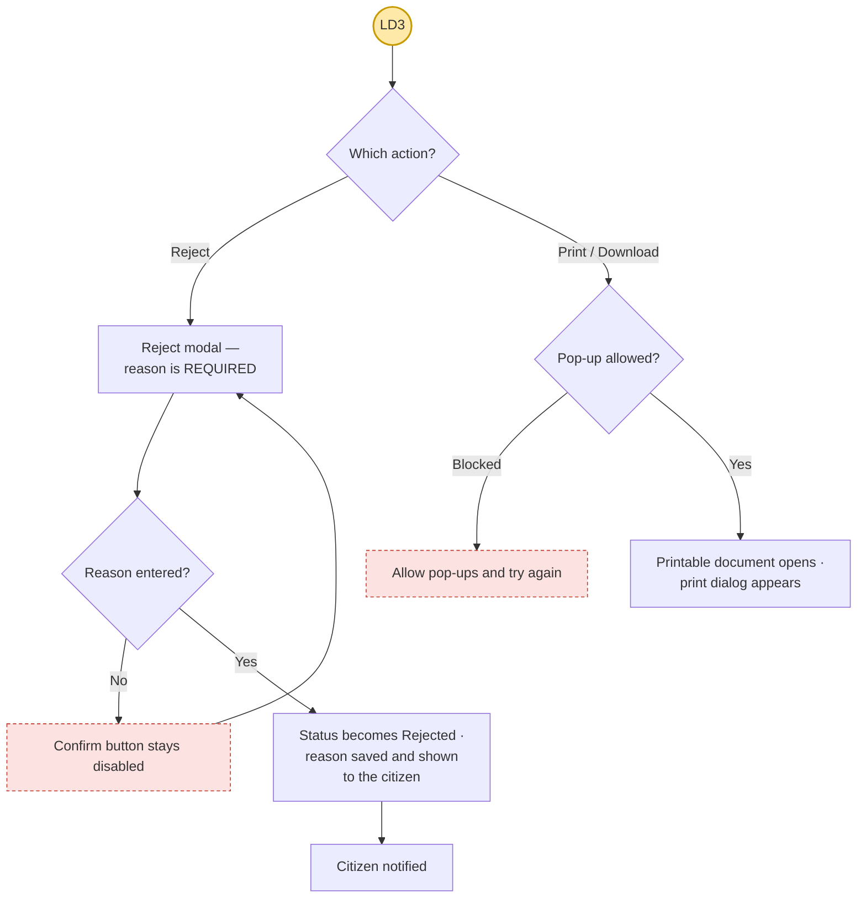
```mermaid
flowchart TD
    IN(("LD3")) --> WHICH{"Which action?"}
    WHICH -->|"Reject"| MODAL["Reject modal —<br/>reason is REQUIRED"]
    WHICH -->|"Print / Download"| PRINT{"Pop-up allowed?"}

    MODAL --> VAL{"Reason entered?"}
    VAL -->|"No"| DIS["Confirm button stays disabled"]
    VAL -->|"Yes"| T["Status becomes Rejected ·<br/>reason saved and shown<br/>to the citizen"]
    DIS --> MODAL
    T --> NOTIFY["Citizen notified"]

    PRINT -->|"Blocked"| PE["Allow pop-ups and try again"]
    PRINT -->|"Yes"| DOC["Printable document opens ·<br/>print dialog appears"]

    classDef connector fill:#FFE9A8,stroke:#C79A00,stroke-width:2px
    classDef errorNode fill:#FDE2E2,stroke:#C0392B,stroke-dasharray:4 3
    class IN connector
    class DIS,PE errorNode
```

---

# LE — Citizen verifications

## LE1 — The queue

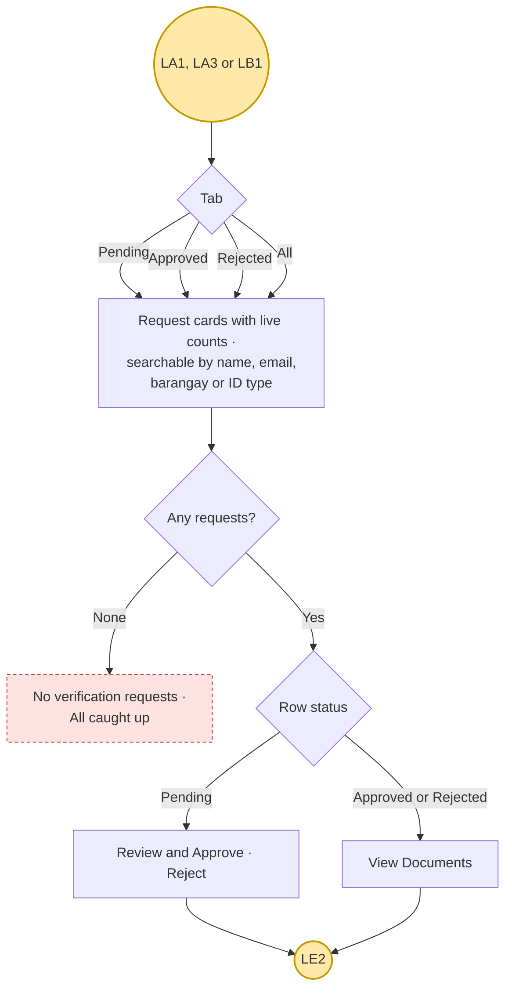
```mermaid
flowchart TD
    IN(("LA1, LA3 or LB1")) --> TABS{"Tab"}
    TABS -->|"Pending"| LIST
    TABS -->|"Approved"| LIST
    TABS -->|"Rejected"| LIST
    TABS -->|"All"| LIST

    LIST["Request cards with live counts ·<br/>searchable by name, email,<br/>barangay or ID type"]
    LIST --> EMPTYQ{"Any requests?"}
    EMPTYQ -->|"None"| EMPTY["No verification requests ·<br/>All caught up"]
    EMPTYQ -->|"Yes"| ROW{"Row status"}
    ROW -->|"Pending"| P["Review and Approve · Reject"]
    ROW -->|"Approved or Rejected"| V["View Documents"]
    P --> OUT(("LE2"))
    V --> OUT

    classDef connector fill:#FFE9A8,stroke:#C79A00,stroke-width:2px
    classDef errorNode fill:#FDE2E2,stroke:#C0392B,stroke-dasharray:4 3
    class IN,OUT connector
    class EMPTY errorNode
```

**Note:** **a failure to load this queue shows nothing at all** — the admin sees an
empty list and assumes there is no work. Worth fixing.

## LE2 — Reviewing the documents

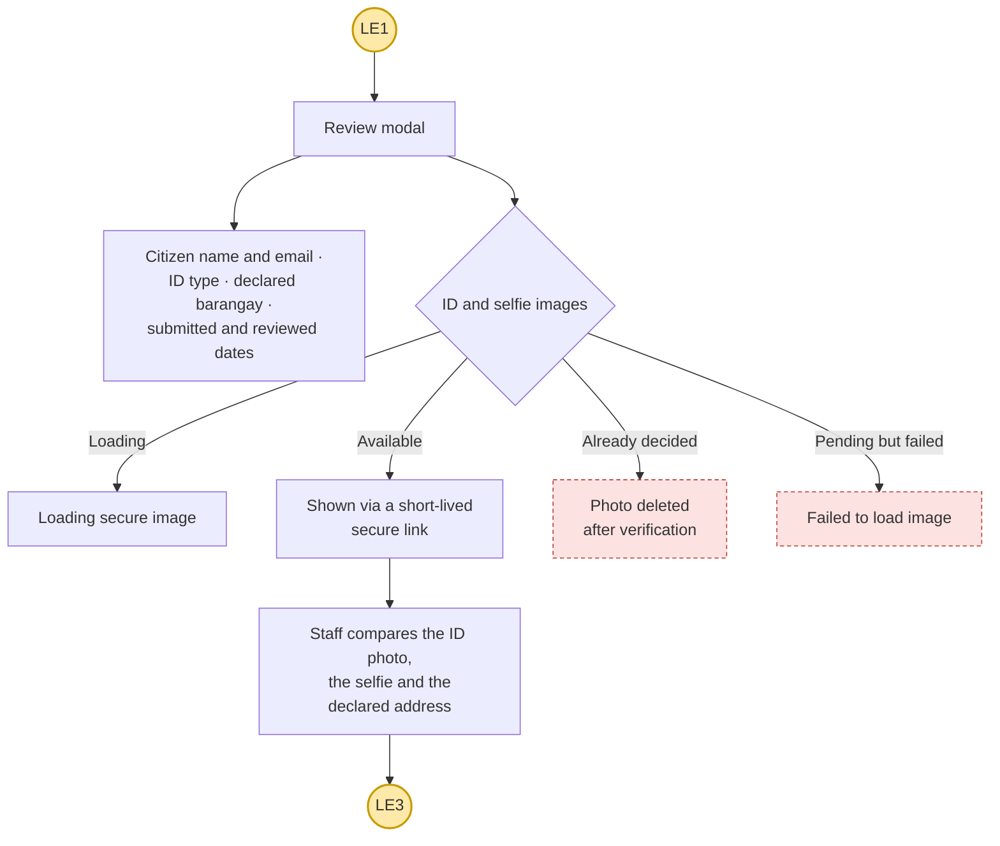
```mermaid
flowchart TD
    IN(("LE1")) --> MODAL["Review modal"]
    MODAL --> INFO["Citizen name and email ·<br/>ID type · declared barangay ·<br/>submitted and reviewed dates"]
    MODAL --> PHOTOS{"ID and selfie images"}
    PHOTOS -->|"Loading"| PL["Loading secure image"]
    PHOTOS -->|"Available"| SHOW["Shown via a short-lived<br/>secure link"]
    PHOTOS -->|"Already decided"| GONE["Photo deleted<br/>after verification"]
    PHOTOS -->|"Pending but failed"| FAIL["Failed to load image"]

    SHOW --> COMPARE["Staff compares the ID photo,<br/>the selfie and the<br/>declared address"]
    COMPARE --> OUT(("LE3"))

    classDef connector fill:#FFE9A8,stroke:#C79A00,stroke-width:2px
    classDef errorNode fill:#FDE2E2,stroke:#C0392B,stroke-dasharray:4 3
    class IN,OUT connector
    class GONE,FAIL errorNode
```

**Note:** photos are served through **short-lived secure links**, never public URLs.

## LE3 — Approve or reject

```mermaid
flowchart TD
    IN(("LE2")) --> DECIDE{"Decision"}
    DECIDE -->|"Approve"| APP["Citizen becomes Verified"]
    DECIDE -->|"Reject"| MODAL["Reject modal —<br/>reason is REQUIRED"]

    MODAL --> VAL{"Reason entered?"}
    VAL -->|"No"| DIS["Confirm disabled ·<br/>asks for a reason"]
    VAL -->|"Yes"| REJ["Citizen becomes Rejected ·<br/>reason saved"]
    DIS --> MODAL

    APP --> PURGE
    REJ --> PURGE
    PURGE["ID and selfie photos deleted<br/>from storage immediately"]
    PURGE --> NOTIFY["Citizen notified ·<br/>rejection includes the reason"]
    APP --> UNLOCK["Citizen can now submit reports,<br/>service requests and forum posts"]
    REJ --> RESUB["Citizen may correct<br/>and resubmit"]

    classDef connector fill:#FFE9A8,stroke:#C79A00,stroke-width:2px
    classDef errorNode fill:#FDE2E2,stroke:#C0392B,stroke-dasharray:4 3
    class IN connector
    class DIS,REJ errorNode
```

**Notes**
- **This is the gate that unlocks the whole citizen app.**
- **Photos are deleted the moment a decision is recorded** — a deliberate data
  minimisation choice under the Data Privacy Act. State the trade-off too: a disputed
  decision cannot be re-examined afterwards.

---

# LF — News & announcements

## LF1 — The list

```mermaid
flowchart TD
    IN(("LA1")) --> LIST["Single list, newest first —<br/>no tabs, no search"]
    LIST --> EMPTYQ{"Any items?"}
    EMPTYQ -->|"None"| EMPTY["No announcements yet ·<br/>Create First button"]
    EMPTYQ -->|"Yes"| ROWS["Title · status · public or private ·<br/>type · preview · views · expiry"]

    LIST --> ACT{"Action"}
    ACT -->|"Make News"| GOF2(("LF2"))
    ACT -->|"Make Announcement"| GOF2
    ACT -->|"Make Advisory"| GOF2
    ROWS --> EDIT{"Row action"}
    EDIT -->|"Edit"| GOF2
    EDIT -->|"Archive, Publish or Delete"| GOF4(("LF4"))

    classDef connector fill:#FFE9A8,stroke:#C79A00,stroke-width:2px
    classDef errorNode fill:#FDE2E2,stroke:#C0392B,stroke-dasharray:4 3
    class IN,GOF2,GOF4 connector
    class EMPTY errorNode
```

## LF2 — Composing an item

```mermaid
flowchart TD
    IN(("LF1")) --> FORM["Title · Content ·<br/>Visible to Citizens checkbox ·<br/>Attachments"]
    FORM --> TYPEQ{"Announcement or advisory?"}
    TYPEQ -->|"Yes"| DUR["Duration · manual, 2, 4,<br/>12 or 24 hours"]
    TYPEQ -->|"Plain news"| NODUR["No expiry option"]
    DUR --> OUT
    NODUR --> OUT
    OUT(("LF3"))

    classDef connector fill:#FFE9A8,stroke:#C79A00,stroke-width:2px
    class IN,OUT connector
```

**Note:** the attachment hint says "Max 5MB each" but **no size check is performed** —
a large file fails at upload with a generic message.

## LF3 — Publishing or scheduling

```mermaid
flowchart TD
    IN(("LF2")) --> HOW{"How to save?"}
    HOW -->|"Publish Now"| PVAL{"Title and content filled?"}
    HOW -->|"Schedule"| SMODAL["Pick a date and time"]

    PVAL -->|"No"| PE["Enter a title and content"]
    PVAL -->|"Yes"| UP1["Upload attachments"]
    PE --> BACK(("LF2"))

    SMODAL --> SVAL{"Date and time chosen?"}
    SVAL -->|"No"| SE["Select a date and time"]
    SVAL -->|"Yes"| UP2["Upload attachments"]
    SE --> SMODAL

    UP1 --> Q1{"Upload OK?"}
    UP2 --> Q2{"Upload OK?"}
    Q1 -->|"Failed"| UE["Upload failed ·<br/>the whole save is abandoned"]
    Q2 -->|"Failed"| UE
    Q1 -->|"OK"| PUB["Published · live in the<br/>citizen app now"]
    Q2 -->|"OK"| SCH["Scheduled · waits for its time"]
    UE --> BACK

    classDef connector fill:#FFE9A8,stroke:#C79A00,stroke-width:2px
    classDef errorNode fill:#FDE2E2,stroke:#C0392B,stroke-dasharray:4 3
    class IN,BACK connector
    class PE,SE,UE errorNode
```

**Note:** **"Draft" status exists in the data model but no button creates one.**
Every save is either Published or Scheduled.

## LF4 — Archive, republish, delete

```mermaid
flowchart TD
    IN(("LF1")) --> ACT{"Which action?"}
    ACT -->|"Archive — published items"| ARCH["Status becomes Archived ·<br/>moves to the citizen Archives tab"]
    ACT -->|"Publish — archived items"| REPUB["Status becomes Published"]
    ACT -->|"Delete"| CONF{"Confirm delete?"}
    CONF -->|"Cancel"| BACK(("LF1"))
    CONF -->|"Delete"| GONE["Permanently removed"]

    classDef connector fill:#FFE9A8,stroke:#C79A00,stroke-width:2px
    classDef errorNode fill:#FDE2E2,stroke:#C0392B,stroke-dasharray:4 3
    class IN,BACK connector
    class GONE errorNode
```

**Note:** the delete confirmation shows the **raw internal ID** rather than the title.

---

# LG — Forum moderation

## LG1 — The moderation queue

```mermaid
flowchart TD
    IN(("LA1 or LA3")) --> TABS{"Tab"}
    TABS -->|"Pending — with count"| LIST
    TABS -->|"Flagged — with count, red"| LIST
    TABS -->|"All Posts"| LIST

    LIST["Post list, searchable by<br/>author or content"]
    LIST --> EMPTYQ{"Any posts?"}
    EMPTYQ -->|"None"| EMPTY["No posts found<br/>matching your criteria"]
    EMPTYQ -->|"Yes"| CARD["Author · time · status ·<br/>content"]
    CARD --> FLAGQ{"Was it flagged?"}
    FLAGQ -->|"Yes"| REASON["Red box listing the words<br/>that triggered it"]
    FLAGQ -->|"No"| PLAIN["Shown normally"]
    CARD --> OUT(("LG2"))
    CARD --> COMM(("LG3"))

    classDef connector fill:#FFE9A8,stroke:#C79A00,stroke-width:2px
    classDef errorNode fill:#FDE2E2,stroke:#C0392B,stroke-dasharray:4 3
    class IN,OUT,COMM connector
    class EMPTY errorNode
```

**Note:** posts arrive here already screened twice — a word list in the mobile app and
a database rule. This queue is the **human third pass**. Load failures are captured but
**never shown**, the same silent-failure pattern as the verifications queue.

## LG2 — Acting on a post

```mermaid
flowchart TD
    IN(("LG1")) --> ACT{"Action — only if<br/>not yet approved"}
    ACT -->|"Approve"| APP["Visible to everyone ·<br/>flags cleared"]
    ACT -->|"Edit"| EDIT["Inline editor"]
    ACT -->|"Reject"| REJ["Post PERMANENTLY DELETED"]

    EDIT --> ESAVE{"Save or cancel"}
    ESAVE -->|"Cancel"| BACK(("LG1"))
    ESAVE -->|"Save"| EQ{"Saved?"}
    EQ -->|"Failed"| EERR["Reverted · error shown"]
    EQ -->|"OK"| EOK["Content updated"]

    APP --> AQ{"Saved?"}
    AQ -->|"Failed"| AERR["Reverted · error shown"]
    AQ -->|"OK"| VISIBLE["Now visible in the citizen app"]

    REJ --> GONE["Removed from the database ·<br/>the author is NOT notified<br/>and cannot see what happened"]

    classDef connector fill:#FFE9A8,stroke:#C79A00,stroke-width:2px
    classDef errorNode fill:#FDE2E2,stroke:#C0392B,stroke-dasharray:4 3
    class IN,BACK connector
    class REJ,GONE,EERR,AERR errorNode
```

**Note — a significant concern:** "Reject" **permanently deletes the citizen's post**.
No soft-delete, no audit trail, and the author is never told — from their side it
simply vanishes and they will assume the app lost it. For a government platform, a
soft-delete plus a short "removed by a moderator" notice would be far more defensible
and is not hard to build.

## LG3 — Moderating comments

```mermaid
flowchart TD
    IN(("LG1")) --> EXPAND["Expand a post's comment thread"]
    EXPAND --> CLIST["Unapproved comments marked<br/>Pending or Flagged, with<br/>the triggering words"]
    CLIST --> ACT{"Comment action"}
    ACT -->|"Approve"| APP["Visible to everyone"]
    ACT -->|"Delete"| DEL["Permanently removed ·<br/>author not notified"]

    classDef connector fill:#FFE9A8,stroke:#C79A00,stroke-width:2px
    classDef errorNode fill:#FDE2E2,stroke:#C0392B,stroke-dasharray:4 3
    class IN connector
    class DEL errorNode
```

**Note:** comments can be approved or deleted, but **not edited**.

---

# LH — E-services catalog

## LH1 — The service list

```mermaid
flowchart TD
    IN(("LA1")) --> SPLIT["Form on the left,<br/>list on the right"]
    SPLIT --> LIST["Services ordered by<br/>the sort-order field"]
    LIST --> EMPTYQ{"Any services?"}
    EMPTYQ -->|"None"| EMPTY["No services yet —<br/>add the first from the form"]
    EMPTYQ -->|"Yes"| ROWS["Name · office · fee note ·<br/>Active or Hidden"]

    ROWS --> ACT{"Row action"}
    ACT -->|"Hide or Show"| TOGGLE["Hidden from or restored to<br/>the citizen catalog immediately"]
    ACT -->|"Click to edit"| OUT(("LH2"))
    SPLIT --> NEW["Blank form = create"]
    NEW --> OUT

    classDef connector fill:#FFE9A8,stroke:#C79A00,stroke-width:2px
    classDef errorNode fill:#FDE2E2,stroke:#C0392B,stroke-dasharray:4 3
    class IN,OUT connector
    class EMPTY errorNode
```

**Note:** **hide is safer than delete** — hiding preserves existing requests that
reference the service.

## LH2 — Creating or editing a service

```mermaid
flowchart TD
    IN(("LH1")) --> FORM["Office · Name · Description ·<br/>Requirements · Fee note ·<br/>Processing time · Sort order ·<br/>Active checkbox"]
    FORM --> REQ{"Requirements editor"}
    REQ -->|"Type and press Enter"| ADD["Requirement added"]
    REQ -->|"Remove"| DEL["Requirement removed"]

    FORM --> VAL{"Save"}
    VAL -->|"Office empty"| E1["Please enter the office name"]
    VAL -->|"Name empty"| E2["Please enter the service name"]
    VAL -->|"OK"| MODE{"Create or edit?"}
    E1 --> FORM
    E2 --> FORM

    MODE -->|"Create"| INS["Added to the citizen catalog"]
    MODE -->|"Edit"| UPD["Service updated"]

    FORM --> DELETE{"Delete — edit mode only"}
    DELETE --> DCONF{"Confirm removal?"}
    DCONF -->|"Cancel"| FORM
    DCONF -->|"Remove"| GONE["Citizens can no longer<br/>request this service"]

    INS --> LIVE["Live in the citizen<br/>app immediately"]
    UPD --> LIVE
    GONE --> LIVE

    classDef connector fill:#FFE9A8,stroke:#C79A00,stroke-width:2px
    classDef errorNode fill:#FDE2E2,stroke:#C0392B,stroke-dasharray:4 3
    class IN connector
    class E1,E2,GONE errorNode
```

---

# LJ — Facilities map

## LJ1 — Placing and selecting

```mermaid
flowchart TD
    IN(("LA1")) --> SCREEN["Map on one side,<br/>facility list on the other"]
    SCREEN --> MAPACT{"Map interaction"}
    MAPACT -->|"Click empty map"| PIN["Draft pin placed there"]
    MAPACT -->|"Click an existing pin"| SEL["Loads into the form"]
    SCREEN --> LISTACT{"List interaction"}
    LISTACT -->|"Click a facility"| SEL
    PIN --> OUT(("LJ2"))
    SEL --> OUT

    classDef connector fill:#FFE9A8,stroke:#C79A00,stroke-width:2px
    class IN,OUT connector
```

**Note:** pins are placed by **clicking the map**, so coordinates are always valid —
there is no way to type a wrong latitude.

## LJ2 — Saving a facility

```mermaid
flowchart TD
    IN(("LJ1")) --> FORM["Name · Category · Address ·<br/>Description · Phone · Photo"]
    FORM --> CAT["Municipal · Police · Fire ·<br/>Hospital · Other"]
    FORM --> VAL{"Save"}
    VAL -->|"Name empty"| E1["Please enter a facility name"]
    VAL -->|"Address empty"| E2["Please enter the address"]
    VAL -->|"No pin placed"| E3["Click the map to<br/>place the pin first"]
    VAL -->|"Photo over 5 MB"| E4["Image must be under 5 MB"]
    VAL -->|"OK"| UP{"Photo upload"}
    E1 --> FORM
    E2 --> FORM
    E3 --> FORM
    E4 --> FORM

    UP -->|"Failed"| UE["Image upload failed"]
    UP -->|"OK or no photo"| MODE{"Create or edit?"}
    UE --> FORM
    MODE -->|"Create"| INS["Facility added"]
    MODE -->|"Edit"| UPD["Facility updated"]

    FORM --> DELETE{"Delete"}
    DELETE --> DCONF{"Confirm?"}
    DCONF -->|"Cancel"| FORM
    DCONF -->|"Remove"| GONE["Facility and photo removed"]

    INS --> LIVE["Appears on the citizen<br/>map immediately"]
    UPD --> LIVE
    GONE --> LIVE

    classDef connector fill:#FFE9A8,stroke:#C79A00,stroke-width:2px
    classDef errorNode fill:#FDE2E2,stroke:#C0392B,stroke-dasharray:4 3
    class IN connector
    class E1,E2,E3,E4,UE errorNode
```

---

# LK — Citizen guide directory

## LK1 — The directory list

```mermaid
flowchart TD
    IN(("LA1")) --> LIST["Entries grouped by section —<br/>known sections first, custom<br/>ones alphabetically after"]
    LIST --> EMPTYQ{"Any entries?"}
    EMPTYQ -->|"None"| EMPTY["No directories added yet"]
    EMPTYQ -->|"Yes"| CARDS["Title · address · schedule ·<br/>website · phone"]
    CARDS --> ACT{"Action"}
    ACT -->|"Edit"| OUT(("LK2"))
    ACT -->|"Delete"| CONF{"Confirm?"}
    CONF -->|"Cancel"| LIST
    CONF -->|"Remove"| GONE["Card deleted"]
    LIST --> NEW["Blank form = create"]
    NEW --> OUT

    classDef connector fill:#FFE9A8,stroke:#C79A00,stroke-width:2px
    classDef errorNode fill:#FDE2E2,stroke:#C0392B,stroke-dasharray:4 3
    class IN,OUT connector
    class EMPTY,GONE errorNode
```

## LK2 — Creating or editing an entry

```mermaid
flowchart TD
    IN(("LK1")) --> FORM["Section · Agency title ·<br/>Address · Schedule ·<br/>Website · Phone"]
    FORM --> SECT{"Section entry"}
    SECT -->|"Quick pick"| PRESET["One of the 4<br/>standard sections"]
    SECT -->|"Typed"| CUSTOM["Custom section name"]

    FORM --> SCHED{"Schedule type"}
    SCHED -->|"Weekdays"| S1["Weekdays plus hours"]
    SCHED -->|"Everyday"| S2["Everyday plus hours"]
    SCHED -->|"Custom"| S3["Pick specific days,<br/>then hours"]
    SCHED -->|"None"| S4["No schedule shown"]
    S1 --> HOURS
    S2 --> HOURS
    S3 --> HOURS
    HOURS["Hour picker builds<br/>a display string"]

    FORM --> VAL{"Save"}
    VAL -->|"Section empty"| E1["Please specify a section"]
    VAL -->|"Title empty"| E2["Please enter the title"]
    VAL -->|"OK"| MODE{"Create or edit?"}
    E1 --> FORM
    E2 --> FORM
    MODE -->|"Create"| INS["Directory card added"]
    MODE -->|"Edit"| UPD["Directory card updated"]

    classDef connector fill:#FFE9A8,stroke:#C79A00,stroke-width:2px
    classDef errorNode fill:#FDE2E2,stroke:#C0392B,stroke-dasharray:4 3
    class IN connector
    class E1,E2 errorNode
```

**Note:** the schedule is stored as a **display string, not structured data** — so the
citizen app cannot compute "open now", and an appointment scheduler cannot be built
on top of it without changing the data model first.

---

# LL — Settings

## LL1 — Settings tabs

```mermaid
flowchart TD
    IN(("LA1")) --> TABS{"Which tab?"}
    TABS -->|"General Info"| GOL2(("LL2"))
    TABS -->|"Customization"| GOL2
    TABS -->|"Staff Management"| GOL3(("LL3"))
    TABS -->|"Notifications"| NOTIF["Push · SMS · Email checkboxes<br/>for this admin's own account"]
    NOTIF --> CONF{"Save Preferences"}
    CONF -->|"Confirmation modal"| SAVED["Preferences saved"]

    classDef connector fill:#FFE9A8,stroke:#C79A00,stroke-width:2px
    class IN,GOL2,GOL3 connector
```

## LL2 — General info and branding

```mermaid
flowchart TD
    IN(("LL1")) --> WHICH{"Which section?"}
    WHICH -->|"General Info"| GEN["Municipality name · Province ·<br/>Contact email and phone ·<br/>Office address ·<br/>Coordinates read-only ·<br/>Feature flags · Social links"]
    WHICH -->|"Customization"| CUST["Primary, secondary, icon and<br/>dark-background colours ·<br/>Preset palettes"]

    GEN --> FLAGS["Chatbot · Pothole detection · Forum"]
    CUST --> LOGO{"Logo upload"}
    LOGO -->|"Over 2 MB"| LE["Logo must be under 2 MB"]
    LOGO -->|"OK"| LOK["Uploaded — click Save<br/>Changes to apply"]
    LE --> CUST

    GEN --> SAVE
    LOK --> SAVE
    SAVE{"Save Changes"}
    SAVE --> CONFIRM{"Confirmation modal"}
    CONFIRM -->|"Cancel"| IN
    CONFIRM -->|"Yes, save"| SAVED["Written · branding applies to<br/>the citizen app immediately"]

    classDef connector fill:#FFE9A8,stroke:#C79A00,stroke-width:2px
    classDef errorNode fill:#FDE2E2,stroke:#C0392B,stroke-dasharray:4 3
    class IN connector
    class LE errorNode
```

## LL3 — Staff list

```mermaid
flowchart TD
    IN(("LL1")) --> LIST["Staff list · name · email · role"]
    LIST --> ACT{"Action"}
    ACT -->|"Add Staff"| GOL4(("LL4"))
    ACT -->|"Edit"| EDIT["Change name, email or role ·<br/>password cannot be changed here"]
    ACT -->|"Delete"| CONF{"Remove this person<br/>from your staff?"}
    CONF -->|"Cancel"| LIST
    CONF -->|"Remove"| GONE["Staff profile deleted"]

    classDef connector fill:#FFE9A8,stroke:#C79A00,stroke-width:2px
    classDef errorNode fill:#FDE2E2,stroke:#C0392B,stroke-dasharray:4 3
    class IN,GOL4 connector
    class GONE errorNode
```

**Note:** deleting removes the **profile row** — verify what actually happens to that
person's login account before claiming staff removal works cleanly.

## LL4 — Adding a staff account

```mermaid
flowchart TD
    IN(("LL3")) --> MODAL["Full name · Email ·<br/>Temporary password ·<br/>Role: Personnel or Admin"]
    MODAL --> VAL{"Validation"}
    VAL -->|"Name or email empty"| E1["Please enter both<br/>name and email"]
    VAL -->|"Password under 8 characters"| E2["Password must be at<br/>least 8 characters"]
    VAL -->|"OK"| SERVER["Server creates the account"]
    E1 --> MODAL
    E2 --> MODAL

    SERVER --> AUTHZ{"Server authorisation check"}
    AUTHZ -->|"Not your LGU, or<br/>role not allowed"| DENIED["Rejected"]
    AUTHZ -->|"Allowed"| CREATE{"Created?"}
    DENIED --> MODAL

    CREATE -->|"Profile write failed"| ROLLBACK["Half-created account deleted ·<br/>nothing left behind"]
    CREATE -->|"OK"| OK["Staff added · temporary password<br/>shown once to pass on"]
    ROLLBACK --> MODAL

    classDef connector fill:#FFE9A8,stroke:#C79A00,stroke-width:2px
    classDef errorNode fill:#FDE2E2,stroke:#C0392B,stroke-dasharray:4 3
    class IN connector
    class E1,E2,DENIED,ROLLBACK errorNode
```

**Notes**
- An LGU admin can create staff **only for their own municipality**, and only Personnel
  or Admin roles — never a Super Admin, never a citizen. Enforced on the server.
- If the profile write fails the server **deletes the half-created account** rather
  than leaving an orphan. Worth citing as a correctness measure.
- The temporary password is shown once. **There is no forced password change on first
  login** — worth adding.

---

# PA — Personnel: service queue

## PA1 — Personnel shell and queue

```mermaid
flowchart TD
    IN(("EN3")) --> SHELL["Personnel shell —<br/>only 3 nav items"]
    SHELL --> NAV{"Navigation"}
    NAV -->|"My Queue"| QUEUE["Service requests for<br/>this municipality"]
    NAV -->|"Issue Reports"| GOPB(("PB1"))
    NAV -->|"Settings"| GOPC(("PC1"))
    QUEUE --> SELECT["Select a request"]
    SELECT --> DETAIL["Request details and documents"]
    DETAIL --> OUT(("PA2"))

    classDef connector fill:#FFE9A8,stroke:#C79A00,stroke-width:2px
    class IN,GOPB,GOPC,OUT connector
```

## PA2 — Processing and releasing

```mermaid
flowchart TD
    IN(("PA1")) --> ACT{"Action by status"}
    ACT -->|"Under Review"| A1["Start Processing"]
    ACT -->|"In Progress"| A2["Mark Ready for Pickup"]
    ACT -->|"Ready for Pickup"| A3["Mark Released"]

    A1 --> T1["Status becomes In Progress"]
    A2 --> GEN["Server generates a claim code"]
    GEN --> MODAL["Code shown — give it at the<br/>counter or read the citizen's QR"]
    MODAL --> T2["Status becomes Ready for Pickup"]
    A3 --> T3["Status becomes Released"]

    T1 --> NOTIFY["Citizen notified"]
    T2 --> NOTIFY
    T3 --> NOTIFY

    IN --> GAP["No claim-code lookup exists —<br/>a request can only be released<br/>if already open in the queue"]

    classDef connector fill:#FFE9A8,stroke:#C79A00,stroke-width:2px
    classDef errorNode fill:#FDE2E2,stroke:#C0392B,stroke-dasharray:4 3
    class IN connector
    class GAP errorNode
```

**Note — a genuine workflow gap:** staff **cannot type in the code a citizen shows
them at the counter** and find the request. They can only release something already
open in their queue. This is the most useful thing to fix if the personnel role is
going to be demonstrated.

---

# PB — Personnel: issue reports

## PB1 — Working a report

```mermaid
flowchart TD
    IN(("PA1")) --> TABS{"Tab"}
    TABS -->|"All"| LIST
    TABS -->|"Open"| LIST
    TABS -->|"In Progress"| LIST
    TABS -->|"Done"| LIST

    LIST["Report list, searchable"]
    LIST --> SELECT["Select a report"]
    SELECT --> DETAIL["Details including the<br/>AI photo-check result"]

    DETAIL --> ACT{"Action by status"}
    ACT -->|"Pending or Acknowledged"| A1["Acknowledge · Start · Reject"]
    ACT -->|"In Progress"| A2["Mark Resolved"]
    ACT -->|"Resolved"| A3["No further action"]

    A1 --> T1["Under Review, In Progress<br/>or Rejected"]
    A2 --> T2["Status becomes Resolved"]
    T1 --> SAVE
    T2 --> SAVE
    SAVE{"Saved?"}
    SAVE -->|"Blocked or failed"| ROLL["Reverted on screen ·<br/>error shown"]
    SAVE -->|"OK"| NOTIFY["Citizen notified"]

    classDef connector fill:#FFE9A8,stroke:#C79A00,stroke-width:2px
    classDef errorNode fill:#FDE2E2,stroke:#C0392B,stroke-dasharray:4 3
    class IN connector
    class ROLL errorNode
```

**Note:** **personnel have a "Start" button that the LGU admin screen does not** —
this is the only place a report can move into In Progress, which explains the
lifecycle hole in **LC3**. Fixing the admin screen means copying this button across.

---

# PC — Personnel: settings

## PC1 — What personnel can change

```mermaid
flowchart TD
    IN(("PA1")) --> SET["Personnel settings"]
    SET --> CAN{"Available"}
    CAN -->|"Profile"| P["Own name and email"]
    CAN -->|"Password"| W["Change own password"]
    CAN -->|"Notifications"| N["Push · SMS · Email toggles"]
    SET --> CANNOT["Not available: municipality settings ·<br/>branding · staff management ·<br/>analytics · content management"]

    classDef connector fill:#FFE9A8,stroke:#C79A00,stroke-width:2px
    classDef errorNode fill:#FDE2E2,stroke:#C0392B,stroke-dasharray:4 3
    class IN connector
    class CANNOT errorNode
```

**Note — an honest assessment of the personnel role.** Personnel see **fewer pages**
than an LGU admin, but within the pages they share they can perform **the same
actions**. There is no per-person assignment, no restriction to "reports assigned to
me", and no server-side permission difference for report and request updates. Today
personnel is best described as **a reduced-menu view of the LGU admin role**, not a
separately-permissioned role. The manuscript should say that plainly rather than
implying a stricter separation of duties than exists. The office-based redesign that
would make it genuinely distinct is planned but not built — see
`Docs/Planning/Plan-Personnel-Enhancement.md`.

---

# LY — Errors & edge cases

## LY1 — When a save fails

```mermaid
flowchart TD
    START(["Any status change"]) --> AUTHQ{"Session still valid?"}
    AUTHQ -->|"Expired"| KICK["Middleware redirects<br/>to the login page"]
    AUTHQ -->|"Valid"| SCOPE{"Record in the admin's<br/>own municipality?"}
    SCOPE -->|"No"| BLOCKED["Database refuses ·<br/>shown as a generic failure"]
    SCOPE -->|"Yes"| SAVE{"Save result"}
    SAVE -->|"Error returned"| E1["Reverted on screen ·<br/>red error message"]
    SAVE -->|"Zero rows changed"| E2["Treated as a failure and<br/>reverted — catches silent blocks"]
    SAVE -->|"OK"| DONE["Success · citizen notified<br/>where relevant"]

    classDef errorNode fill:#FDE2E2,stroke:#C0392B,stroke-dasharray:4 3
    class KICK,BLOCKED,E1,E2 errorNode
```

**Note:** the app does something genuinely good here — after every status change it
checks whether **any row actually changed** and treats "zero rows" as a failure.
Without that, a database rule silently blocking the update would look like success.
Worth calling out as a deliberate correctness measure.

## LY2 — When a list fails to load

```mermaid
flowchart TD
    START(["Opening a queue"]) --> LOAD{"Load result"}
    LOAD -->|"OK"| LIST["List renders"]
    LOAD -->|"Reports or Services failed"| GOOD["Red error banner shown"]
    LOAD -->|"Verifications or Forum failed"| BAD["NOTHING shown —<br/>looks like an empty queue"]

    classDef errorNode fill:#FDE2E2,stroke:#C0392B,stroke-dasharray:4 3
    class GOOD,BAD errorNode
```

**Note:** this is the **most misleading behaviour in the admin app** — an admin could
believe there are no pending verifications when the request simply failed.

---

## Open questions before this is final

1. **Rejecting a report collects no reason** (LC3), while services and verifications
   both require one. The citizen is told "rejected" with no explanation.
2. **The report lifecycle has a hole in the admin screen** (LC3) — nothing moves a
   report to In Progress there, though the personnel screen (PB1) has that button.
3. **Forum rejection permanently deletes the post with no notice to the author** (LG2).
4. **Silent load failures** in the verifications and forum queues (LY2).
5. **No claim-code lookup** for counter staff (PA2).
6. **Personnel is not a distinct permission level** (PC1) — build the separation, or
   describe the role accurately.
7. **Assignment history is not persisted** (LC4).
8. **The service CSV export lacks the formula-injection protection** the reports export
   has (LD1).
9. **No forced password change** on a staff member's first login (LL4).

---

## What this document does not cover

- Visual design and layout — behaviour and navigation only.
- The citizen-side counterpart of each flow — see `01-Citizen-App-Flowcharts.md`.
- Super Admin flows — see `03-Super-Admin-Flowcharts.md`.
- Exact wording of every message, except where the wording drives a decision.
