# AGAPP — Super Admin Flowcharts

> **Status:** Draft for review · **Created:** 2026-07-18 · **Revised:** 2026-07-18
> **Source:** Derived by reading the actual page code in `agapp-system/apps/admin/src/`,
> not from design intent. Quirks and gaps are called out in the **Notes** under each
> chart rather than silently corrected.
> **Format:** Charts are kept small so each fits a single page or half-page.
> **Companion documents:** `01-Citizen-App-Flowcharts.md` · `02-LGU-Admin-Flowcharts.md`

---

## How to read these charts

| Symbol | Meaning | draw.io shape |
|---|---|---|
| Rounded rectangle | Start / End terminator | Terminator |
| Rectangle | Process / action / screen | Process |
| Diamond | Decision | Decision |
| Yellow circle with an ID | **Off-page connector** | Off-Page Reference |
| Dashed red rectangle | Error / rejection / blocked outcome | Process, dashed border |

**Numbering:** `EN*` = shared entry · `S*` = Super Admin · `L*`/`P*` = LGU Admin and
Personnel (document 02). Letters **I** and **O** are skipped.

### Chart index

| Group | Charts | Covers |
|---|---|---|
| **EN** | EN1 · EN2 · EN3 | Login, role routing, password reset |
| **SA** | SA1 · SA2 · SA3 · SA4 | Shell, dashboard, needs-attention, leaderboard |
| **SB** | SB1 | LGU directory |
| **SC** | SC1 · SC2 · SC3 · SC4 · SC5 | LGU onboarding wizard |
| **SD** | SD1 | Configure an existing LGU |
| **SE** | SE1 | Cross-LGU analytics |
| **SF** | SF1 · SF2 | Platform settings |
| **SY** | SY1 | Errors and edge cases |

### What makes this role different

| | LGU Admin | **Super Admin** |
|---|---|---|
| Scope | One municipality | **Every municipality** |
| Onboard a new LGU | ❌ | ✅ |
| Set platform-wide rules | ❌ | ✅ |
| Operational queues | ✅ | ❌ **None** |
| Content management | ✅ | ❌ |
| Create staff | Own LGU only | Any LGU |

The Super Admin is a **platform operator, not a caseworker**. There is no way to
approve a verification, resolve a report, or moderate a forum post from this area —
those actions belong to the LGU that owns the data.

---

# EN — Login & role routing (shared)

Identical to document 02, repeated so this document stands alone.

## EN1 — Reaching the login page

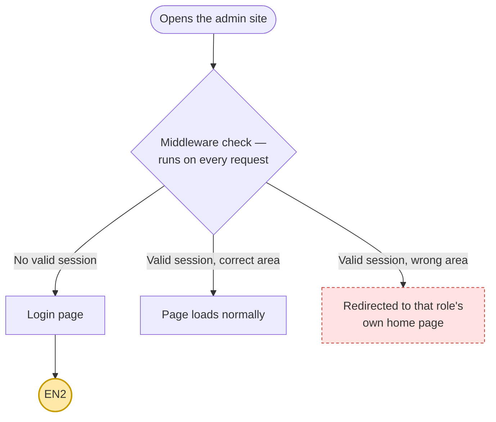
```mermaid
flowchart TD
    START(["Opens the admin site"]) --> MW{"Middleware check —<br/>runs on every request"}
    MW -->|"No valid session"| LOGIN["Login page"]
    MW -->|"Valid session, correct area"| PASS["Page loads normally"]
    MW -->|"Valid session, wrong area"| REDIR["Redirected to that role's<br/>own home page"]
    LOGIN --> OUT(("EN2"))

    classDef connector fill:#FFE9A8,stroke:#C79A00,stroke-width:2px
    classDef errorNode fill:#FDE2E2,stroke:#C0392B,stroke-dasharray:4 3
    class OUT connector
    class REDIR errorNode
```

## EN2 — Signing in

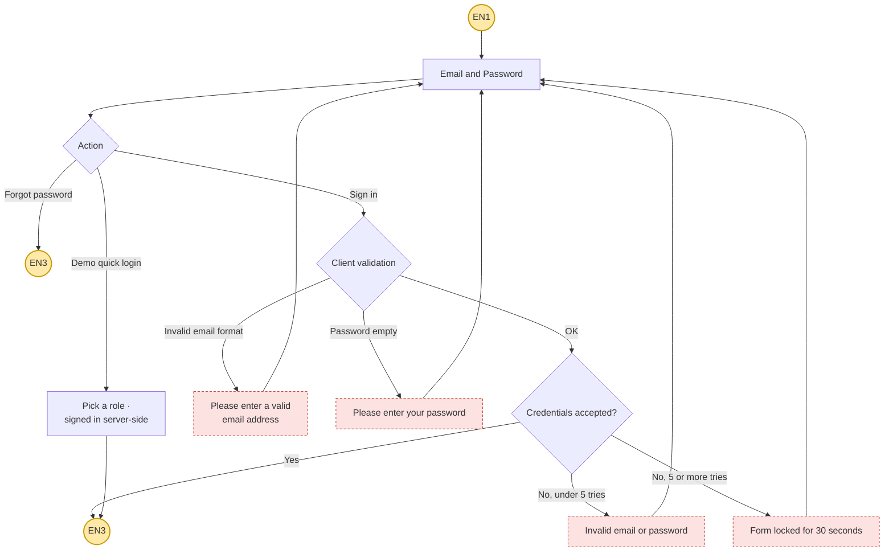
```mermaid
flowchart TD
    IN(("EN1")) --> FORM["Email and Password"]
    FORM --> ACT{"Action"}
    ACT -->|"Forgot password"| GOEN3(("EN3"))
    ACT -->|"Demo quick login"| DEMO["Pick a role ·<br/>signed in server-side"]
    ACT -->|"Sign in"| VAL{"Client validation"}

    VAL -->|"Invalid email format"| E1["Please enter a valid<br/>email address"]
    VAL -->|"Password empty"| E2["Please enter your password"]
    VAL -->|"OK"| AUTH{"Credentials accepted?"}
    E1 --> FORM
    E2 --> FORM

    AUTH -->|"No, under 5 tries"| E3["Invalid email or password"]
    AUTH -->|"No, 5 or more tries"| LOCK["Form locked for 30 seconds"]
    AUTH -->|"Yes"| OUT(("EN3"))
    E3 --> FORM
    LOCK --> FORM
    DEMO --> OUT

    classDef connector fill:#FFE9A8,stroke:#C79A00,stroke-width:2px
    classDef errorNode fill:#FDE2E2,stroke:#C0392B,stroke-dasharray:4 3
    class IN,GOEN3,OUT connector
    class E1,E2,E3,LOCK errorNode
```

## EN3 — Role routing

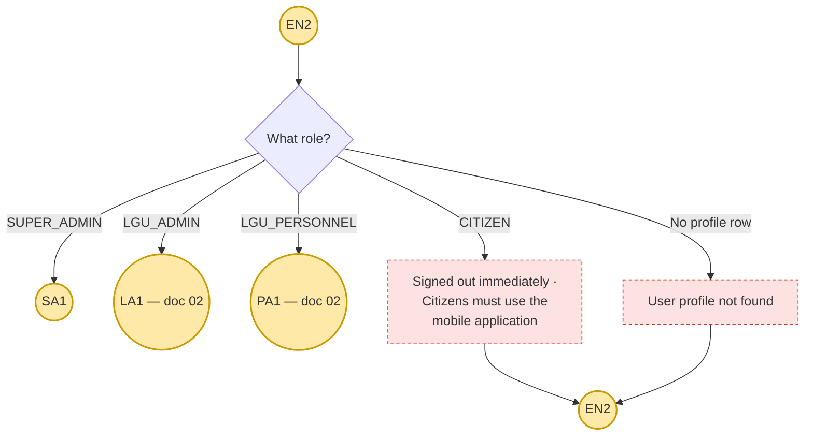
```mermaid
flowchart TD
    IN(("EN2")) --> ROLE{"What role?"}
    ROLE -->|"SUPER_ADMIN"| GOSA(("SA1"))
    ROLE -->|"LGU_ADMIN"| GOLA(("LA1 — doc 02"))
    ROLE -->|"LGU_PERSONNEL"| GOPA(("PA1 — doc 02"))
    ROLE -->|"CITIZEN"| KICK["Signed out immediately ·<br/>Citizens must use the<br/>mobile application"]
    ROLE -->|"No profile row"| NOPROF["User profile not found"]
    KICK --> BACK(("EN2"))
    NOPROF --> BACK

    classDef connector fill:#FFE9A8,stroke:#C79A00,stroke-width:2px
    classDef errorNode fill:#FDE2E2,stroke:#C0392B,stroke-dasharray:4 3
    class IN,GOSA,GOLA,GOPA,BACK connector
    class KICK,NOPROF errorNode
```

**Note:** an LGU admin who types a `/super/*` address is redirected back to their own
dashboard by server-side middleware.

---

# SA — Shell & dashboard

## SA1 — Shell and scope filter

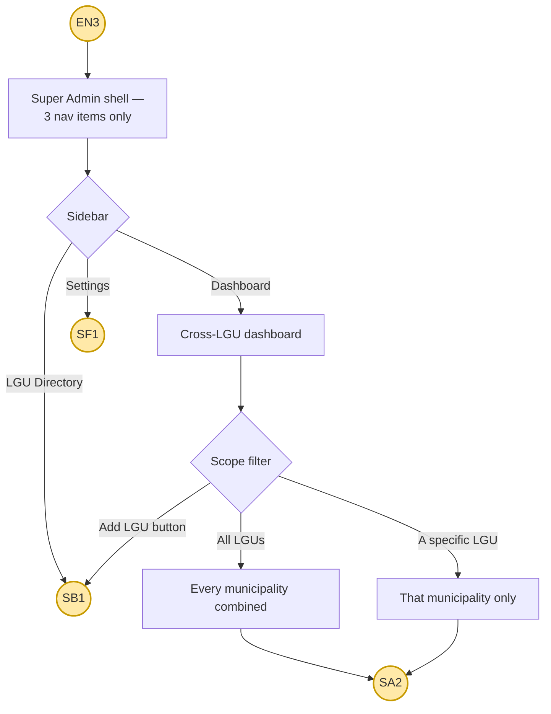
```mermaid
flowchart TD
    IN(("EN3")) --> SHELL["Super Admin shell —<br/>3 nav items only"]
    SHELL --> NAV{"Sidebar"}
    NAV -->|"Dashboard"| DASH["Cross-LGU dashboard"]
    NAV -->|"LGU Directory"| GOSB(("SB1"))
    NAV -->|"Settings"| GOSF(("SF1"))

    DASH --> FILTER{"Scope filter"}
    FILTER -->|"All LGUs"| ALL["Every municipality combined"]
    FILTER -->|"A specific LGU"| ONE["That municipality only"]
    FILTER -->|"Add LGU button"| GOSB
    ALL --> OUT(("SA2"))
    ONE --> OUT

    classDef connector fill:#FFE9A8,stroke:#C79A00,stroke-width:2px
    class IN,GOSB,GOSF,OUT connector
```

**Note:** the dashboard is **entirely read-only**. Its purpose is comparison and
oversight — a super admin cannot act on another municipality's backlog from here.

## SA2 — Dashboard widgets

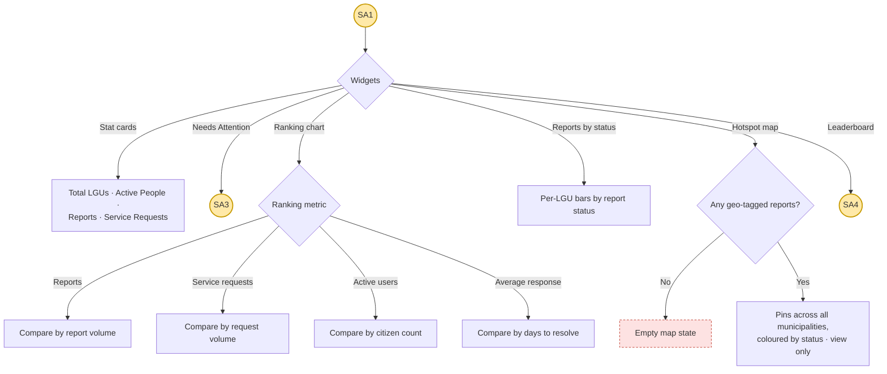
```mermaid
flowchart TD
    IN(("SA1")) --> W{"Widgets"}
    W -->|"Stat cards"| W1["Total LGUs · Active People ·<br/>Reports · Service Requests"]
    W -->|"Needs Attention"| GOSA3(("SA3"))
    W -->|"Ranking chart"| W3{"Ranking metric"}
    W -->|"Reports by status"| W4["Per-LGU bars by report status"]
    W -->|"Hotspot map"| W5{"Any geo-tagged reports?"}
    W -->|"Leaderboard"| GOSA4(("SA4"))

    W3 -->|"Reports"| M1["Compare by report volume"]
    W3 -->|"Service requests"| M2["Compare by request volume"]
    W3 -->|"Active users"| M3["Compare by citizen count"]
    W3 -->|"Average response"| M4["Compare by days to resolve"]

    W5 -->|"No"| MEMPTY["Empty map state"]
    W5 -->|"Yes"| PINS["Pins across all municipalities,<br/>coloured by status · view only"]

    classDef connector fill:#FFE9A8,stroke:#C79A00,stroke-width:2px
    classDef errorNode fill:#FDE2E2,stroke:#C0392B,stroke-dasharray:4 3
    class IN,GOSA3,GOSA4 connector
    class MEMPTY errorNode
```

**Note:** the hotspot map is explicitly **view-only** — pins are not clickable, unlike
the LGU admin's own map. A super admin cannot drill into an individual report.

## SA3 — Needs Attention panel

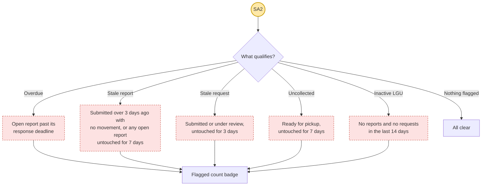
```mermaid
flowchart TD
    IN(("SA2")) --> ATT{"What qualifies?"}
    ATT -->|"Overdue"| A1["Open report past its<br/>response deadline"]
    ATT -->|"Stale report"| A2["Submitted over 3 days ago with<br/>no movement, or any open report<br/>untouched for 7 days"]
    ATT -->|"Stale request"| A3["Submitted or under review,<br/>untouched for 3 days"]
    ATT -->|"Uncollected"| A4["Ready for pickup,<br/>untouched for 7 days"]
    ATT -->|"Inactive LGU"| A5["No reports and no requests<br/>in the last 14 days"]
    ATT -->|"Nothing flagged"| OK["All clear"]

    A1 --> COUNT["Flagged count badge"]
    A2 --> COUNT
    A3 --> COUNT
    A4 --> COUNT
    A5 --> COUNT

    classDef connector fill:#FFE9A8,stroke:#C79A00,stroke-width:2px
    classDef errorNode fill:#FDE2E2,stroke:#C0392B,stroke-dasharray:4 3
    class IN connector
    class A1,A2,A3,A4,A5 errorNode
```

**Note:** this is **the most useful widget on the dashboard** — the only place in the
platform where a neglected municipality becomes visible. The "inactive LGU" rule is
what surfaces a town that has quietly stopped using the system. The overdue deadline
itself is configurable in **SF1**.

## SA4 — Performance leaderboard

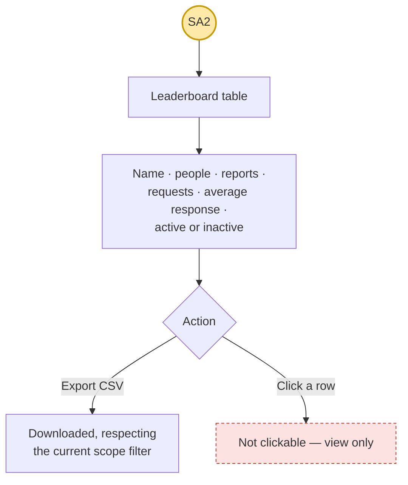
```mermaid
flowchart TD
    IN(("SA2")) --> TABLE["Leaderboard table"]
    TABLE --> COLS["Name · people · reports ·<br/>requests · average response ·<br/>active or inactive"]
    COLS --> ACT{"Action"}
    ACT -->|"Export CSV"| CSV["Downloaded, respecting<br/>the current scope filter"]
    ACT -->|"Click a row"| NOOP["Not clickable — view only"]

    classDef connector fill:#FFE9A8,stroke:#C79A00,stroke-width:2px
    classDef errorNode fill:#FDE2E2,stroke:#C0392B,stroke-dasharray:4 3
    class IN connector
    class NOOP errorNode
```

---

# SB — LGU directory

## SB1 — Directory and activation

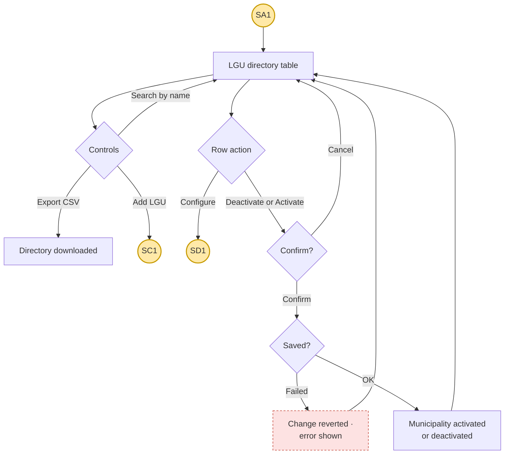
```mermaid
flowchart TD
    IN(("SA1")) --> DIR["LGU directory table"]
    DIR --> CTRL{"Controls"}
    CTRL -->|"Search by name"| DIR
    CTRL -->|"Export CSV"| CSV["Directory downloaded"]
    CTRL -->|"Add LGU"| GOSC(("SC1"))

    DIR --> ROW{"Row action"}
    ROW -->|"Configure"| GOSD(("SD1"))
    ROW -->|"Deactivate or Activate"| CONF{"Confirm?"}
    CONF -->|"Cancel"| DIR
    CONF -->|"Confirm"| RES{"Saved?"}
    RES -->|"Failed"| ERR["Change reverted ·<br/>error shown"]
    RES -->|"OK"| OK["Municipality activated<br/>or deactivated"]
    ERR --> DIR
    OK --> DIR

    classDef connector fill:#FFE9A8,stroke:#C79A00,stroke-width:2px
    classDef errorNode fill:#FDE2E2,stroke:#C0392B,stroke-dasharray:4 3
    class IN,GOSC,GOSD connector
    class ERR errorNode
```

**Note:** a municipality can be **deactivated but never deleted** — deactivating
removes it from the citizen app's town list while retaining its data. The right choice
for a government system. Confirm separately what deactivation does to citizens
**already signed in** to that town; that downstream effect was not verified.

---

# SC — LGU onboarding wizard

## SC1 — Step 1: location

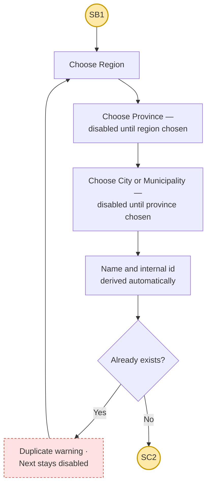
```mermaid
flowchart TD
    IN(("SB1")) --> REGION["Choose Region"]
    REGION --> PROVINCE["Choose Province —<br/>disabled until region chosen"]
    PROVINCE --> CITY["Choose City or Municipality —<br/>disabled until province chosen"]
    CITY --> DERIVE["Name and internal id<br/>derived automatically"]
    DERIVE --> DUP{"Already exists?"}
    DUP -->|"Yes"| WARN["Duplicate warning ·<br/>Next stays disabled"]
    DUP -->|"No"| OUT(("SC2"))
    WARN --> REGION

    classDef connector fill:#FFE9A8,stroke:#C79A00,stroke-width:2px
    classDef errorNode fill:#FDE2E2,stroke:#C0392B,stroke-dasharray:4 3
    class IN,OUT connector
    class WARN errorNode
```

**Note:** the picker covers **the whole Philippines**, replacing a fixed short list.
Each level unlocks the next, so an invalid combination cannot be produced, and
duplicates are blocked.

## SC2 — Step 2: branding

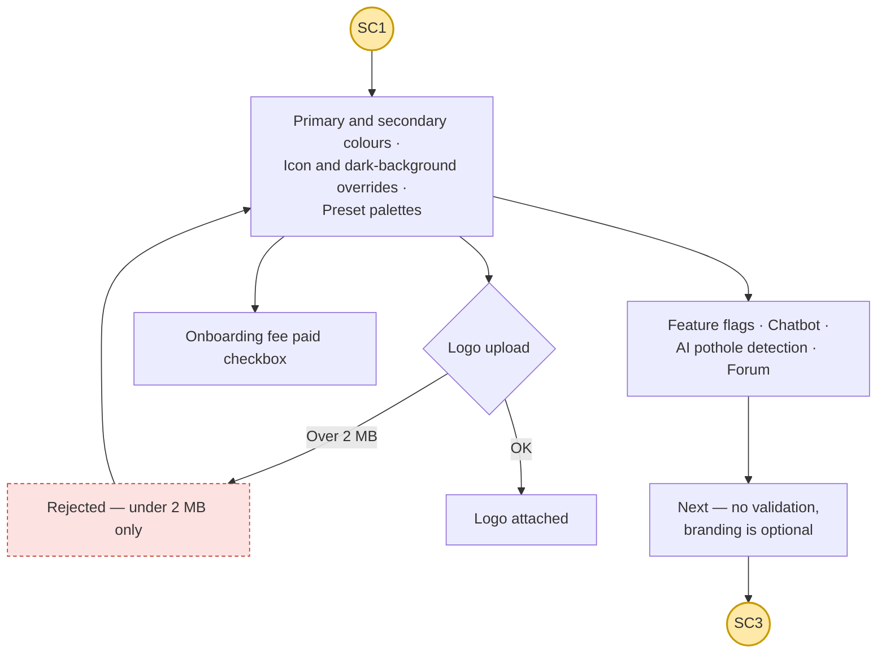
```mermaid
flowchart TD
    IN(("SC1")) --> BRAND["Primary and secondary colours ·<br/>Icon and dark-background overrides ·<br/>Preset palettes"]
    BRAND --> LOGO{"Logo upload"}
    LOGO -->|"Over 2 MB"| LE["Rejected — under 2 MB only"]
    LOGO -->|"OK"| LOK["Logo attached"]
    LE --> BRAND
    BRAND --> FEE["Onboarding fee paid checkbox"]
    BRAND --> FLAGS["Feature flags · Chatbot ·<br/>AI pothole detection · Forum"]
    FLAGS --> NEXT["Next — no validation,<br/>branding is optional"]
    NEXT --> OUT(("SC3"))

    classDef connector fill:#FFE9A8,stroke:#C79A00,stroke-width:2px
    classDef errorNode fill:#FDE2E2,stroke:#C0392B,stroke-dasharray:4 3
    class IN,OUT connector
    class LE errorNode
```

## SC3 — Step 3: first admin (optional)

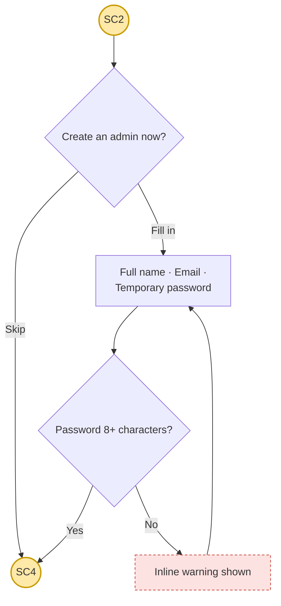
```mermaid
flowchart TD
    IN(("SC2")) --> Q{"Create an admin now?"}
    Q -->|"Skip"| OUT(("SC4"))
    Q -->|"Fill in"| FORM["Full name · Email ·<br/>Temporary password"]
    FORM --> PWD{"Password 8+ characters?"}
    PWD -->|"No"| WARN["Inline warning shown"]
    PWD -->|"Yes"| OUT
    WARN --> FORM

    classDef connector fill:#FFE9A8,stroke:#C79A00,stroke-width:2px
    classDef errorNode fill:#FDE2E2,stroke:#C0392B,stroke-dasharray:4 3
    class IN,OUT connector
    class WARN errorNode
```

## SC4 — Step 4: review

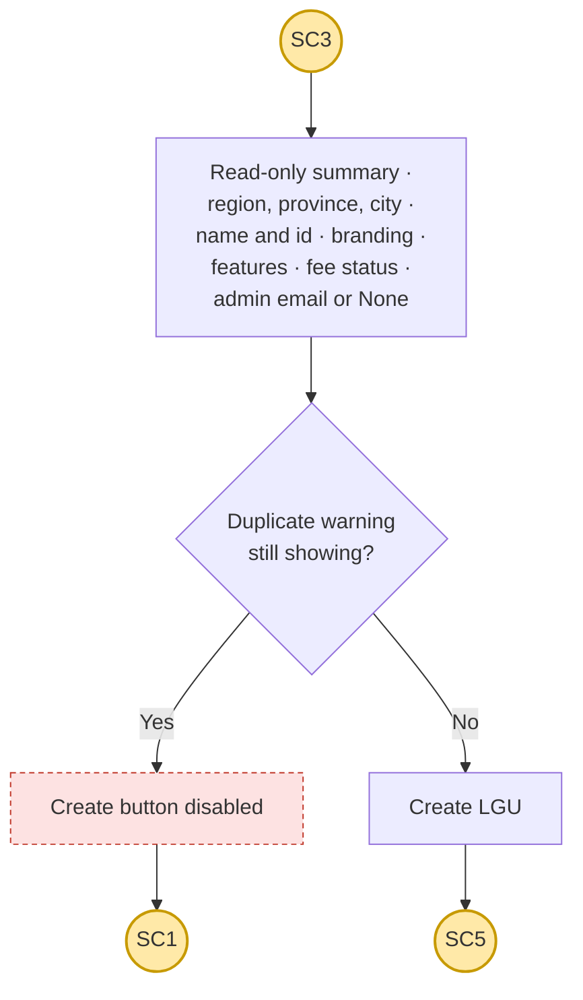
```mermaid
flowchart TD
    IN(("SC3")) --> SUMMARY["Read-only summary ·<br/>region, province, city ·<br/>name and id · branding ·<br/>features · fee status ·<br/>admin email or None"]
    SUMMARY --> DUPWARN{"Duplicate warning<br/>still showing?"}
    DUPWARN -->|"Yes"| BLOCKED["Create button disabled"]
    DUPWARN -->|"No"| CREATE["Create LGU"]
    BLOCKED --> BACK(("SC1"))
    CREATE --> OUT(("SC5"))

    classDef connector fill:#FFE9A8,stroke:#C79A00,stroke-width:2px
    classDef errorNode fill:#FDE2E2,stroke:#C0392B,stroke-dasharray:4 3
    class IN,BACK,OUT connector
    class BLOCKED errorNode
```

## SC5 — Creating the municipality

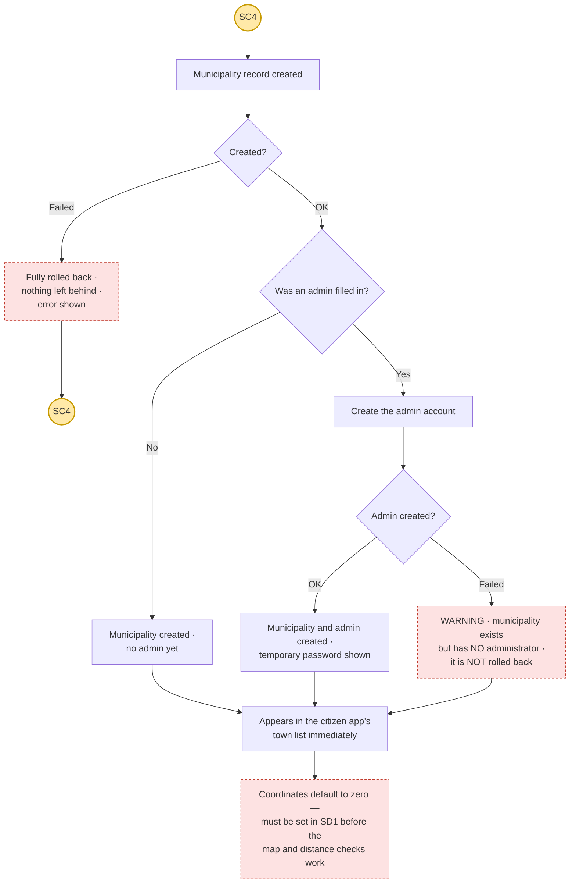
```mermaid
flowchart TD
    IN(("SC4")) --> INSERT["Municipality record created"]
    INSERT --> IRES{"Created?"}
    IRES -->|"Failed"| ROLLBACK["Fully rolled back ·<br/>nothing left behind ·<br/>error shown"]
    IRES -->|"OK"| ADMINQ{"Was an admin filled in?"}
    ROLLBACK --> BACK(("SC4"))

    ADMINQ -->|"No"| DONE1["Municipality created ·<br/>no admin yet"]
    ADMINQ -->|"Yes"| MAKE["Create the admin account"]

    MAKE --> ARES{"Admin created?"}
    ARES -->|"Failed"| PARTIAL["WARNING · municipality exists<br/>but has NO administrator ·<br/>it is NOT rolled back"]
    ARES -->|"OK"| DONE2["Municipality and admin created ·<br/>temporary password shown"]

    DONE1 --> LIVE["Appears in the citizen app's<br/>town list immediately"]
    DONE2 --> LIVE
    PARTIAL --> LIVE
    LIVE --> COORD["Coordinates default to zero —<br/>must be set in SD1 before the<br/>map and distance checks work"]

    classDef connector fill:#FFE9A8,stroke:#C79A00,stroke-width:2px
    classDef errorNode fill:#FDE2E2,stroke:#C0392B,stroke-dasharray:4 3
    class IN,BACK connector
    class ROLLBACK,PARTIAL,COORD errorNode
```

**Notes — two real weaknesses**
1. **If the municipality is created but the admin account fails, the municipality is
   not rolled back.** The result is a live town with nobody able to administer it. It
   is recoverable — add staff later — but only a warning message signals what happened.
2. **Coordinates default to zero**, so a new town's map and the distance check on
   citizen reports misbehave until someone remembers to open **SD1**. This is easy to
   forget and belongs in the wizard.

Creating the admin uses the same protected server route as LGU staff creation, so a
super admin still cannot create another super admin.

---

# SD — Configure an existing LGU

## SD1 — Editing a municipality

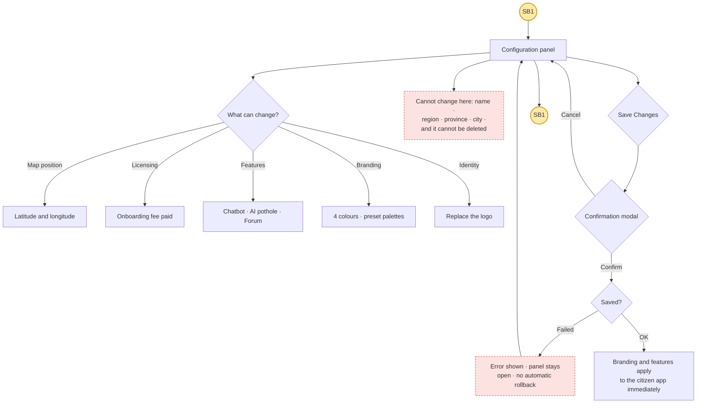
```mermaid
flowchart TD
    IN(("SB1")) --> PANEL["Configuration panel"]
    PANEL --> EDIT{"What can change?"}
    EDIT -->|"Map position"| COORD["Latitude and longitude"]
    EDIT -->|"Licensing"| FEE["Onboarding fee paid"]
    EDIT -->|"Features"| FLAGS["Chatbot · AI pothole · Forum"]
    EDIT -->|"Branding"| COLORS["4 colours · preset palettes"]
    EDIT -->|"Identity"| LOGO["Replace the logo"]

    PANEL --> LOCKED["Cannot change here: name ·<br/>region · province · city ·<br/>and it cannot be deleted"]

    PANEL --> SAVE{"Save Changes"}
    SAVE --> CONFIRM{"Confirmation modal"}
    CONFIRM -->|"Cancel"| PANEL
    CONFIRM -->|"Confirm"| RES{"Saved?"}
    RES -->|"Failed"| ERR["Error shown · panel stays<br/>open · no automatic rollback"]
    RES -->|"OK"| OK["Branding and features apply<br/>to the citizen app immediately"]
    ERR --> PANEL
    PANEL --> BACK(("SB1"))

    classDef connector fill:#FFE9A8,stroke:#C79A00,stroke-width:2px
    classDef errorNode fill:#FDE2E2,stroke:#C0392B,stroke-dasharray:4 3
    class IN,BACK connector
    class ERR,LOCKED errorNode
```

**Notes**
- **This is where coordinates get set** after onboarding — see the note on **SC5**.
- Feature flags let a super admin turn the chatbot, AI pothole detection, or the forum
  on or off **per municipality** — genuinely useful for a phased rollout and worth
  highlighting in the manuscript.
- A municipality's **name and location cannot be corrected after creation.** A typo can
  only be fixed by deactivating and re-adding.

---

# SE — Cross-LGU analytics

## SE1 — Analytics

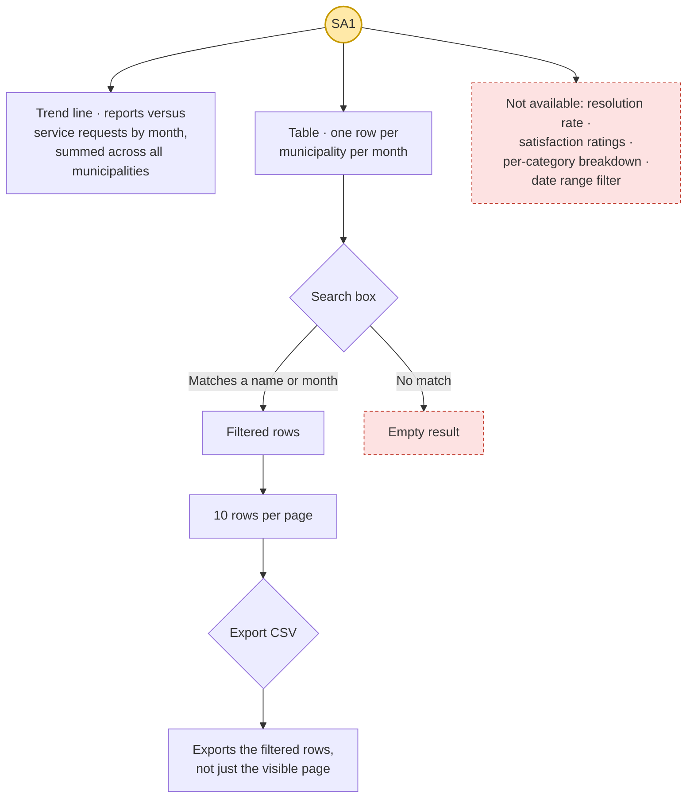
```mermaid
flowchart TD
    IN(("SA1")) --> TREND["Trend line · reports versus<br/>service requests by month,<br/>summed across all municipalities"]
    IN --> TABLE["Table · one row per<br/>municipality per month"]
    TABLE --> FILT{"Search box"}
    FILT -->|"Matches a name or month"| FILTERED["Filtered rows"]
    FILT -->|"No match"| NONE["Empty result"]
    FILTERED --> PAGE["10 rows per page"]
    PAGE --> EXPORT{"Export CSV"}
    EXPORT --> CSV["Exports the filtered rows,<br/>not just the visible page"]

    IN --> MISSING["Not available: resolution rate ·<br/>satisfaction ratings ·<br/>per-category breakdown ·<br/>date range filter"]

    classDef connector fill:#FFE9A8,stroke:#C79A00,stroke-width:2px
    classDef errorNode fill:#FDE2E2,stroke:#C0392B,stroke-dasharray:4 3
    class IN connector
    class NONE,MISSING errorNode
```

**Note — the clearest quick win in this document:** analytics is **volume-only**.
The **citizen satisfaction ratings collected in the mobile app are not surfaced
anywhere in the admin dashboard.** That is data you already collect going unused, and
showing it would strengthen the evaluation chapter of the manuscript.

---

# SF — Platform settings

## SF1 — Global configuration and response target

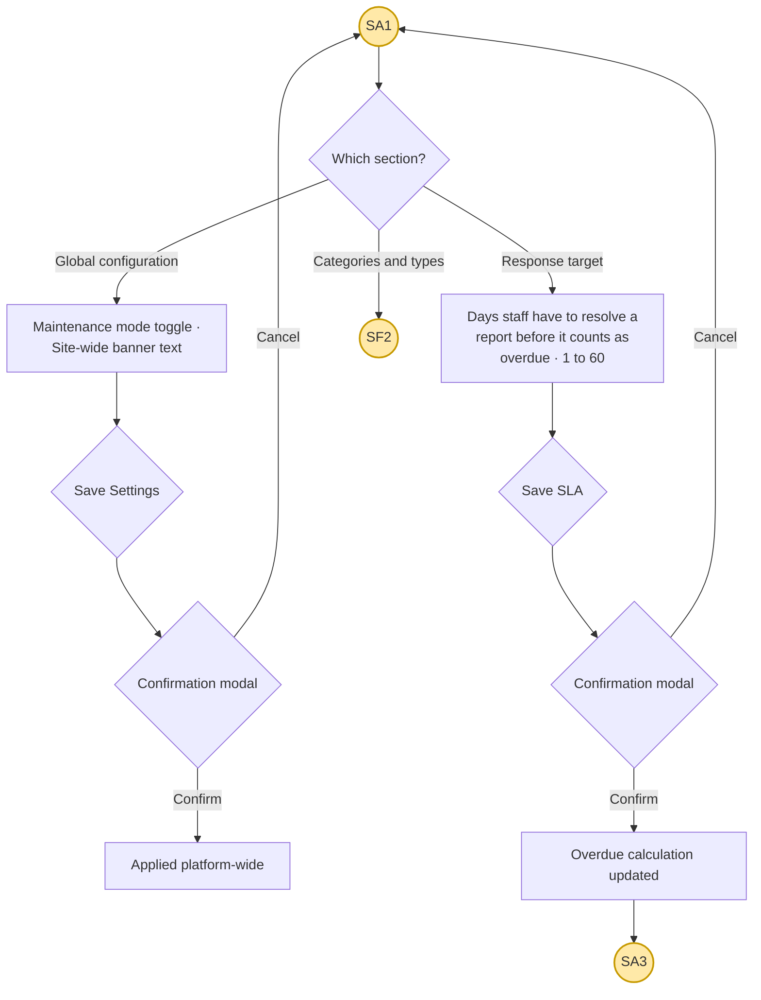
```mermaid
flowchart TD
    IN(("SA1")) --> SECT{"Which section?"}
    SECT -->|"Global configuration"| GLOBAL["Maintenance mode toggle ·<br/>Site-wide banner text"]
    SECT -->|"Response target"| SLA["Days staff have to resolve a<br/>report before it counts as<br/>overdue · 1 to 60"]
    SECT -->|"Categories and types"| GOSF2(("SF2"))

    GLOBAL --> C1{"Save Settings"}
    SLA --> C2{"Save SLA"}
    C1 --> M1{"Confirmation modal"}
    C2 --> M2{"Confirmation modal"}
    M1 -->|"Cancel"| IN
    M2 -->|"Cancel"| IN
    M1 -->|"Confirm"| S1["Applied platform-wide"]
    M2 -->|"Confirm"| S2["Overdue calculation updated"]
    S2 --> FEEDS(("SA3"))

    classDef connector fill:#FFE9A8,stroke:#C79A00,stroke-width:2px
    class IN,GOSF2,FEEDS connector
```

**Note:** the **response target is the setting with real teeth** — it defines what
counts as overdue, which drives the Needs Attention panel (**SA3**) and the
notification bell for every LGU admin. Changing it changes what every municipality
sees as urgent.

## SF2 — Categories and service types

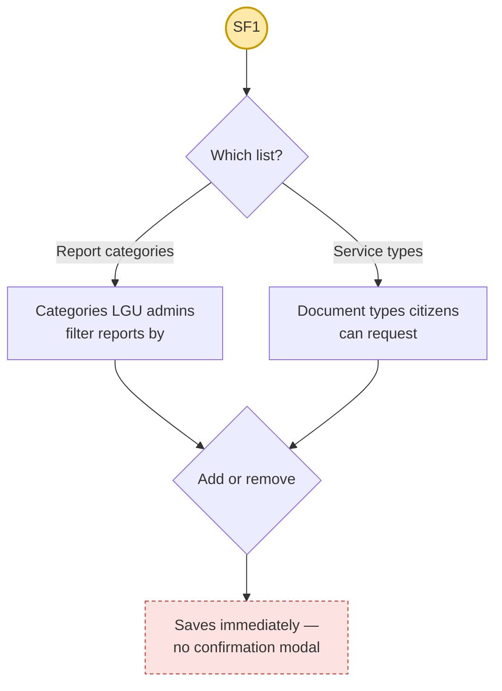
```mermaid
flowchart TD
    IN(("SF1")) --> WHICH{"Which list?"}
    WHICH -->|"Report categories"| CATS["Categories LGU admins<br/>filter reports by"]
    WHICH -->|"Service types"| TYPES["Document types citizens<br/>can request"]
    CATS --> ACT{"Add or remove"}
    TYPES --> ACT
    ACT --> IMMEDIATE["Saves immediately —<br/>no confirmation modal"]

    classDef connector fill:#FFE9A8,stroke:#C79A00,stroke-width:2px
    classDef errorNode fill:#FDE2E2,stroke:#C0392B,stroke-dasharray:4 3
    class IN connector
    class IMMEDIATE errorNode
```

**Note — inconsistent behaviour:** global settings and the response target require a
confirmation modal, but adding or **removing** a report category or service type saves
**immediately with no confirmation**, even though removal is arguably more
consequential. Worth making consistent.

---

# SY — Errors & edge cases

## SY1 — Failure modes

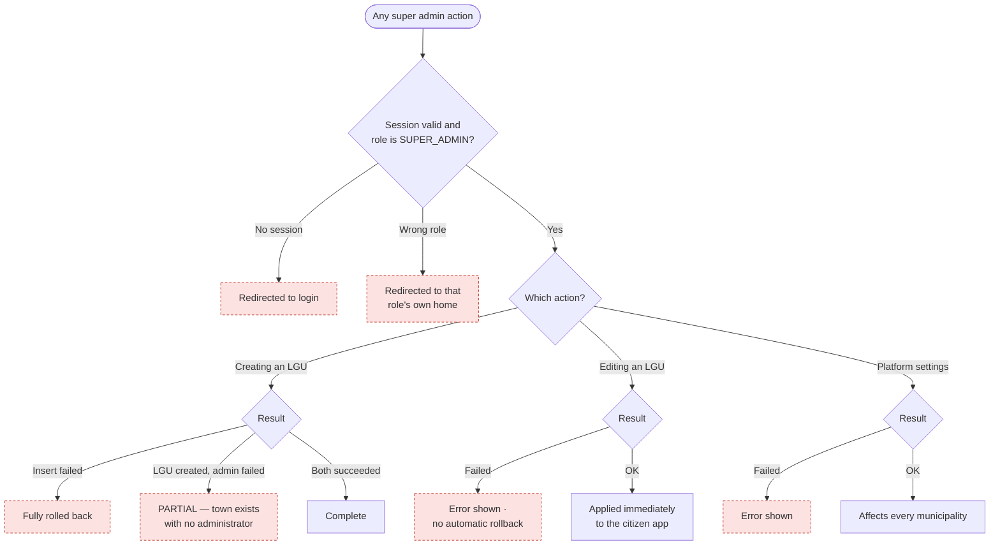
```mermaid
flowchart TD
    START(["Any super admin action"]) --> AUTHQ{"Session valid and<br/>role is SUPER_ADMIN?"}
    AUTHQ -->|"No session"| KICK["Redirected to login"]
    AUTHQ -->|"Wrong role"| WRONG["Redirected to that<br/>role's own home"]
    AUTHQ -->|"Yes"| ACTION{"Which action?"}

    ACTION -->|"Creating an LGU"| C{"Result"}
    C -->|"Insert failed"| C1["Fully rolled back"]
    C -->|"LGU created, admin failed"| C2["PARTIAL — town exists<br/>with no administrator"]
    C -->|"Both succeeded"| C3["Complete"]

    ACTION -->|"Editing an LGU"| E{"Result"}
    E -->|"Failed"| E1["Error shown ·<br/>no automatic rollback"]
    E -->|"OK"| E2["Applied immediately<br/>to the citizen app"]

    ACTION -->|"Platform settings"| S{"Result"}
    S -->|"Failed"| S1["Error shown"]
    S -->|"OK"| S2["Affects every municipality"]

    classDef errorNode fill:#FDE2E2,stroke:#C0392B,stroke-dasharray:4 3
    class KICK,WRONG,C1,C2,E1,S1 errorNode
```

**Note:** the riskiest state in the whole platform is **C2** — a municipality that is
live and visible to citizens but has no administrator, so nothing submitted to it will
ever be reviewed. It is recoverable, but nothing in the interface flags it afterwards.
**A "municipalities with no admin" warning would close this properly**, and would fit
naturally into the existing Needs Attention panel (**SA3**).

---

## Open questions before this is final

1. **Partial onboarding** (SC5, SY1) — an LGU created without its admin stays live with
   nobody to run it. Roll back, or surface it on the dashboard afterwards.
2. **Coordinates default to zero** (SC5, SD1) — a new town's map and the distance check
   on citizen reports misbehave until someone sets them. Move this into the wizard.
3. **Name and location cannot be corrected** after creation (SD1).
4. **Citizen satisfaction ratings are collected but never shown anywhere** (SE1).
5. **Inconsistent confirmation behaviour** in platform settings (SF2).
6. Confirm what **maintenance mode** and **LGU deactivation** actually do to citizens
   already signed in — neither downstream effect was verified.

---

## What this document does not cover

- Visual design and layout — behaviour and navigation only.
- LGU Admin and Personnel flows — see `02-LGU-Admin-Flowcharts.md`.
- Citizen app flows — see `01-Citizen-App-Flowcharts.md`.
- Exact wording of every message, except where the wording drives a decision.
