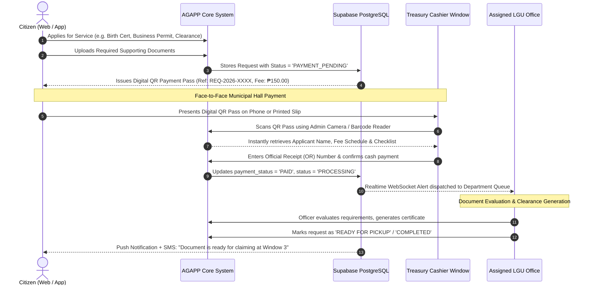

# Comprehensive Master Plan: Panel Recommendations & QR Payment System
**AGAPP System — Automated Governance and Public Service Platform**
*Document Version: 1.0 · August 16, 2026*

---

## Executive Summary & Panel Directives

This master design document outlines the technical architecture, workflow specifications, testing protocols, and implementation plan for the **9 Panel Recommendations**, incorporating the specific guidelines:
1. **Face-to-Face QR Payment Flow**: Payment is made in-person at the Municipal Hall Cashier / Treasury Window, digitally accelerated by **Cryptographic QR Payment Passes** and an **Admin Barcode/QR Scanner**.
2. **Forum Module Removal**: Scheduled for clean deprecation and removal in favor of **Official Announcements & Broadcast Advisories**.
3. **AI Confidence Threshold Gating ($\tau = 0.60$)**: Reports below threshold are automatically returned to citizens for clearer photos.
4. **End-to-End Workflow Diagrams**: Detailed routing from citizen application to departmental completion and document release.
5. **Departmental Access Control (RBAC)**: LGU Personnel only see records assigned to their specific office (MDRRMO, MENRO, Engineering, Civil Registrar, BPLO, Assessor).
6. **Automated Request Prioritization**: Algorithmic classification into Critical (P1), High (P2), Medium (P3), and Low (P4) urgency tiers.
7. **User Acceptance Testing (UAT)**: Scientific SUS and ISO/IEC 25010 testing methodology with target citizen and staff cohorts.
8. **Performance Testing**: k6 load test specifications for up to 2,000 concurrent users.

---

## 1. Panel Compliance Matrix & Technical State

| # | Panel Recommendation | AGAPP Implementation Architecture |
| :--- | :--- | :--- |
| **1** | **AI-Based Filtering & Confidence Threshold** | Fastify ML engine returns `ml_confidence` (0.00–1.00). Reports with score $< 0.50$ trigger `returned_for_review` with guidance to re-upload clear photos. Scores $0.50 \le s < 0.65$ flagged with `is_low_credibility`. Scores $\ge 0.65$ forwarded directly to department queue. |
| **2** | **Service Request Workflow Routing Diagram** | End-to-end Sequence & Flowchart models mapping citizen application &rarr; QR Payment Pass &rarr; Cashier QR scan &rarr; Department evaluation &rarr; Document release. |
| **3** | **Departmental Access Control & Distribution** | LGU Personnel bound to `assigned_office` (MDRRMO, MENRO, Engineering, Civil Registrar, BPLO, Assessor) and can only access records relevant to their office. |
| **4** | **Supporting Document Upload Module** | Dynamic slot-by-slot upload module with client-side WebP compression (max 1.5MB) per service requirement schema. |
| **5** | **Face-to-Face QR Payment Verification** | Citizen generates a digital QR Payment Pass &rarr; presents at Treasury Window &rarr; Cashier scans QR &rarr; records Official Receipt (OR) Number &rarr; realtime status updates to `PAID` / `PROCESSING`. |
| **6** | **User Testing Protocol (SUS + ISO/IEC 25010)** | Structured evaluation protocol testing $N=30$ citizens and $N=10$ LGU staff with 10-item Likert SUS questionnaires and task-completion metrics. |
| **7** | **Request Prioritization Criterion** | Algorithmic scoring matrix: Critical (P1, $<2\text{hr}$), High (P2, $<24\text{hr}$), Medium (P3, $1-3\text{d}$), Low (P4, $3-5\text{d}$). |
| **8** | **Performance & Concurrency Load Testing** | k6 load scripts testing 100 &rarr; 500 &rarr; 2,000 concurrent users with target P95 latency $< 350\text{ms}$ and HTTP error rate $< 0.05\%$. |
| **9** | **Forum De-scoping & Announcements Elevation** | Systematic deprecation of public discussion forums; elevation of official announcements, broadcast advisories, and disaster alerts. |

---

## 2. End-to-End Workflow Diagram



---

## 3. Detailed Technical Architecture

### A. Face-to-Face QR Payment Architecture
```
Citizen Side (Web / Mobile):
- Applies for service &rarr; receives QR Payment Pass containing encrypted payload:
  {
    "type": "AGAPP_PAYMENT_PASS",
    "req_id": "8b9e12...",
    "ref_no": "REQ-2026-0816",
    "service": "Barangay Clearance",
    "applicant": "Juan Dela Cruz",
    "amount": 150.00,
    "lgu_id": "liliw-laguna"
  }

Treasury / Cashier Side (Admin Portal):
- Cashier clicks "Scan QR Payment" button in Admin Header.
- Uses webcam, phone camera, or USB barcode reader.
- Modal opens instantly with:
  [ Applicant: Juan Dela Cruz ]
  [ Service: Barangay Clearance ]
  [ Fee Due: ₱150.00 ]
  [ Input Field: Official Receipt (OR) Number e.g. "OR-2026-98124" ]
  [ Button: "Confirm Payment & Issue Receipt" ]
- On confirmation:
  - Database updates `payment_status = 'PAID'`, `or_number = 'OR-2026-98124'`, `paid_at = NOW()`.
  - Request status moves to `PROCESSING`.
  - Citizen tracking screen instantly shows green "PAID — Official Receipt #OR-2026-98124 verified".
```

### B. AI Confidence Gating Mechanism ($\tau = 0.60$)
```
Citizen Submits Photo
      │
      ▼
Fastify ML Engine (Roboflow / Custom Model)
      │
      ├───────────────────────────────┬───────────────────────────────┐
      ▼                               ▼                               ▼
Score ≥ 0.65                    0.50 ≤ Score < 0.65             Score < 0.50
[HIGH CONFIDENCE]               [BORDERLINE CONFIDENCE]         [LOW CONFIDENCE]
Status: 'submitted'             Status: 'submitted'             Status: 'returned_for_review'
Forwarded to Dept Queue         Flag: is_low_credibility=true   Returned to Citizen with message:
                                Shows amber review warning      "Photo unclear. Please upload a clear photo."
```

### C. Request Prioritization Algorithm
```
Priority Score = (Hazard Weight × 0.45) + (Public Impact × 0.35) + (SLA Elapsed × 0.20)

- P1 CRITICAL (Score ≥ 0.80): Emergency disasters, live downed wires, flash floods (< 2 hours SLA).
- P2 HIGH (0.60 ≤ Score < 0.80): Major road potholes, water main leaks, permit filing deadlines (< 24 hours SLA).
- P3 MEDIUM (0.40 ≤ Score < 0.60): Standard certificates, clearances, tax declarations (1–3 days SLA).
- P4 LOW (Score < 0.40): General inquiries, archival records (3–5 days SLA).
```

### D. User Acceptance Testing (UAT) & Performance Testing Plan
1. **SUS & ISO/IEC 25010 Methodology**:
   - $N = 30$ Residents + $N = 10$ Municipal Staff.
   - 10 standardized SUS questions (1–5 Likert scale) targeting $> 80.0 / 100$ (Grade A).
2. **k6 Load Benchmark Specs**:
   - Stage 1: 100 VUs (Warm-up).
   - Stage 2: 500 VUs (Standard day).
   - Stage 3: 2,000 VUs (Peak disaster alert surge).
   - KPI: P95 Latency $< 350\text{ms}$, 5xx Error Rate $< 0.05\%$.

---

## 4. Execution Readiness

The master plan is documented and ready for step-by-step execution upon your instruction.
