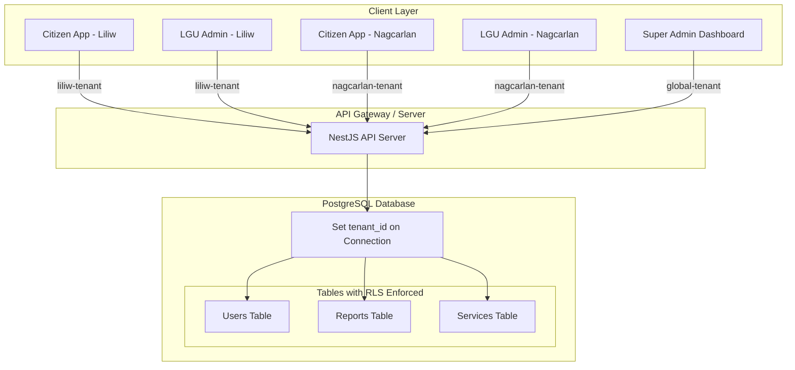

# AGAPP Development Roadmap & Tech Stack Transition

This document provides a comprehensive roadmap for transforming the current web prototype of the **Automated Governance and Public Service Platform (AGAPP)** into the production-ready system proposed in the capstone manuscript. It outlines the architecture gap analysis, design constraints, tenant isolation strategies, and a step-by-step phased execution plan.

---

## 1. Core System Architecture & Scope

AGAPP is designed as a multi-tenant platform for Philippine Local Government Units (LGUs), with the **Municipality of Liliw, Laguna** serving as the pilot LGU. 

> [!IMPORTANT]
> **Key Architecture Constraints:**
> - **No Online Payments**: In compliance with local LGU guidelines, all financial transactions are completed in-person at the Municipal Hall counter. The platform generates a pre-filled application PDF and a reference QR code. LGU personnel scan the QR code to retrieve and approve the transaction.
> - **Multi-Tenant Isolation**: The database must use PostgreSQL Row-Level Security (RLS) to enforce data privacy between different LGUs (e.g., Liliw, Nagcarlan, Magdalena, Majayjay, and Pila) while utilizing a single shared database instance.
> - **On-Device ML**: Pothole detection runs completely on-device using a compressed TensorFlow Lite model, eliminating the need for expensive cloud-based GPU inference.

---

## 2. Technology Stack Gap Analysis

Below is the comparison between the **Current Prototype** and the **Proposed Production Stack** detailed in the manuscript:

| Layer / Component | Current Prototype Stack | Proposed Production Stack | Status / Development Gap |
| :--- | :--- | :--- | :--- |
| **Citizen Mobile App** | React web simulator inside SPA | **React Native + Expo (TypeScript)** | Major rewrite required to support native APIs (Camera, GPS, SecureStore) |
| **Admin Dashboards** | React + Vite (Monorepo Workspace) | **Next.js 14 + Tailwind CSS + shadcn/ui** | Transition dashboard layout to Next.js App Router |
| **API Backend Server** | Express + TypeScript | **NestJS (Node.js runtime)** | Migrate routes, controllers, and middlewares into a modular NestJS workspace |
| **Database** | In-memory mock data (JSON arrays) | **PostgreSQL + PostGIS + pgvector** | Implement schema with spatial indices and vector embeddings support |
| **Asset Storage** | Local mock urls | **Cloudflare R2 or Supabase Storage** | Required for citizen-uploaded report photos and generated PDF documents |
| **Mapping Engine** | CSS grids / inline SVG maps | **MapLibre GL + OpenStreetMap** | Integrate interactive map canvases for navigation and location picking |
| **Machine Learning (ML)** | Static simulator toggle | **YOLOv8n -> TensorFlow Lite INT8** | Train on custom Philippine road datasets and package inside Expo bundle |
| **Support Chatbot** | Pre-scripted responses | **RAG Pipeline + pgvector** | Embed LGU FAQs, compare cosine similarities, and fallback to support tickets |
| **User Authentication** | Mock localStorage flag | **JWT + OTP (One-Time Passcode) + Expo SecureStore** | Develop SMS/Email OTP flow with JWT authentication and secure storage |
| **Push Notifications** | Simple alert banners | **Expo Push Notifications** | Configure backend triggers to send real-time system alerts to citizens |

---

## 3. Multi-Tenant Design Strategy (Database Level)

To allow multiple LGUs to share the platform while guaranteeing absolute data privacy, we will use a **Single Database, Shared Schema, Multi-Tenant** approach enforced by PostgreSQL Row-Level Security (RLS).



### Row-Level Security Enforcer Example:
```sql
-- Enable Row-Level Security on critical tables
ALTER TABLE reports ENABLE ROW LEVEL SECURITY;

-- Create policy for LGU Admins and Citizens
CREATE POLICY LguIsolationPolicy ON reports
    FOR ALL
    USING (lgu_id = current_setting('app.current_lgu_id', true))
    WITH CHECK (lgu_id = current_setting('app.current_lgu_id', true));
```

---

## 4. Phased Implementation Roadmap

### Phase 1: Backend Infrastructure & Data Models
Establish the server baseline and database schemas to replace all mock data layers.
- [ ] Initialize **PostgreSQL** database with `postgis` and `vector` extensions enabled.
- [ ] Implement database migrations for `lgus`, `users`, `reports`, `services`, `faq_embeddings`, and `forum_posts`.
- [ ] Migrate the API from Express to **NestJS**:
  - Set up modules for Auth, Lgus, Users, Reports, and System Directories.
  - Implement JWT authentication with simulated OTP delivery.
- [ ] Configure **Supabase Storage or Cloudflare R2** client SDKs for handling document and image uploads.

### Phase 2: Citizen Mobile App (React Native + Expo)
Port the web citizen simulator to a real native mobile platform.
- [ ] Create a new Expo project (`npx create-expo-app`) configured with TypeScript.
- [ ] Port styling variables and custom colors (`#e8e7e5` background, `#1A1A1A` text, `#F497A2` accent) to `react-native` stylesheets.
- [ ] Integrate native hardware libraries:
  - `expo-camera` for capturing pothole and community reports.
  - `expo-location` for retrieving GPS coordinates when dropping pins.
  - `expo-secure-store` for maintaining the user's JWT token.
- [ ] Port UI navigation and components (Services, Guided Directories, Report Queue, Community Forum).

### Phase 3: Next.js 14 Dashboard Migration
Build modern, responsive administrative portals using Next.js.
- [ ] Initialize Next.js app in the monorepo using the App Router.
- [ ] Install **shadcn/ui** and configure theme variables with the new design system.
- [ ] Build the **Super Admin Console**:
  - Global dashboard analytics, system health metrics.
  - LGU onboarding form and system configuration configurations.
- [ ] Build the **LGU Admin Console**:
  - Live Map queue displaying local community issues.
  - Verification & Moderation queue for citizens' applications and reports.
  - Knowledge Base uploader (FAQ text input tool for chatbot reference).

### Phase 4: Advanced Modules Development
Implement the core interactive and AI capabilities of AGAPP.
- [ ] **On-Device Pothole Detector**:
  - Train a custom YOLOv8n model using the RDD2020 dataset and Philippine road samples.
  - Export to a quantized `.tflite` model (INT8).
  - Package model into the React Native app using `react-native-fast-tflite` or custom WebAssembly bindings.
- [ ] **AI Retrieval-Augmented Generation Chatbot**:
  - Write a NestJS background worker to generate text embeddings for LGU FAQs.
  - Store vector representations in the `pgvector` column.
  - Build query logic verifying that similarity scores are above the threshold ($0.75$) before answering; otherwise, fallback to creating a support ticket.
- [ ] **Interactive Maps**:
  - Render OpenStreetMap tiles with custom markers representing municipal hall rooms, offices, and town tourist spots.
- [ ] **PDF Generator**:
  - Set up a Node-canvas or Puppeteer backend generator producing clean, official LGU application receipt files containing a high-density QR code.

### Phase 5: CI/CD & Deployments
Automate build systems and publish hosting deployments.
- [ ] Set up **GitHub Actions** pipelines for compiling tests and linting.
- [ ] Deploy Next.js dashboards to **Vercel**.
- [ ] Deploy NestJS API and PostgreSQL database instances to **Render** or **Fly.io**.
- [ ] Set up secure environment variables (Database URLs, Storage keys, Secret keys).

---

## 5. Next Steps for Lawrence

To begin execution, prioritize these tasks in order:
1. **Initialize Git Repository**: Run `git init` inside `agapp-system` to track code revisions if not already done.
2. **Setup the Database**: Spin up a local Docker container running PostgreSQL with PostGIS and pgvector support:
   ```bash
   docker run --name agapp-db -e POSTGRES_PASSWORD=postgres -p 5432:5432 -d postgis/postgis
   ```
3. **Bootstrapping Expo**: Initialize the mobile citizen framework inside `packages/mobile-native` or as a new folder.
