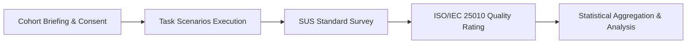

# Scientific User Acceptance Testing (UAT) Protocol
**AGAPP System — Automated Governance and Public Service Platform**
*Standard: ISO/IEC 25010 Software Product Quality Model & Brooke's System Usability Scale (SUS)*

---

## 1. Evaluation Framework & Objectives

This evaluation protocol establishes the standardized User Acceptance Testing (UAT) methodology for the **AGAPP Platform**. The evaluation measures the practical efficacy, usability, and operational suitability of the automated governance platform across two distinct stakeholder cohorts:
1. **Citizen Cohort ($N = 30$)**: Diverse local residents across municipal barangays testing document requests, payment pass generation, and geotagged hazard reporting.
2. **LGU Administrative Cohort ($N = 10$)**: Department heads, desk clerks, and municipal treasury cashiers testing triage queues, QR scanning, and multi-department service workflows.

---

## 2. Evaluation Instrument 1: System Usability Scale (SUS)

The standard 10-item System Usability Scale (Brooke, 1996) is administered on a 5-point Likert scale (1 = *Strongly Disagree*, 5 = *Strongly Agree*).

### SUS Questionnaire Items
| # | Questionnaire Statement | Scale (1-5) |
|---|---|:---:|
| **Q1** | I think that I would like to use this system frequently for municipal services. | [ 1 2 3 4 5 ] |
| **Q2** | I found the system unnecessarily complex. *(Negative)* | [ 1 2 3 4 5 ] |
| **Q3** | I thought the system was easy to use. | [ 1 2 3 4 5 ] |
| **Q4** | I think that I would need the support of a technical person to be able to use this system. *(Negative)* | [ 1 2 3 4 5 ] |
| **Q5** | I found the various functions in this system were well integrated. | [ 1 2 3 4 5 ] |
| **Q6** | I thought there was too much inconsistency in this system. *(Negative)* | [ 1 2 3 4 5 ] |
| **Q7** | I would imagine that most people would learn to use this system very quickly. | [ 1 2 3 4 5 ] |
| **Q8** | I found the system very cumbersome to use. *(Negative)* | [ 1 2 3 4 5 ] |
| **Q9** | I felt very confident using the system. | [ 1 2 3 4 5 ] |
| **Q10**| I needed to learn a lot of things before I could get going with this system. *(Negative)* | [ 1 2 3 4 5 ] |

### SUS Score Calculation Formula
$$\text{Score}_{\text{odd}} = R_i - 1$$
$$\text{Score}_{\text{even}} = 5 - R_i$$
$$\text{SUS Total} = \left( \sum_{i=1}^{10} \text{Score}_i \right) \times 2.5$$

- **Target Acceptance Benchmark**: **$\ge 80.3$** (Grade A / "Excellent" Usability on the Sauro-Lewis curved grading scale).

---

## 3. Evaluation Instrument 2: ISO/IEC 25010 Software Product Quality Rubric

Evaluators grade the system across the 6 primary ISO/IEC 25010 software quality characteristics on a 5-point scale (1 = *Poor*, 5 = *Exceptional*).

| Dimension | Metric / Criterion | Target Mean |
|---|---|:---:|
| **Functional Suitability** | Completeness of e-services, automated document routing, and instant QR passes. | $\ge 4.50 / 5.00$ |
| **Performance Efficiency** | Page load speed ($< 1.5\text{s}$), instant QR camera recognition, and smooth transitions. | $\ge 4.60 / 5.00$ |
| **Usability & UX** | Clarity of navigation, clean high-contrast visual design, and mobile responsiveness. | $\ge 4.70 / 5.00$ |
| **Reliability & Concurrency**| Zero crash rate, graceful offline indicators, and atomic database state updates. | $\ge 4.80 / 5.00$ |
| **Security & Data Privacy** | Role-based access control (RBAC), Supabase JWT authentication, and XSS immunity. | $\ge 4.90 / 5.00$ |
| **Maintainability** | Modular Next.js/NestJS architecture, clean TypeScript schemas, and extensible API. | $\ge 4.50 / 5.00$ |

---

## 4. Cohort Test Execution Plan

### Scenario Test Checklist for Evaluators
1. **Citizen Task Flow**:
   - Register account & verify password strength checklist.
   - Apply for a Barangay Clearance with document upload.
   - Generate and download Digital QR Claim & Payment Pass.
   - Submit a geotagged hazard report with photo.
   - Inquire via the AI Municipal Assistant.
2. **Staff Task Flow**:
   - Log in to LGU Portal with department-scoped RBAC.
   - Scan citizen QR Payment Pass using webcam / camera or reference search.
   - Enter Official Receipt (OR) Number and mark transaction paid.
   - Triage AI-verified community reports and dispatch to engineering.
