# AGAPP Diagrams and Figures

## Figure 1: Conceptual Model of AGAPP
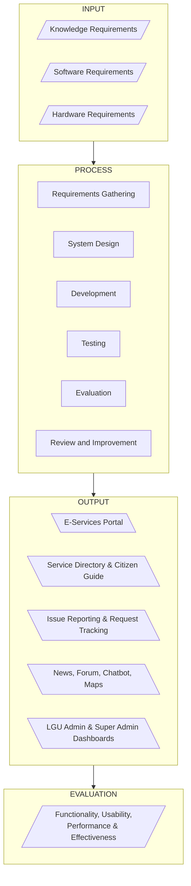
```mermaid
flowchart TB
    subgraph Input["INPUT"]
        I1[/Knowledge Requirements/]
        I2[/Software Requirements/]
        I3[/Hardware Requirements/]
    end

    subgraph Process["PROCESS"]
        P1[Requirements Gathering]
        P2[System Design]
        P3[Development]
        P4[Testing]
        P5[Evaluation]
        P6[Review and Improvement]
    end

    subgraph Output["OUTPUT"]
        O1[\E-Services Portal\]
        O2[\Service Directory & Citizen Guide\]
        O3[\Issue Reporting & Request Tracking\]
        O4[\News, Forum, Chatbot, Maps\]
        O5[\LGU Admin & Super Admin Dashboards\]
    end

    subgraph Evaluation["EVALUATION"]
        E1[/Functionality, Usability,
Performance & Effectiveness/]
    end

    Input --> Process --> Output --> Evaluation
```

---

## Figure 2: Project Design of AGAPP
```mermaid
flowchart TB
    subgraph Users["👥 Users"]
        C[Citizen<br/>Mobile App]
        SA[Super Administrator<br/>Web Browser]
        LA[LGU Administrator<br/>Web Browser]
        LP[LGU Personnel<br/>Web Browser]
    end
    
    subgraph Backend["🖥️ AGAPP Backend"]
        API[Node.js + NestJS API]
    end
    
    subgraph Storage["💾 Data Storage"]
        DB[(PostgreSQL + PostGIS)]
        Storage[Supabase Storage<br/>Photos/Attachments]
    end
    
    C <-->|HTTP/REST| API
    SA <-->|HTTP/REST| API
    LA <-->|HTTP/REST| API
    LP <-->|HTTP/REST| API
    API <-->|SQL| DB
    API <-->|Upload/Download| Storage
```

---

## Figure 3: Flowchart of Main Interface for Super Administrator
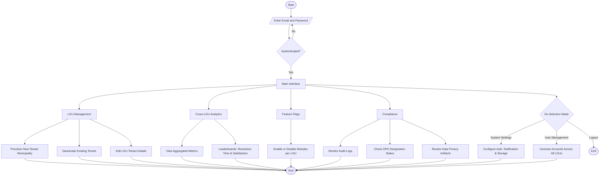
```mermaid
flowchart TD
    Start([Start]) --> Login[/Enter Email and Password/]
    Login --> Auth{Authenticated?}
    Auth -->|No| Login
    Auth -->|Yes| Main[Main Interface]

    Main --> LM[LGU Management]
    Main --> CA[Cross-LGU Analytics]
    Main --> FF[Feature Flags]
    Main --> Comp[Compliance]
    Main --> Ext{No Selection Made}

    LM --> Provision[Provision New Tenant Municipality]
    LM --> Deactivate[Deactivate Existing Tenant]
    LM --> EditLGU[Edit LGU Tenant Details]

    CA --> Metrics[View Aggregated Metrics]
    CA --> Leader[Leaderboards: Resolution Time & Satisfaction]

    FF --> Toggle[Enable or Disable Modules per LGU]

    Comp --> Audit[Monitor Audit Logs]
    Comp --> DPO[Check DPO Designation Status]
    Comp --> DPA[Review Data Privacy Artifacts]

    Ext -->|System Settings| Settings[Configure Auth, Notification & Storage]
    Ext -->|User Management| UM[Oversee Accounts Across All LGUs]
    Ext -->|Logout| Logout([End])

    Provision --> Done([End])
    Deactivate --> Done
    EditLGU --> Done
    Metrics --> Done
    Leader --> Done
    Toggle --> Done
    Audit --> Done
    DPO --> Done
    DPA --> Done
    Settings --> Done
    UM --> Done
```

---

## Figure 4: Flowchart of Main Interface for LGU Administrator
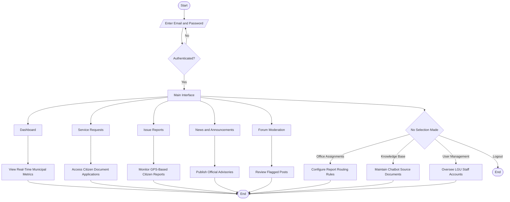
```mermaid
flowchart TD
    Start([Start]) --> Login[/Enter Email and Password/]
    Login --> Auth{Authenticated?}
    Auth -->|No| Login
    Auth -->|Yes| Main[Main Interface]

    Main --> Dash[Dashboard]
    Main --> SR[Service Requests]
    Main --> IR[Issue Reports]
    Main --> News[News and Announcements]
    Main --> Forum[Forum Moderation]
    Main --> Ext{No Selection Made}

    Dash --> Metrics[View Real-Time Municipal Metrics]
    SR --> Queue[Access Citizen Document Applications]
    IR --> MapQueue[Monitor GPS-Based Citizen Reports]

    News --> Publish[Publish Official Advisories]
    Forum --> Moderate[Review Flagged Posts]

    Ext -->|Office Assignments| OA[Configure Report Routing Rules]
    Ext -->|Knowledge Base| KB[Maintain Chatbot Source Documents]
    Ext -->|User Management| UM[Oversee LGU Staff Accounts]
    Ext -->|Logout| Logout([End])

    Metrics --> Done([End])
    Queue --> Done
    MapQueue --> Done
    Publish --> Done
    Moderate --> Done
    OA --> Done
    KB --> Done
    UM --> Done
```

---

## Figure 5: Flowchart of Dashboard for Super Admin and LGU Admin
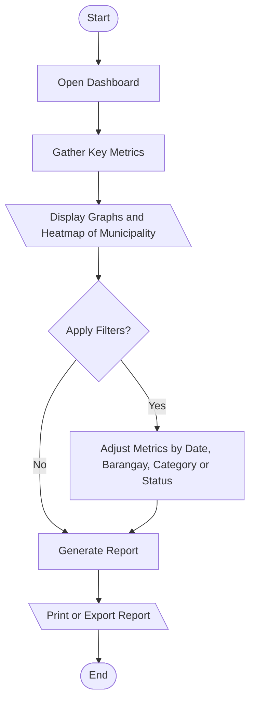
```mermaid
flowchart TD
    Start([Start]) --> Open[Open Dashboard]
    Open --> Gather[Gather Key Metrics]
    Gather --> Display[\Display Graphs and Heatmap of Municipality\]
    Display --> Filter{Apply Filters?}
    Filter -->|Yes| Adjust[Adjust Metrics by Date, Barangay, Category or Status]
    Filter -->|No| Generate[Generate Report]
    Adjust --> Generate
    Generate --> Export[\Print or Export Report\]
    Export --> End([End])
```

---

## Figure 6: Flowchart of Service Requests for LGU Administrator
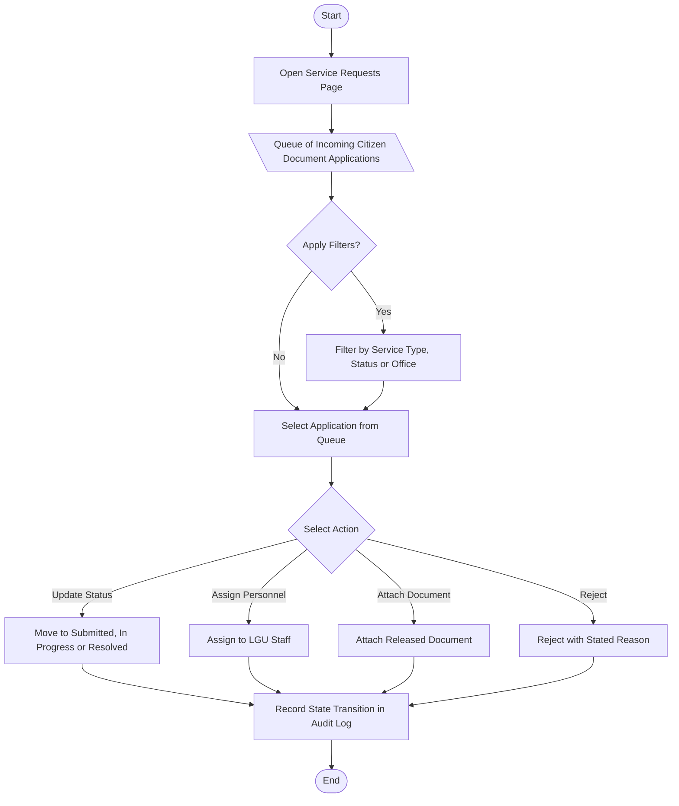
```mermaid
flowchart TD
    Start([Start]) --> Open[Open Service Requests Page]
    Open --> Queue[\Queue of Incoming Citizen Document Applications\]
    Queue --> Filter{Apply Filters?}
    Filter -->|Yes| Filtered[Filter by Service Type, Status or Office]
    Filter -->|No| Action[Select Application from Queue]
    Filtered --> Action
    Action --> Decision{Select Action}
    Decision -->|Update Status| Update[Move to Submitted, In Progress or Resolved]
    Decision -->|Assign Personnel| Assign[Assign to LGU Staff]
    Decision -->|Attach Document| Attach[Attach Released Document]
    Decision -->|Reject| Reject[Reject with Stated Reason]
    Update --> Log[Record State Transition in Audit Log]
    Assign --> Log
    Attach --> Log
    Reject --> Log
    Log --> End([End])
```

---

## Figure 7: Flowchart of Issue Reports for LGU Administrator
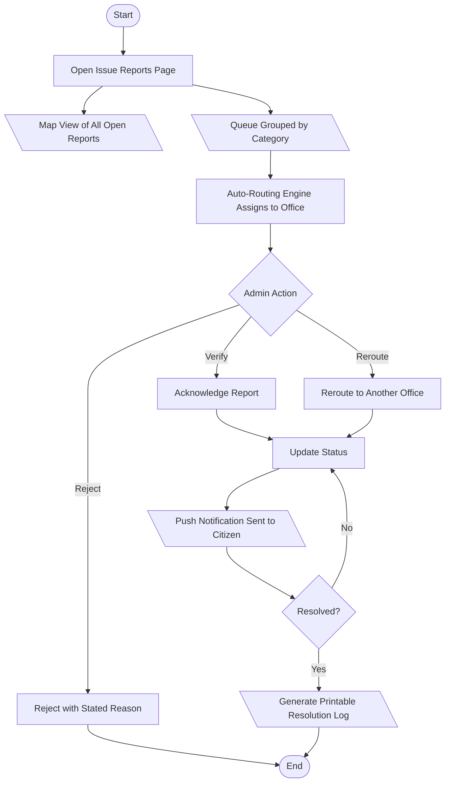
```mermaid
flowchart TD
    Start([Start]) --> Open[Open Issue Reports Page]
    Open --> MapView[\Map View of All Open Reports\]
    Open --> Queue[\Queue Grouped by Category\]
    Queue --> AutoRoute[Auto-Routing Engine Assigns to Office]
    AutoRoute --> Decision{Admin Action}
    Decision -->|Verify| Acknowledge[Acknowledge Report]
    Decision -->|Reroute| Reroute[Reroute to Another Office]
    Decision -->|Reject| Reject[Reject with Stated Reason]
    Acknowledge --> Status[Update Status]
    Reroute --> Status
    Status --> Notify[\Push Notification Sent to Citizen\]
    Notify --> Resolved{Resolved?}
    Resolved -->|No| Status
    Resolved -->|Yes| Log[\Generate Printable Resolution Log\]
    Reject --> End([End])
    Log --> End
```

---

## Figure 8: Flowchart of News and Announcements for LGU Administrator
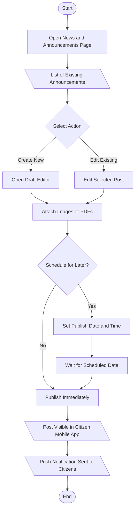
```mermaid
flowchart TD
    Start([Start]) --> Open[Open News and Announcements Page]
    Open --> PostList[\List of Existing Announcements\]
    PostList --> Action{Select Action}
    Action -->|Create New| Draft[Open Draft Editor]
    Action -->|Edit Existing| Edit[Edit Selected Post]
    Draft --> Attach[Attach Images or PDFs]
    Edit --> Attach
    Attach --> Schedule{Schedule for Later?}
    Schedule -->|Yes| SetDate[Set Publish Date and Time]
    Schedule -->|No| Publish[Publish Immediately]
    SetDate --> Wait[Wait for Scheduled Date]
    Wait --> Publish
    Publish --> Visible[\Post Visible in Citizen Mobile App\]
    Visible --> Notify[\Push Notification Sent to Citizens\]
    Notify --> End([End])
```

---

## Figure 9: Flowchart of Forum Moderation for LGU Administrator
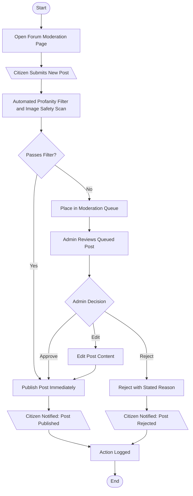
```mermaid
flowchart TD
    Start([Start]) --> Open[Open Forum Moderation Page]
    Open --> NewPost[\Citizen Submits New Post\]
    NewPost --> Filter[Automated Profanity Filter and Image Safety Scan]
    Filter --> Pass{Passes Filter?}
    Pass -->|Yes| Publish[Publish Post Immediately]
    Pass -->|No| Queue[Place in Moderation Queue]
    Queue --> Review[Admin Reviews Queued Post]
    Review --> Decision{Admin Decision}
    Decision -->|Approve| Publish
    Decision -->|Edit| EditPost[Edit Post Content]
    EditPost --> Publish
    Decision -->|Reject| Reject[Reject with Stated Reason]
    Publish --> Notify1[\Citizen Notified: Post Published\]
    Reject --> Notify2[\Citizen Notified: Post Rejected\]
    Notify1 --> Log[Action Logged]
    Notify2 --> Log
    Log --> End([End])
```

---

## Figure 10: Flowchart of Office Assignments for LGU Administrator
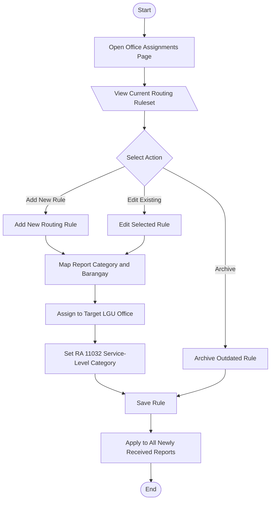
```mermaid
flowchart TD
    Start([Start]) --> Open[Open Office Assignments Page]
    Open --> View[\View Current Routing Ruleset\]
    View --> Action{Select Action}
    Action -->|Add New Rule| Add[Add New Routing Rule]
    Action -->|Edit Existing| Edit[Edit Selected Rule]
    Action -->|Archive| Archive[Archive Outdated Rule]
    Add --> Map[Map Report Category and Barangay]
    Edit --> Map
    Map --> Office[Assign to Target LGU Office]
    Office --> SLA[Set RA 11032 Service-Level Category]
    SLA --> Save[Save Rule]
    Archive --> Save
    Save --> Apply[Apply to All Newly Received Reports]
    Apply --> End([End])
```

---

## Figure 11: Flowchart of User Management for Super Admin and LGU Admin
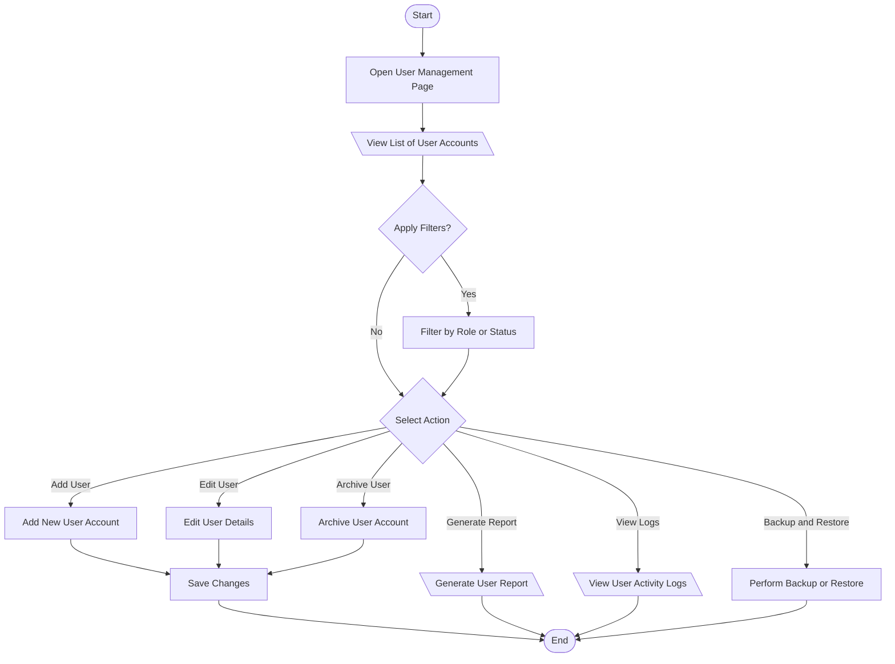
```mermaid
flowchart TD
    Start([Start]) --> Open[Open User Management Page]
    Open --> Users[\View List of User Accounts\]
    Users --> Filter{Apply Filters?}
    Filter -->|Yes| Search[Filter by Role or Status]
    Filter -->|No| Action{Select Action}
    Search --> Action
    Action -->|Add User| Add[Add New User Account]
    Action -->|Edit User| Edit[Edit User Details]
    Action -->|Archive User| Archive[Archive User Account]
    Action -->|Generate Report| Report[\Generate User Report\]
    Action -->|View Logs| Logs[\View User Activity Logs\]
    Action -->|Backup and Restore| Backup[Perform Backup or Restore]
    Add --> Save[Save Changes]
    Edit --> Save
    Archive --> Save
    Save --> End([End])
    Report --> End
    Logs --> End
    Backup --> End
```

---

## Figure 12: Flowchart of Main Interface for Citizen
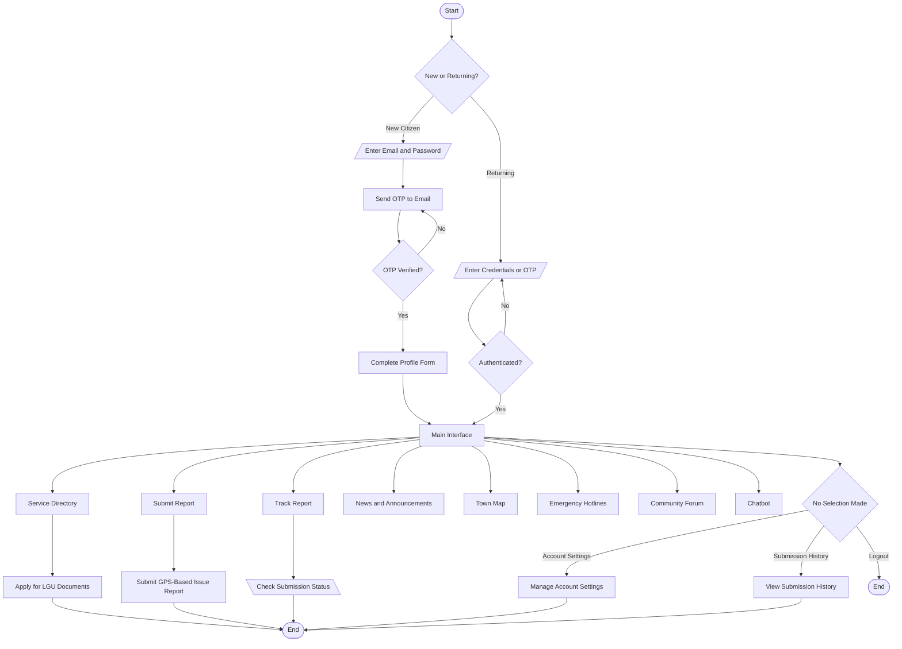
```mermaid
flowchart TD
    Start([Start]) --> Choice{New or Returning?}
    Choice -->|New Citizen| SignUp[/Enter Email and Password/]
    Choice -->|Returning| Login[/Enter Credentials or OTP/]
    SignUp --> OTP[Send OTP to Email]
    OTP --> Verify{OTP Verified?}
    Verify -->|No| OTP
    Verify -->|Yes| Profile[Complete Profile Form]
    Login --> Auth{Authenticated?}
    Auth -->|No| Login
    Auth -->|Yes| Main[Main Interface]
    Profile --> Main

    Main --> SD[Service Directory]
    Main --> SR[Submit Report]
    Main --> TR[Track Report]
    Main --> News[News and Announcements]
    Main --> Map[Town Map]
    Main --> SOS[Emergency Hotlines]
    Main --> Forum[Community Forum]
    Main --> Chat[Chatbot]
    Main --> Ext{No Selection Made}

    Ext -->|Account Settings| Settings[Manage Account Settings]
    Ext -->|Submission History| History[View Submission History]
    Ext -->|Logout| Logout([End])

    SD --> Apply[Apply for LGU Documents]
    SR --> Report[Submit GPS-Based Issue Report]
    TR --> Status[\Check Submission Status\]
    Apply --> End([End])
    Report --> End
    Status --> End
    Settings --> End
    History --> End
```

---

## Figure 13: Flowchart of Service Directory for Citizen
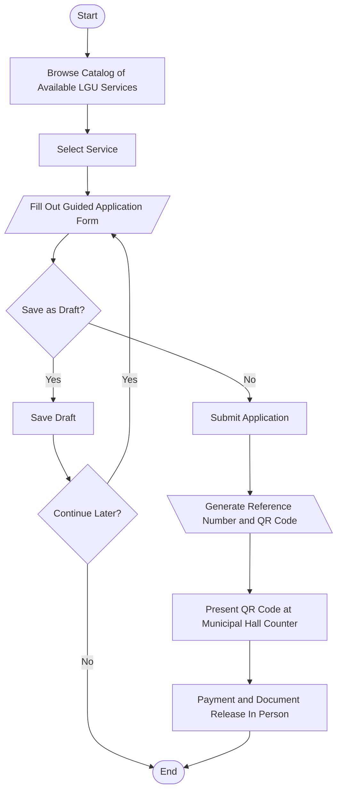
```mermaid
flowchart TD
    Start([Start]) --> Browse[Browse Catalog of Available LGU Services]
    Browse --> Select[Select Service]
    Select --> Form[/Fill Out Guided Application Form/]
    Form --> Draft{Save as Draft?}
    Draft -->|Yes| Save[Save Draft]
    Draft -->|No| Submit[Submit Application]
    Save --> Continue{Continue Later?}
    Continue -->|Yes| Form
    Continue -->|No| End([End])
    Submit --> QR[\Generate Reference Number and QR Code\]
    QR --> Present[Present QR Code at Municipal Hall Counter]
    Present --> Pay[Payment and Document Release In Person]
    Pay --> End
```

---

## Figure 14: Flowchart of Submit Report for Citizen
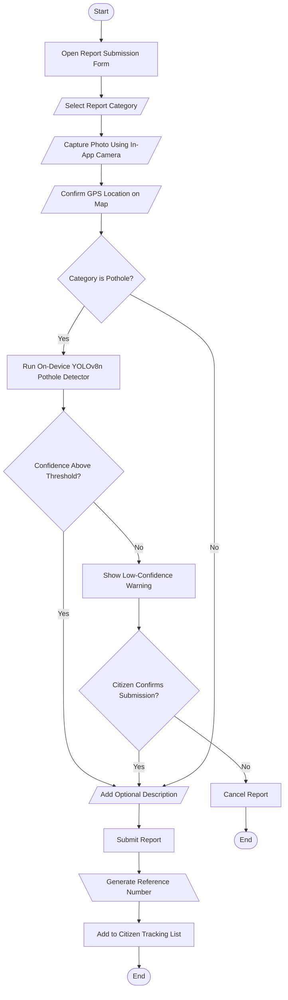
```mermaid
flowchart TD
    Start([Start]) --> Form[Open Report Submission Form]
    Form --> Category[/Select Report Category/]
    Category --> Photo[/Capture Photo Using In-App Camera/]
    Photo --> GPS[/Confirm GPS Location on Map/]
    GPS --> Check{Category is Pothole?}

    Check -->|Yes| YOLO[Run On-Device YOLOv8n Pothole Detector]
    YOLO --> Confidence{Confidence Above Threshold?}
    Confidence -->|Yes| Desc[/Add Optional Description/]
    Confidence -->|No| Warn[Show Low-Confidence Warning]
    Warn --> Confirm{Citizen Confirms Submission?}
    Confirm -->|Yes| Desc
    Confirm -->|No| Cancel[Cancel Report]

    Check -->|No| Desc
    Desc --> Submit[Submit Report]
    Submit --> Ref[\Generate Reference Number\]
    Ref --> Track[Add to Citizen Tracking List]
    Track --> Success([End])
    Cancel --> End([End])
```

---

## Figure 15: Flowchart of Track Report for Citizen
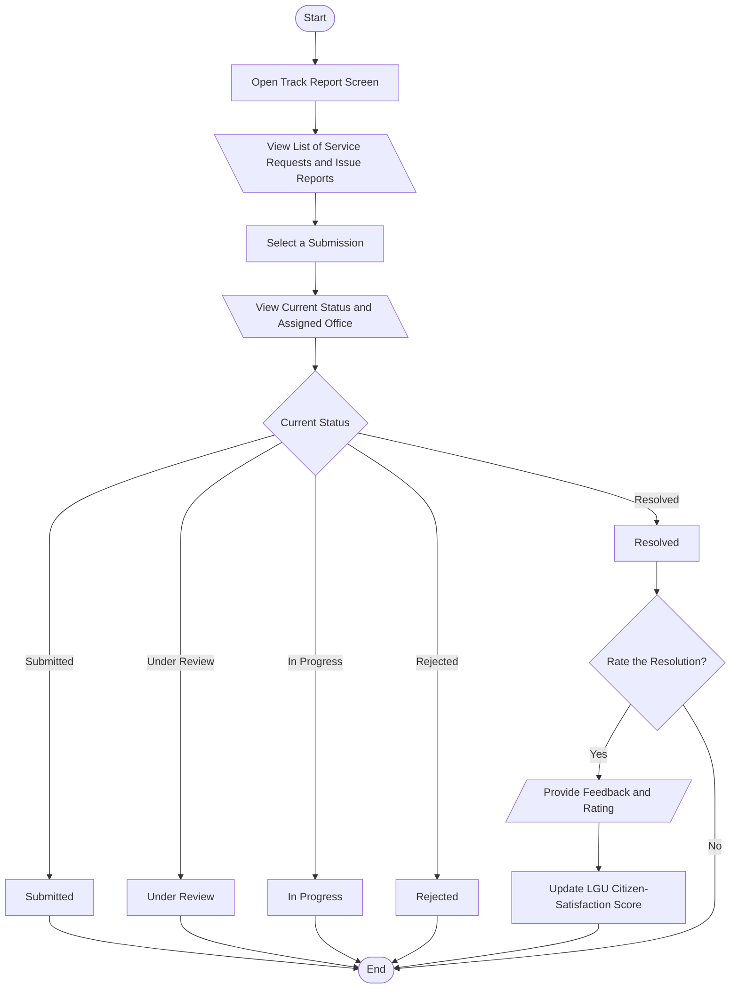
```mermaid
flowchart TD
    Start([Start]) --> Open[Open Track Report Screen]
    Open --> List[\View List of Service Requests and Issue Reports\]
    List --> Select[Select a Submission]
    Select --> Status[\View Current Status and Assigned Office\]
    Status --> StatusVal{Current Status}
    StatusVal -->|Submitted| S1[Submitted]
    StatusVal -->|Under Review| S2[Under Review]
    StatusVal -->|In Progress| S3[In Progress]
    StatusVal -->|Rejected| S4[Rejected]
    StatusVal -->|Resolved| S5[Resolved]
    S5 --> Rate{Rate the Resolution?}
    Rate -->|Yes| Feedback[/Provide Feedback and Rating/]
    Feedback --> Score[Update LGU Citizen-Satisfaction Score]
    Rate -->|No| End([End])
    S1 --> End
    S2 --> End
    S3 --> End
    S4 --> End
    Score --> End
```

---

## Figure 16: Flowchart of Town Map for Citizen
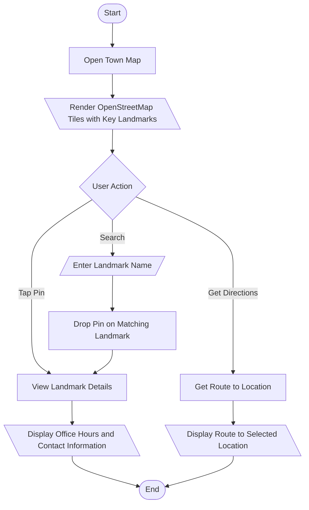
```mermaid
flowchart TD
    Start([Start]) --> Open[Open Town Map]
    Open --> OSM[\Render OpenStreetMap Tiles with Key Landmarks\]
    OSM --> Action{User Action}
    Action -->|Search| Search[/Enter Landmark Name/]
    Action -->|Tap Pin| Details[View Landmark Details]
    Action -->|Get Directions| Navigate[Get Route to Location]
    Search --> Pin[Drop Pin on Matching Landmark]
    Pin --> Details
    Details --> Info[\Display Office Hours and Contact Information\]
    Navigate --> Route[\Display Route to Selected Location\]
    Info --> End([End])
    Route --> End
```

---

## Figure 17: Flowchart of Emergency Hotlines for Citizen
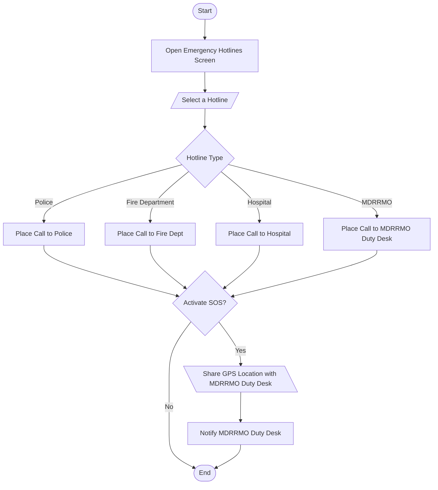
```mermaid
flowchart TD
    Start([Start]) --> Open[Open Emergency Hotlines Screen]
    Open --> Select[/Select a Hotline/]
    Select --> Type{Hotline Type}
    Type -->|Police| Call1[Place Call to Police]
    Type -->|Fire Department| Call2[Place Call to Fire Dept]
    Type -->|Hospital| Call3[Place Call to Hospital]
    Type -->|MDRRMO| Call4[Place Call to MDRRMO Duty Desk]
    Call1 --> SOS{Activate SOS?}
    Call2 --> SOS
    Call3 --> SOS
    Call4 --> SOS
    SOS -->|Yes| Share[\Share GPS Location with MDRRMO Duty Desk\]
    SOS -->|No| End([End])
    Share --> Duty[Notify MDRRMO Duty Desk]
    Duty --> End
```

---

## Figure 18: Flowchart of Community Forum for Citizen
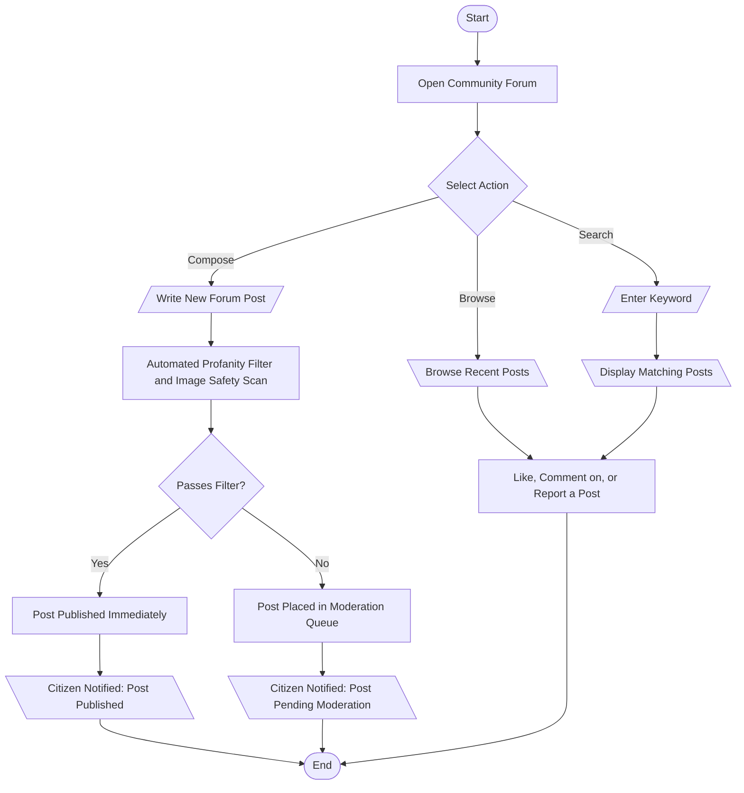
```mermaid
flowchart TD
    Start([Start]) --> Open[Open Community Forum]
    Open --> Action{Select Action}
    Action -->|Browse| Browse[\Browse Recent Posts\]
    Action -->|Search| Search[/Enter Keyword/]
    Action -->|Compose| Compose[/Write New Forum Post/]
    Browse --> Interact[Like, Comment on, or Report a Post]
    Search --> Results[\Display Matching Posts\]
    Results --> Interact
    Compose --> Filter[Automated Profanity Filter and Image Safety Scan]
    Filter --> Pass{Passes Filter?}
    Pass -->|Yes| Published[Post Published Immediately]
    Pass -->|No| Await[Post Placed in Moderation Queue]
    Published --> Notify1[\Citizen Notified: Post Published\]
    Await --> Notify2[\Citizen Notified: Post Pending Moderation\]
    Notify1 --> End([End])
    Notify2 --> End
    Interact --> End
```

---

## Figure 19: Flowchart of Chatbot for Citizen
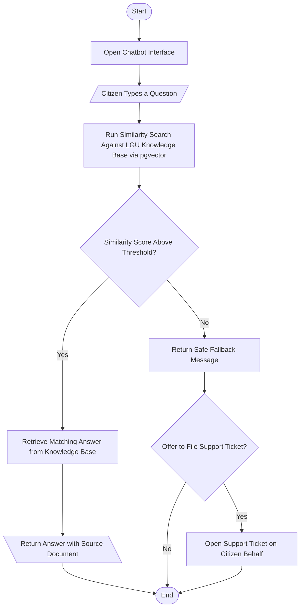
```mermaid
flowchart TD
    Start([Start]) --> Open[Open Chatbot Interface]
    Open --> Input[/Citizen Types a Question/]
    Input --> RAG[Run Similarity Search Against LGU Knowledge Base via pgvector]
    RAG --> Score{Similarity Score Above Threshold?}

    Score -->|Yes| Answer[Retrieve Matching Answer from Knowledge Base]
    Answer --> Source[\Return Answer with Source Document\]
    Source --> Done([End])

    Score -->|No| Fallback[Return Safe Fallback Message]
    Fallback --> Ticket{Offer to File Support Ticket?}
    Ticket -->|Yes| File[Open Support Ticket on Citizen Behalf]
    Ticket -->|No| Done
    File --> Done
```

---

## Figure 20: Flowchart of Account Settings for Citizen
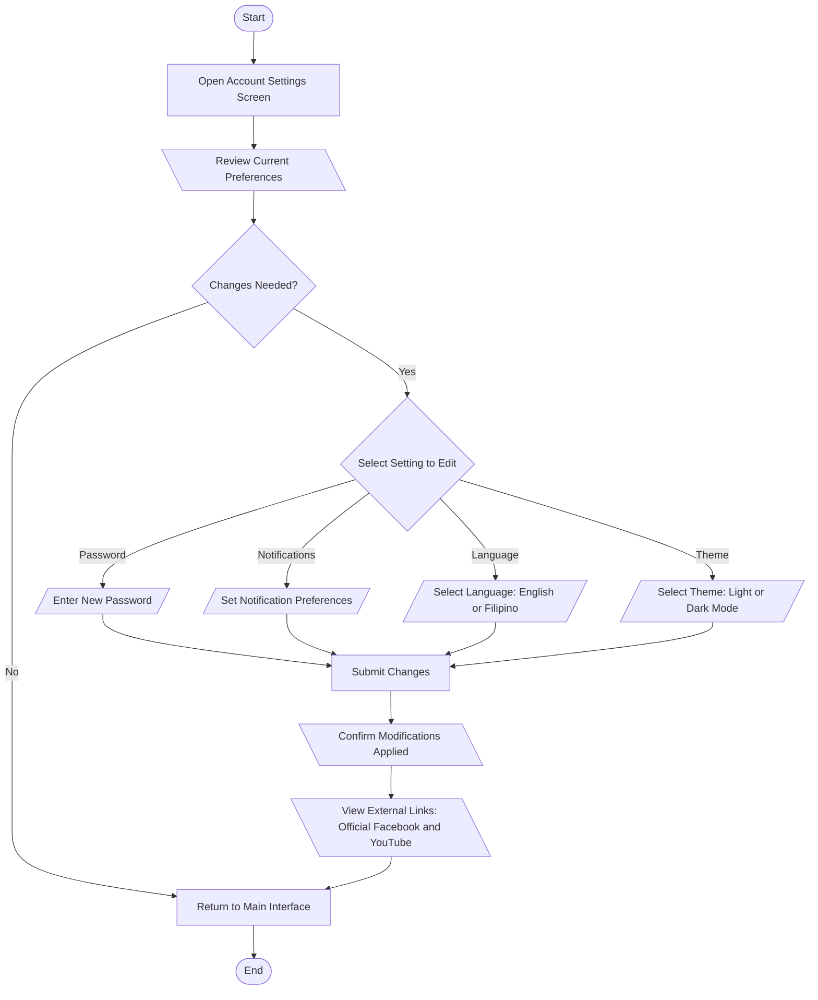
```mermaid
flowchart TD
    Start([Start]) --> Open[Open Account Settings Screen]
    Open --> Review[\Review Current Preferences\]
    Review --> Change{Changes Needed?}
    Change -->|No| Main[Return to Main Interface]
    Change -->|Yes| Edit{Select Setting to Edit}
    Edit -->|Password| Pass[/Enter New Password/]
    Edit -->|Notifications| Notif[/Set Notification Preferences/]
    Edit -->|Language| Lang[/Select Language: English or Filipino/]
    Edit -->|Theme| Theme[/Select Theme: Light or Dark Mode/]
    Pass --> Submit[Submit Changes]
    Notif --> Submit
    Lang --> Submit
    Theme --> Submit
    Submit --> Confirm[\Confirm Modifications Applied\]
    Confirm --> Links[\View External Links: Official Facebook and YouTube\]
    Links --> Main
    Main --> End([End])
```

---

## Figure 21: Wireframe for Citizen Sign-Up

---

## Figure 22: Wireframe for Citizen Main Interface

---

## Figure 23: Wireframe for Submit Report Flow

---

## Figure 24: Wireframe of LGU Admin Dashboard

---

## Figure 25: Wireframe of Issue Reports Page

---

## Figure 26: Wireframe of Service Requests Page

---

## Figure 27: Wireframe of News and Announcements Page

---

## Figure 28: Wireframe of Forum Moderation Page

---

## Figure 29: Wireframe of Office Assignments Page

---

## Figure 30: Wireframe of User Management Page

---

## Figure 31: Wireframe of Super Admin Cross-LGU Analytics Page

---

## Figure 32: Use Case Diagram for Super Administrator
```mermaid
useCaseDiagram
    actor "Super Administrator" as SA
    
    package AGAPP {
        usecase "Provision LGU Tenants" as UC1
        usecase "Deactivate Tenants" as UC2
        usecase "Manage Feature Flags" as UC3
        usecase "Monitor Cross-LGU Analytics" as UC4
        usecase "Supervise Compliance" as UC5
        usecase "Oversee User Accounts" as UC6
    }
    
    SA --> UC1
    SA --> UC2
    SA --> UC3
    SA --> UC4
    SA --> UC5
    SA --> UC6
```

---

## Figure 33: Use Case Diagram for LGU Administrator
```mermaid
useCaseDiagram
    actor "LGU Administrator" as LA
    
    package AGAPP {
        usecase "Manage Service Requests" as UC1
        usecase "Process Issue Reports" as UC2
        usecase "Configure Office Assignments" as UC3
        usecase "Publish News" as UC4
        usecase "Moderate Forum" as UC5
        usecase "Maintain Knowledge Base" as UC6
        usecase "Manage Staff Accounts" as UC7
        usecase "Monitor RA 11032 Compliance" as UC8
    }
    
    LA --> UC1
    LA --> UC2
    LA --> UC3
    LA --> UC4
    LA --> UC5
    LA --> UC6
    LA --> UC7
    LA --> UC8
```

---

## Figure 34: Use Case Diagram for LGU Personnel
```mermaid
useCaseDiagram
    actor "LGU Personnel" as LP
    
    package AGAPP {
        usecase "View Assigned Reports" as UC1
        usecase "Update Status" as UC2
        usecase "Attach Documents" as UC3
        usecase "Post Status Updates" as UC4
        usecase "Add Internal Notes" as UC5
    }
    
    LP --> UC1
    LP --> UC2
    LP --> UC3
    LP --> UC4
    LP --> UC5
```

---

## Figure 35: Use Case Diagram for Citizen
```mermaid
useCaseDiagram
    actor "Citizen" as C
    
    package AGAPP {
        usecase "Sign Up/Login" as UC1
        usecase "Apply for Documents" as UC2
        usecase "Submit Issue Report" as UC3
        usecase "Track Submission Status" as UC4
        usecase "View News" as UC5
        usecase "Open Town Map" as UC6
        usecase "Call Emergency Hotlines" as UC7
        usecase "Participate in Forum" as UC8
        usecase "Ask Chatbot" as UC9
    }
    
    C --> UC1
    C --> UC2
    C --> UC3
    C --> UC4
    C --> UC5
    C --> UC6
    C --> UC7
    C --> UC8
    C --> UC9
```

---

## Figure 36: Agile Scrum Model of AGAPP
```mermaid
flowchart LR
    subgraph Sprint0["Sprint 0: Initiation"]
        S0[Client Interviews<br/>Scope Document<br/>Wireframes<br/>DB Schema]
    end
    
    subgraph Sprint1["Sprint 1: Auth"]
        S1[Login/OTP<br/>Role Access<br/>Multi-tenant RLS]
    end
    
    subgraph Sprint2["Sprint 2: Service Directory"]
        S2[Content Modules<br/>Service Catalog<br/>Offline Caching]
    end
    
    subgraph Sprint3["Sprint 3: Issue Reporting + ML"]
        S3[Geotagged Reports<br/>YOLOv8n Detection<br/>Status Workflow]
    end
    
    subgraph Sprint4["Sprint 4: News/Forum/Chatbot"]
        S4[News Publishing<br/>Forum Moderation<br/>Keyword Chatbot]
    end
    
    subgraph Sprint5["Sprint 5: Admin Dashboards"]
        S5[Routing Rules<br/>SLA Tracker<br/>Analytics]
    end
    
    subgraph Sprint6["Sprint 6: Hardening"]
        S6[Security Review<br/>Performance Testing<br/>Privacy Compliance]
    end
    
    subgraph Sprint7["Sprint 7: UAT + Release"]
        S7[Beta Testing<br/>Bug Fixes<br/>Production Deploy]
    end
    
    Sprint0 --> Sprint1 --> Sprint2 --> Sprint3 --> Sprint4 --> Sprint5 --> Sprint6 --> Sprint7
    
    style Sprint0 fill:#e1f5fe
    style Sprint1 fill:#e8f5e9
    style Sprint2 fill:#fff3e0
    style Sprint3 fill:#fce4ec
    style Sprint4 fill:#f3e5f5
    style Sprint5 fill:#e0f2f1
    style Sprint6 fill:#fff8e1
    style Sprint7 fill:#d1c4e9
```
